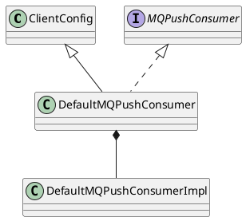

org.apache.rocketmq.client.consumer.DefaultMQPushConsumer
- DefaultMQPushConsumerImpl#pullMessage
- 通过长轮询达到Push的效果，长轮询既有Pull的有点，又兼具Push方式的实时性
- 流量控制 ProcessQueue

## hierarchy
```
ClientConfig (org.apache.rocketmq.client)
    DefaultMQPushConsumer (org.apache.rocketmq.client.consumer)
    DefaultMQPullConsumer (org.apache.rocketmq.client.consumer)
DefaultMQPushConsumer (org.apache.rocketmq.client.consumer)
    ClientConfig (org.apache.rocketmq.client)
    MQPushConsumer (org.apache.rocketmq.client.consumer)
        MQConsumer (org.apache.rocketmq.client.consumer)
```

## define


```java
public class DefaultMQPushConsumer extends ClientConfig implements MQPushConsumer {
    protected final transient DefaultMQPushConsumerImpl defaultMQPushConsumerImpl;
}   
```

## fields

```java
    private String consumerGroup;
    private MessageModel messageModel = MessageModel.CLUSTERING;
    private ConsumeFromWhere consumeFromWhere = ConsumeFromWhere.CONSUME_FROM_LAST_OFFSET;
    private AllocateMessageQueueStrategy allocateMessageQueueStrategy;
    
    // 单个消费实例的并行处理的线程数
    private int consumeThreadMin = 20;
    private int consumeThreadMax = 64;
    
    // 批量消费
    private int consumeMessageBatchMaxSize = 1;
```

## methods

### DefaultMQPushConsumer
```java
    public DefaultMQPushConsumer(final String consumerGroup, RPCHook rpcHook,
        AllocateMessageQueueStrategy allocateMessageQueueStrategy) {
        this.consumerGroup = consumerGroup;
        this.allocateMessageQueueStrategy = allocateMessageQueueStrategy;
        defaultMQPushConsumerImpl = new DefaultMQPushConsumerImpl(this, rpcHook);
    }
```

## other

### MessageModel
```java
public enum MessageModel {
    BROADCASTING("BROADCASTING"),
    CLUSTERING("CLUSTERING");

    private String modeCN;

    MessageModel(String modeCN) {
        this.modeCN = modeCN;
    }

    public String getModeCN() {
        return modeCN;
    }
}
```