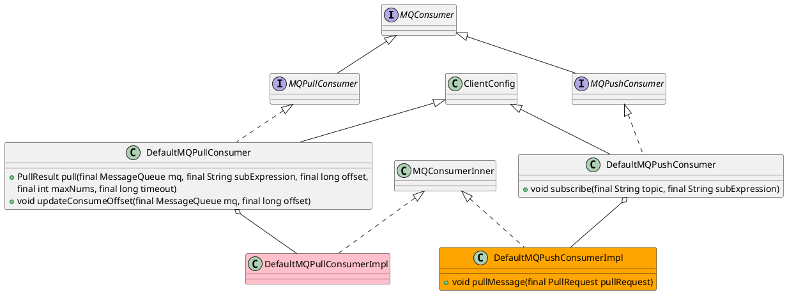

org.apache.rocketmq.client.consumer.MQConsumer
- 消费者组名称、消费模式、NameServer地址
- Push
  - 实时性高
  - Sever端复杂，Client处理能力不同，Client不及时消费会出问题
- Pull
  - 主动权在Client，拉取消息消费处理妥当再接着取
  - 循环拉取消息间隔不好设置，间隔太短忙等，间隔太长不能及时处理
- 长轮询
  - Broker端HOLD住客户端过来的请求一小段时间，在这个时间内有消息到达，利用现有连接理科返回给Consumer
  - 主动权还在Comsumer
  - 局限，HOLD住Comsumer请求的时候需要占用资源
- [PullRequestHoldService](/docs/30-distributed/src/mq/rocketmq/rocketmq-broker/longpolling/PullRequestHoldService.md)

## hierarhy
```
MQConsumer (org.apache.rocketmq.client.consumer)
  MQPullConsumer (org.apache.rocketmq.client.consumer)
    DefaultMQPullConsumer (org.apache.rocketmq.client.consumer)
  MQPushConsumer (org.apache.rocketmq.client.consumer)
    DefaultMQPushConsumer (org.apache.rocketmq.client.consumer)
```

## define
