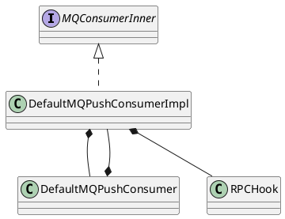

org.apache.rocketmq.client.impl.consumer.DefaultMQPushConsumerImpl

## define

```java
public class DefaultMQPushConsumerImpl implements MQConsumerInner {
}
```

## fields
```java
    private final ArrayList<ConsumeMessageHook> consumeMessageHookList = new ArrayList<ConsumeMessageHook>();
    private final RPCHook rpcHook;
    
    private MQClientInstance mQClientFactory;
    private PullAPIWrapper pullAPIWrapper;
    private volatile boolean pause = false;
    private boolean consumeOrderly = false;
    private MessageListener messageListenerInner;
    private OffsetStore offsetStore;
    private ConsumeMessageService consumeMessageService;
```

## methods

### DefaultMQPushConsumerImpl
```java
    public DefaultMQPushConsumerImpl(DefaultMQPushConsumer defaultMQPushConsumer, RPCHook rpcHook) {
        this.defaultMQPushConsumer = defaultMQPushConsumer;
        this.rpcHook = rpcHook;
    }
```

### start
- MQClientInstance
- PullAPIWrapper
- 偏移量存储
  - BROADCASTING LocalFileOffsetStore
  - CLUSTERING RemoteBrokerOffsetStore
- 顺序消费、并发消费

```java
public synchronized void start() throws MQClientException {
        switch (this.serviceState) {
            case CREATE_JUST:
                log.info("the consumer [{}] start beginning. messageModel={}, isUnitMode={}", this.defaultMQPushConsumer.getConsumerGroup(),
                    this.defaultMQPushConsumer.getMessageModel(), this.defaultMQPushConsumer.isUnitMode());
                this.serviceState = ServiceState.START_FAILED;

                this.checkConfig();

                this.copySubscription();

                if (this.defaultMQPushConsumer.getMessageModel() == MessageModel.CLUSTERING) {
                    this.defaultMQPushConsumer.changeInstanceNameToPID();
                }

                this.mQClientFactory = MQClientManager.getInstance().getAndCreateMQClientInstance(this.defaultMQPushConsumer, this.rpcHook);

                this.rebalanceImpl.setConsumerGroup(this.defaultMQPushConsumer.getConsumerGroup());
                this.rebalanceImpl.setMessageModel(this.defaultMQPushConsumer.getMessageModel());
                this.rebalanceImpl.setAllocateMessageQueueStrategy(this.defaultMQPushConsumer.getAllocateMessageQueueStrategy());
                this.rebalanceImpl.setmQClientFactory(this.mQClientFactory);
                
                this.pullAPIWrapper = new PullAPIWrapper(
                    mQClientFactory,
                    this.defaultMQPushConsumer.getConsumerGroup(), isUnitMode());
                this.pullAPIWrapper.registerFilterMessageHook(filterMessageHookList);

                if (this.defaultMQPushConsumer.getOffsetStore() != null) {
                    this.offsetStore = this.defaultMQPushConsumer.getOffsetStore();
                } else {
                    switch (this.defaultMQPushConsumer.getMessageModel()) {
                        case BROADCASTING:
                            this.offsetStore = new LocalFileOffsetStore(this.mQClientFactory, this.defaultMQPushConsumer.getConsumerGroup());
                            break;
                        case CLUSTERING:
                            this.offsetStore = new RemoteBrokerOffsetStore(this.mQClientFactory, this.defaultMQPushConsumer.getConsumerGroup());
                            break;
                        default:
                            break;
                    }
                    this.defaultMQPushConsumer.setOffsetStore(this.offsetStore);
                }
                this.offsetStore.load();

                if (this.getMessageListenerInner() instanceof MessageListenerOrderly) {
                    this.consumeOrderly = true;
                    this.consumeMessageService =
                        new ConsumeMessageOrderlyService(this, (MessageListenerOrderly) this.getMessageListenerInner());
                } else if (this.getMessageListenerInner() instanceof MessageListenerConcurrently) {
                    this.consumeOrderly = false;
                    this.consumeMessageService =
                        new ConsumeMessageConcurrentlyService(this, (MessageListenerConcurrently) this.getMessageListenerInner());
                }

                this.consumeMessageService.start();

                boolean registerOK = mQClientFactory.registerConsumer(this.defaultMQPushConsumer.getConsumerGroup(), this);
                if (!registerOK) {
                    this.serviceState = ServiceState.CREATE_JUST;
                    this.consumeMessageService.shutdown();
                    throw new MQClientException("The consumer group[" + this.defaultMQPushConsumer.getConsumerGroup()
                        + "] has been created before, specify another name please." + FAQUrl.suggestTodo(FAQUrl.GROUP_NAME_DUPLICATE_URL),
                        null);
                }

                mQClientFactory.start();
                log.info("the consumer [{}] start OK.", this.defaultMQPushConsumer.getConsumerGroup());
                this.serviceState = ServiceState.RUNNING;
                break;
            case RUNNING:
            case START_FAILED:
            case SHUTDOWN_ALREADY:
                throw new MQClientException("The PushConsumer service state not OK, maybe started once, "
                    + this.serviceState
                    + FAQUrl.suggestTodo(FAQUrl.CLIENT_SERVICE_NOT_OK),
                    null);
            default:
                break;
        }

        this.updateTopicSubscribeInfoWhenSubscriptionChanged();
        this.mQClientFactory.checkClientInBroker();
        this.mQClientFactory.sendHeartbeatToAllBrokerWithLock();
        this.mQClientFactory.rebalanceImmediately();
    }
```

### pullMessage
- 流量控制
- 顺序消费
- 回调模式，对返回消息结果做处理
- 发送pull请求

```java
public void pullMessage(final PullRequest pullRequest) {
        final ProcessQueue processQueue = pullRequest.getProcessQueue();
        if (processQueue.isDropped()) {
            log.info("the pull request[{}] is dropped.", pullRequest.toString());
            return;
        }

        pullRequest.getProcessQueue().setLastPullTimestamp(System.currentTimeMillis());

        try {
            this.makeSureStateOK();
        } catch (MQClientException e) {
            log.warn("pullMessage exception, consumer state not ok", e);
            this.executePullRequestLater(pullRequest, PULL_TIME_DELAY_MILLS_WHEN_EXCEPTION);
            return;
        }

        if (this.isPause()) {
            log.warn("consumer was paused, execute pull request later. instanceName={}, group={}", this.defaultMQPushConsumer.getInstanceName(), this.defaultMQPushConsumer.getConsumerGroup());
            this.executePullRequestLater(pullRequest, PULL_TIME_DELAY_MILLS_WHEN_SUSPEND);
            return;
        }

        long cachedMessageCount = processQueue.getMsgCount().get();
        long cachedMessageSizeInMiB = processQueue.getMsgSize().get() / (1024 * 1024);

        if (cachedMessageCount > this.defaultMQPushConsumer.getPullThresholdForQueue()) {
            this.executePullRequestLater(pullRequest, PULL_TIME_DELAY_MILLS_WHEN_FLOW_CONTROL);
            if ((queueFlowControlTimes++ % 1000) == 0) {
                log.warn(
                    "the cached message count exceeds the threshold {}, so do flow control, minOffset={}, maxOffset={}, count={}, size={} MiB, pullRequest={}, flowControlTimes={}",
                    this.defaultMQPushConsumer.getPullThresholdForQueue(), processQueue.getMsgTreeMap().firstKey(), processQueue.getMsgTreeMap().lastKey(), cachedMessageCount, cachedMessageSizeInMiB, pullRequest, queueFlowControlTimes);
            }
            return;
        }

        if (cachedMessageSizeInMiB > this.defaultMQPushConsumer.getPullThresholdSizeForQueue()) {
            this.executePullRequestLater(pullRequest, PULL_TIME_DELAY_MILLS_WHEN_FLOW_CONTROL);
            if ((queueFlowControlTimes++ % 1000) == 0) {
                log.warn(
                    "the cached message size exceeds the threshold {} MiB, so do flow control, minOffset={}, maxOffset={}, count={}, size={} MiB, pullRequest={}, flowControlTimes={}",
                    this.defaultMQPushConsumer.getPullThresholdSizeForQueue(), processQueue.getMsgTreeMap().firstKey(), processQueue.getMsgTreeMap().lastKey(), cachedMessageCount, cachedMessageSizeInMiB, pullRequest, queueFlowControlTimes);
            }
            return;
        }

        if (!this.consumeOrderly) {
            if (processQueue.getMaxSpan() > this.defaultMQPushConsumer.getConsumeConcurrentlyMaxSpan()) {
                this.executePullRequestLater(pullRequest, PULL_TIME_DELAY_MILLS_WHEN_FLOW_CONTROL);
                if ((queueMaxSpanFlowControlTimes++ % 1000) == 0) {
                    log.warn(
                        "the queue's messages, span too long, so do flow control, minOffset={}, maxOffset={}, maxSpan={}, pullRequest={}, flowControlTimes={}",
                        processQueue.getMsgTreeMap().firstKey(), processQueue.getMsgTreeMap().lastKey(), processQueue.getMaxSpan(),
                        pullRequest, queueMaxSpanFlowControlTimes);
                }
                return;
            }
        } else {
            if (processQueue.isLocked()) {
                if (!pullRequest.isLockedFirst()) {
                    final long offset = this.rebalanceImpl.computePullFromWhere(pullRequest.getMessageQueue());
                    boolean brokerBusy = offset < pullRequest.getNextOffset();
                    log.info("the first time to pull message, so fix offset from broker. pullRequest: {} NewOffset: {} brokerBusy: {}",
                        pullRequest, offset, brokerBusy);
                    if (brokerBusy) {
                        log.info("[NOTIFYME]the first time to pull message, but pull request offset larger than broker consume offset. pullRequest: {} NewOffset: {}",
                            pullRequest, offset);
                    }

                    pullRequest.setLockedFirst(true);
                    pullRequest.setNextOffset(offset);
                }
            } else {
                this.executePullRequestLater(pullRequest, PULL_TIME_DELAY_MILLS_WHEN_EXCEPTION);
                log.info("pull message later because not locked in broker, {}", pullRequest);
                return;
            }
        }

        final SubscriptionData subscriptionData = this.rebalanceImpl.getSubscriptionInner().get(pullRequest.getMessageQueue().getTopic());
        if (null == subscriptionData) {
            this.executePullRequestLater(pullRequest, PULL_TIME_DELAY_MILLS_WHEN_EXCEPTION);
            log.warn("find the consumer's subscription failed, {}", pullRequest);
            return;
        }

        final long beginTimestamp = System.currentTimeMillis();

        PullCallback pullCallback = new PullCallback() {
            @Override
            public void onSuccess(PullResult pullResult) {
                if (pullResult != null) {
                    pullResult = DefaultMQPushConsumerImpl.this.pullAPIWrapper.processPullResult(pullRequest.getMessageQueue(), pullResult,
                        subscriptionData);

                    switch (pullResult.getPullStatus()) {
                        case FOUND:
                            long prevRequestOffset = pullRequest.getNextOffset();
                            pullRequest.setNextOffset(pullResult.getNextBeginOffset());
                            long pullRT = System.currentTimeMillis() - beginTimestamp;
                            DefaultMQPushConsumerImpl.this.getConsumerStatsManager().incPullRT(pullRequest.getConsumerGroup(),
                                pullRequest.getMessageQueue().getTopic(), pullRT);

                            long firstMsgOffset = Long.MAX_VALUE;
                            if (pullResult.getMsgFoundList() == null || pullResult.getMsgFoundList().isEmpty()) {
                                DefaultMQPushConsumerImpl.this.executePullRequestImmediately(pullRequest);
                            } else {
                                firstMsgOffset = pullResult.getMsgFoundList().get(0).getQueueOffset();

                                DefaultMQPushConsumerImpl.this.getConsumerStatsManager().incPullTPS(pullRequest.getConsumerGroup(),
                                    pullRequest.getMessageQueue().getTopic(), pullResult.getMsgFoundList().size());

                                boolean dispatchToConsume = processQueue.putMessage(pullResult.getMsgFoundList());
                                DefaultMQPushConsumerImpl.this.consumeMessageService.submitConsumeRequest(
                                    pullResult.getMsgFoundList(),
                                    processQueue,
                                    pullRequest.getMessageQueue(),
                                    dispatchToConsume);

                                if (DefaultMQPushConsumerImpl.this.defaultMQPushConsumer.getPullInterval() > 0) {
                                    DefaultMQPushConsumerImpl.this.executePullRequestLater(pullRequest,
                                        DefaultMQPushConsumerImpl.this.defaultMQPushConsumer.getPullInterval());
                                } else {
                                    DefaultMQPushConsumerImpl.this.executePullRequestImmediately(pullRequest);
                                }
                            }

                            if (pullResult.getNextBeginOffset() < prevRequestOffset
                                || firstMsgOffset < prevRequestOffset) {
                                log.warn(
                                    "[BUG] pull message result maybe data wrong, nextBeginOffset: {} firstMsgOffset: {} prevRequestOffset: {}",
                                    pullResult.getNextBeginOffset(),
                                    firstMsgOffset,
                                    prevRequestOffset);
                            }

                            break;
                        case NO_NEW_MSG:
                            pullRequest.setNextOffset(pullResult.getNextBeginOffset());

                            DefaultMQPushConsumerImpl.this.correctTagsOffset(pullRequest);

                            DefaultMQPushConsumerImpl.this.executePullRequestImmediately(pullRequest);
                            break;
                        case NO_MATCHED_MSG:
                            pullRequest.setNextOffset(pullResult.getNextBeginOffset());

                            DefaultMQPushConsumerImpl.this.correctTagsOffset(pullRequest);

                            DefaultMQPushConsumerImpl.this.executePullRequestImmediately(pullRequest);
                            break;
                        case OFFSET_ILLEGAL:
                            log.warn("the pull request offset illegal, {} {}",
                                pullRequest.toString(), pullResult.toString());
                            pullRequest.setNextOffset(pullResult.getNextBeginOffset());

                            pullRequest.getProcessQueue().setDropped(true);
                            DefaultMQPushConsumerImpl.this.executeTaskLater(new Runnable() {

                                @Override
                                public void run() {
                                    try {
                                        DefaultMQPushConsumerImpl.this.offsetStore.updateOffset(pullRequest.getMessageQueue(),
                                            pullRequest.getNextOffset(), false);

                                        DefaultMQPushConsumerImpl.this.offsetStore.persist(pullRequest.getMessageQueue());

                                        DefaultMQPushConsumerImpl.this.rebalanceImpl.removeProcessQueue(pullRequest.getMessageQueue());

                                        log.warn("fix the pull request offset, {}", pullRequest);
                                    } catch (Throwable e) {
                                        log.error("executeTaskLater Exception", e);
                                    }
                                }
                            }, 10000);
                            break;
                        default:
                            break;
                    }
                }
            }

            @Override
            public void onException(Throwable e) {
                if (!pullRequest.getMessageQueue().getTopic().startsWith(MixAll.RETRY_GROUP_TOPIC_PREFIX)) {
                    log.warn("execute the pull request exception", e);
                }

                DefaultMQPushConsumerImpl.this.executePullRequestLater(pullRequest, PULL_TIME_DELAY_MILLS_WHEN_EXCEPTION);
            }
        };

        boolean commitOffsetEnable = false;
        long commitOffsetValue = 0L;
        if (MessageModel.CLUSTERING == this.defaultMQPushConsumer.getMessageModel()) {
            commitOffsetValue = this.offsetStore.readOffset(pullRequest.getMessageQueue(), ReadOffsetType.READ_FROM_MEMORY);
            if (commitOffsetValue > 0) {
                commitOffsetEnable = true;
            }
        }

        String subExpression = null;
        boolean classFilter = false;
        SubscriptionData sd = this.rebalanceImpl.getSubscriptionInner().get(pullRequest.getMessageQueue().getTopic());
        if (sd != null) {
            if (this.defaultMQPushConsumer.isPostSubscriptionWhenPull() && !sd.isClassFilterMode()) {
                subExpression = sd.getSubString();
            }

            classFilter = sd.isClassFilterMode();
        }

        int sysFlag = PullSysFlag.buildSysFlag(
            commitOffsetEnable, // commitOffset
            true, // suspend
            subExpression != null, // subscription
            classFilter // class filter
        );
        try {
            this.pullAPIWrapper.pullKernelImpl(
                pullRequest.getMessageQueue(),
                subExpression,
                subscriptionData.getExpressionType(),
                subscriptionData.getSubVersion(),
                pullRequest.getNextOffset(),
                this.defaultMQPushConsumer.getPullBatchSize(),
                sysFlag,
                commitOffsetValue,
                BROKER_SUSPEND_MAX_TIME_MILLIS,
                CONSUMER_TIMEOUT_MILLIS_WHEN_SUSPEND,
                CommunicationMode.ASYNC,
                pullCallback
            );
        } catch (Exception e) {
            log.error("pullKernelImpl exception", e);
            this.executePullRequestLater(pullRequest, PULL_TIME_DELAY_MILLS_WHEN_EXCEPTION);
        }
    }
```


## class

### MQConsumerInner
```java
public interface MQConsumerInner {
    String groupName();
    MessageModel messageModel();
    ConsumeType consumeType();
    ConsumeFromWhere consumeFromWhere();
    Set<SubscriptionData> subscriptions();
    void doRebalance();
    void persistConsumerOffset();
    void updateTopicSubscribeInfo(final String topic, final Set<MessageQueue> info);
    boolean isSubscribeTopicNeedUpdate(final String topic);
    boolean isUnitMode();
    ConsumerRunningInfo consumerRunningInfo();
}
```

### PullCallback

```java
public interface PullCallback {
    void onSuccess(final PullResult pullResult);

    void onException(final Throwable e);
}
```

### RPCHook
```java
public interface RPCHook {
    void doBeforeRequest(final String remoteAddr, final RemotingCommand request);

    void doAfterResponse(final String remoteAddr, final RemotingCommand request,
        final RemotingCommand response);
}
```
