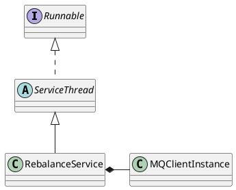

org.apache.rocketmq.client.impl.consumer.RebalanceService

## hierarchy
```
ServiceThread (org.apache.rocketmq.common)
    RebalanceService (org.apache.rocketmq.client.impl.consumer)
```

## define


## methods

### run
```java
    public void run() {
        log.info(this.getServiceName() + " service started");

        while (!this.isStopped()) {
            this.waitForRunning(waitInterval);
            this.mqClientFactory.doRebalance();
        }

        log.info(this.getServiceName() + " service end");
    }
```

### ServiceThread.waitForRunning
```java
    protected void waitForRunning(long interval) {
        if (hasNotified.compareAndSet(true, false)) {
            this.onWaitEnd();
            return;
        }

        //entry to wait
        waitPoint.reset();

        try {
            waitPoint.await(interval, TimeUnit.MILLISECONDS);
        } catch (InterruptedException e) {
            log.error("Interrupted", e);
        } finally {
            hasNotified.set(false);
            this.onWaitEnd();
        }
    }
```

## super class

### ServiceThread
```java
public abstract class ServiceThread implements Runnable {
    
    private static final long JOIN_TIME = 90 * 1000;
    protected final Thread thread;
    protected final CountDownLatch2 waitPoint = new CountDownLatch2(1);
    protected volatile AtomicBoolean hasNotified = new AtomicBoolean(false);
    protected volatile boolean stopped = false;
    
}

```