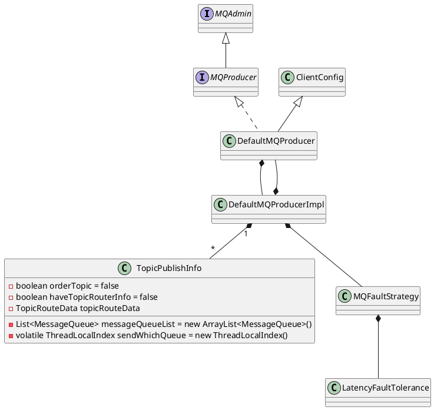

org.apache.rocketmq.client.impl.producer.DefaultMQProducerImpl

## hierarchy
```
DefaultMQProducerImpl (org.apache.rocketmq.client.impl.producer)
    MQProducerInner (org.apache.rocketmq.client.impl.producer)
```

## define


```java
public class DefaultMQProducerImpl implements MQProducerInner {
    private final InternalLogger log = ClientLogger.getLog();
    private final Random random = new Random();
    private final DefaultMQProducer defaultMQProducer;
    // 本地缓存 主题路由信息
    private final ConcurrentMap<String/* topic */, TopicPublishInfo> topicPublishInfoTable = new ConcurrentHashMap<String, TopicPublishInfo>();
    private final ArrayList<SendMessageHook> sendMessageHookList = new ArrayList<SendMessageHook>();
    private final RPCHook rpcHook;
    protected BlockingQueue<Runnable> checkRequestQueue;
    protected ExecutorService checkExecutor;
    private ServiceState serviceState = ServiceState.CREATE_JUST;
    private MQClientInstance mQClientFactory;
    private ArrayList<CheckForbiddenHook> checkForbiddenHookList = new ArrayList<CheckForbiddenHook>();
    private int zipCompressLevel = Integer.parseInt(System.getProperty(MixAll.MESSAGE_COMPRESS_LEVEL, "5"));

    private MQFaultStrategy mqFaultStrategy = new MQFaultStrategy();
}
```
## methods

### start
```java
    public void start(final boolean startFactory) throws MQClientException {
        switch (this.serviceState) {
            case CREATE_JUST:
                this.serviceState = ServiceState.START_FAILED;

                this.checkConfig();

                if (!this.defaultMQProducer.getProducerGroup().equals(MixAll.CLIENT_INNER_PRODUCER_GROUP)) {
                    this.defaultMQProducer.changeInstanceNameToPID();
                }

                this.mQClientFactory = MQClientManager.getInstance().getAndCreateMQClientInstance(this.defaultMQProducer, rpcHook);

                boolean registerOK = mQClientFactory.registerProducer(this.defaultMQProducer.getProducerGroup(), this);
                if (!registerOK) {
                    this.serviceState = ServiceState.CREATE_JUST;
                    throw new MQClientException("The producer group[" + this.defaultMQProducer.getProducerGroup()
                        + "] has been created before, specify another name please." + FAQUrl.suggestTodo(FAQUrl.GROUP_NAME_DUPLICATE_URL),
                        null);
                }

                this.topicPublishInfoTable.put(this.defaultMQProducer.getCreateTopicKey(), new TopicPublishInfo());

                if (startFactory) {
                    mQClientFactory.start();
                }

                log.info("the producer [{}] start OK. sendMessageWithVIPChannel={}", this.defaultMQProducer.getProducerGroup(),
                    this.defaultMQProducer.isSendMessageWithVIPChannel());
                this.serviceState = ServiceState.RUNNING;
                break;
            case RUNNING:
            case START_FAILED:
            case SHUTDOWN_ALREADY:
                throw new MQClientException("The producer service state not OK, maybe started once, "
                    + this.serviceState
                    + FAQUrl.suggestTodo(FAQUrl.CLIENT_SERVICE_NOT_OK),
                    null);
            default:
                break;
        }

        this.mQClientFactory.sendHeartbeatToAllBrokerWithLock();
    }
```

### tryToFindTopicPublishInfo
```java
    private TopicPublishInfo tryToFindTopicPublishInfo(final String topic) {
        // 尝试从本地缓存中获取路由信息
        TopicPublishInfo topicPublishInfo = this.topicPublishInfoTable.get(topic);
        if (null == topicPublishInfo || !topicPublishInfo.ok()) {
            // 从NameServer中获取
            this.topicPublishInfoTable.putIfAbsent(topic, new TopicPublishInfo());
            this.mQClientFactory.updateTopicRouteInfoFromNameServer(topic);
            topicPublishInfo = this.topicPublishInfoTable.get(topic);
        }

        if (topicPublishInfo.isHaveTopicRouterInfo() || topicPublishInfo.ok()) {
            return topicPublishInfo;
        } else {
            // 尝试获取默认主题路由
            this.mQClientFactory.updateTopicRouteInfoFromNameServer(topic, true, this.defaultMQProducer);
            topicPublishInfo = this.topicPublishInfoTable.get(topic);
            return topicPublishInfo;
        }
    }
```

### MQClientInstance.updateTopicRouteInfoFromNameServer
获取默认的路由信息，如果 isDefault = true，则尝试获取【默认主题】的路由信息， Topic 名称为 TBW102（与 Broker 注册的默认主题的路由名称相同）
```java
    public boolean updateTopicRouteInfoFromNameServer(final String topic, boolean isDefault,
        DefaultMQProducer defaultMQProducer) {
        try {
            if (this.lockNamesrv.tryLock(LOCK_TIMEOUT_MILLIS, TimeUnit.MILLISECONDS)) {
                try {
                    TopicRouteData topicRouteData;
                    if (isDefault && defaultMQProducer != null) {
                        // 4.3版本 AUTO_CREATE_TOPIC_KEY 
                        // 4.9版本 TBW102
                        topicRouteData = this.mQClientAPIImpl.getDefaultTopicRouteInfoFromNameServer(defaultMQProducer.getCreateTopicKey(),
                            1000 * 3);
                        if (topicRouteData != null) {
                            for (QueueData data : topicRouteData.getQueueDatas()) {
                                int queueNums = Math.min(defaultMQProducer.getDefaultTopicQueueNums(), data.getReadQueueNums());
                                data.setReadQueueNums(queueNums);
                                data.setWriteQueueNums(queueNums);
                            }
                        }
                    }
        // ......
```

## other class

### MQProducerInner
```java
public interface MQProducerInner {
    Set<String> getPublishTopicList();

    boolean isPublishTopicNeedUpdate(final String topic);

    TransactionListener checkListener();

    void checkTransactionState(
        final String addr,
        final MessageExt msg,
        final CheckTransactionStateRequestHeader checkRequestHeader);

    void updateTopicPublishInfo(final String topic, final TopicPublishInfo info);

    boolean isUnitMode();
}
```