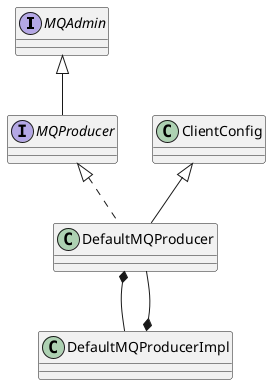

org.apache.rocketmq.client.producer.DefaultMQProducer
- 参数配置：生产者组名称、NameServer地址、失败重试次数、实例名称
- 延时消息

## hierarchy
```
ClientConfig (org.apache.rocketmq.client)
    DefaultMQProducer (org.apache.rocketmq.client.producer)
        TransactionMQProducer (org.apache.rocketmq.client.producer)
```

## define



```java
public class DefaultMQProducer extends ClientConfig implements MQProducer {

    protected final transient DefaultMQProducerImpl defaultMQProducerImpl;
    private String producerGroup;
    private String createTopicKey = MixAll.AUTO_CREATE_TOPIC_KEY_TOPIC;
    
    private int retryTimesWhenSendFailed = 2;
    private int retryTimesWhenSendAsyncFailed = 2;
    private int maxMessageSize = 1024 * 1024 * 4; // 4M
    
}    
```

## methods

### DefaultMQProducer
```java
    public DefaultMQProducer(final String producerGroup, RPCHook rpcHook) {
        this.producerGroup = producerGroup;
        defaultMQProducerImpl = new DefaultMQProducerImpl(this, rpcHook);
    }
```

### send
```java
    public SendResult send(Message msg, MessageQueueSelector selector, Object arg)
        throws MQClientException, RemotingException, MQBrokerException, InterruptedException {
        return this.defaultMQProducerImpl.send(msg, selector, arg);
    }
    public SendResult send(Message msg, MessageQueueSelector selector, Object arg, long timeout)
        throws MQClientException, RemotingException, MQBrokerException, InterruptedException {
        return this.defaultMQProducerImpl.send(msg, selector, arg, timeout);
    }
```

### send callback
```java
    public void send(Message msg, MessageQueue mq, SendCallback sendCallback)
        throws MQClientException, RemotingException, InterruptedException {
        this.defaultMQProducerImpl.send(msg, mq, sendCallback);
    }
    public void send(Message msg, MessageQueue mq, SendCallback sendCallback, long timeout)
        throws MQClientException, RemotingException, InterruptedException {
        this.defaultMQProducerImpl.send(msg, mq, sendCallback, timeout);
    }
```
### sendOneway
```java
    public void sendOneway(Message msg,
        MessageQueue mq) throws MQClientException, RemotingException, InterruptedException {
        this.defaultMQProducerImpl.sendOneway(msg, mq);
    }
```