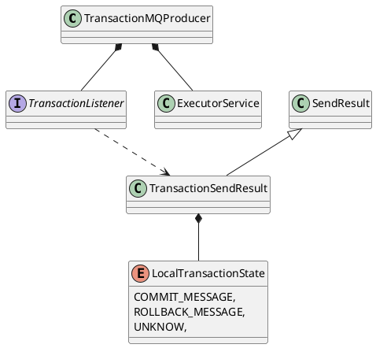

org.apache.rocketmq.client.producer.TransactionMQProducer

## hierarchy
```
ClientConfig (org.apache.rocketmq.client)
    DefaultMQProducer (org.apache.rocketmq.client.producer)
        TransactionMQProducer (org.apache.rocketmq.client.producer)
```

## define


```java
public class TransactionMQProducer extends DefaultMQProducer {
    private TransactionListener transactionListener;

    private ExecutorService executorService;
    
    @Override
    public TransactionSendResult sendMessageInTransaction(final Message msg, final Object arg) throws MQClientException {
        if (null == this.transactionListener) {
            throw new MQClientException("TransactionListener is null", null);
        }

        return this.defaultMQProducerImpl.sendMessageInTransaction(msg, transactionListener, arg);
    }
}
```

## methods

### sendMessageInTransaction
```java
    @Override
    public TransactionSendResult sendMessageInTransaction(final Message msg, final Object arg) throws MQClientException {
        if (null == this.transactionListener) {
            throw new MQClientException("TransactionListener is null", null);
        }

        return this.defaultMQProducerImpl.sendMessageInTransaction(msg, transactionListener, arg);
    }
```

### DefaultMQProducerImpl.initTransactionEnv
```java
    public void initTransactionEnv() {
        TransactionMQProducer producer = (TransactionMQProducer) this.defaultMQProducer;
        if (producer.getExecutorService() != null) {
            this.checkExecutor = producer.getExecutorService();
        } else {
            this.checkRequestQueue = new LinkedBlockingQueue<Runnable>(2000);
            this.checkExecutor = new ThreadPoolExecutor(
                1,
                1,
                1000 * 60,
                TimeUnit.MILLISECONDS,
                this.checkRequestQueue);
        }
    }
```

### DefaultMQProducerImpl.checkTransactionState
```java
    @Override
    public void checkTransactionState(final String addr, final MessageExt msg,
        final CheckTransactionStateRequestHeader header) {
        Runnable request = new Runnable() {
            private final String brokerAddr = addr;
            private final MessageExt message = msg;
            private final CheckTransactionStateRequestHeader checkRequestHeader = header;
            private final String group = DefaultMQProducerImpl.this.defaultMQProducer.getProducerGroup();

            @Override
            public void run() {
                TransactionListener transactionCheckListener = DefaultMQProducerImpl.this.checkListener();
                if (transactionCheckListener != null) {
                    LocalTransactionState localTransactionState = LocalTransactionState.UNKNOW;
                    Throwable exception = null;
                    try {
                        localTransactionState = transactionCheckListener.checkLocalTransaction(message);
                    } catch (Throwable e) {
                        log.error("Broker call checkTransactionState, but checkLocalTransactionState exception", e);
                        exception = e;
                    }

                    this.processTransactionState(
                        localTransactionState,
                        group,
                        exception);
                } else {
                    log.warn("checkTransactionState, pick transactionCheckListener by group[{}] failed", group);
                }
            }

            private void processTransactionState(
                final LocalTransactionState localTransactionState,
                final String producerGroup,
                final Throwable exception) {
                final EndTransactionRequestHeader thisHeader = new EndTransactionRequestHeader();
                thisHeader.setCommitLogOffset(checkRequestHeader.getCommitLogOffset());
                thisHeader.setProducerGroup(producerGroup);
                thisHeader.setTranStateTableOffset(checkRequestHeader.getTranStateTableOffset());
                thisHeader.setFromTransactionCheck(true);

                String uniqueKey = message.getProperties().get(MessageConst.PROPERTY_UNIQ_CLIENT_MESSAGE_ID_KEYIDX);
                if (uniqueKey == null) {
                    uniqueKey = message.getMsgId();
                }
                thisHeader.setMsgId(uniqueKey);
                thisHeader.setTransactionId(checkRequestHeader.getTransactionId());
                switch (localTransactionState) {
                    case COMMIT_MESSAGE:
                        thisHeader.setCommitOrRollback(MessageSysFlag.TRANSACTION_COMMIT_TYPE);
                        break;
                    case ROLLBACK_MESSAGE:
                        thisHeader.setCommitOrRollback(MessageSysFlag.TRANSACTION_ROLLBACK_TYPE);
                        log.warn("when broker check, client rollback this transaction, {}", thisHeader);
                        break;
                    case UNKNOW:
                        thisHeader.setCommitOrRollback(MessageSysFlag.TRANSACTION_NOT_TYPE);
                        log.warn("when broker check, client does not know this transaction state, {}", thisHeader);
                        break;
                    default:
                        break;
                }

                String remark = null;
                if (exception != null) {
                    remark = "checkLocalTransactionState Exception: " + RemotingHelper.exceptionSimpleDesc(exception);
                }

                try {
                    DefaultMQProducerImpl.this.mQClientFactory.getMQClientAPIImpl().endTransactionOneway(brokerAddr, thisHeader, remark,
                        3000);
                } catch (Exception e) {
                    log.error("endTransactionOneway exception", e);
                }
            }
        };

        this.checkExecutor.submit(request);
    }
```

### DefaultMQProducerImpl.sendMessageInTransaction
```java
    public TransactionSendResult sendMessageInTransaction(final Message msg,
                                                          final TransactionListener tranExecuter, final Object arg)
        throws MQClientException {
        if (null == tranExecuter) {
            throw new MQClientException("tranExecutor is null", null);
        }
        Validators.checkMessage(msg, this.defaultMQProducer);

        SendResult sendResult = null;
        MessageAccessor.putProperty(msg, MessageConst.PROPERTY_TRANSACTION_PREPARED, "true");
        MessageAccessor.putProperty(msg, MessageConst.PROPERTY_PRODUCER_GROUP, this.defaultMQProducer.getProducerGroup());
        try {
            sendResult = this.send(msg);
        } catch (Exception e) {
            throw new MQClientException("send message Exception", e);
        }

        LocalTransactionState localTransactionState = LocalTransactionState.UNKNOW;
        Throwable localException = null;
        switch (sendResult.getSendStatus()) {
            case SEND_OK: {
                try {
                    if (sendResult.getTransactionId() != null) {
                        msg.putUserProperty("__transactionId__", sendResult.getTransactionId());
                    }
                    String transactionId = msg.getProperty(MessageConst.PROPERTY_UNIQ_CLIENT_MESSAGE_ID_KEYIDX);
                    if (null != transactionId && !"".equals(transactionId)) {
                        msg.setTransactionId(transactionId);
                    }
                    localTransactionState = tranExecuter.executeLocalTransaction(msg, arg);
                    if (null == localTransactionState) {
                        localTransactionState = LocalTransactionState.UNKNOW;
                    }

                    if (localTransactionState != LocalTransactionState.COMMIT_MESSAGE) {
                        log.info("executeLocalTransactionBranch return {}", localTransactionState);
                        log.info(msg.toString());
                    }
                } catch (Throwable e) {
                    log.info("executeLocalTransactionBranch exception", e);
                    log.info(msg.toString());
                    localException = e;
                }
            }
            break;
            case FLUSH_DISK_TIMEOUT:
            case FLUSH_SLAVE_TIMEOUT:
            case SLAVE_NOT_AVAILABLE:
                localTransactionState = LocalTransactionState.ROLLBACK_MESSAGE;
                break;
            default:
                break;
        }

        try {
            this.endTransaction(sendResult, localTransactionState, localException);
        } catch (Exception e) {
            log.warn("local transaction execute " + localTransactionState + ", but end broker transaction failed", e);
        }

        TransactionSendResult transactionSendResult = new TransactionSendResult();
        transactionSendResult.setSendStatus(sendResult.getSendStatus());
        transactionSendResult.setMessageQueue(sendResult.getMessageQueue());
        transactionSendResult.setMsgId(sendResult.getMsgId());
        transactionSendResult.setQueueOffset(sendResult.getQueueOffset());
        transactionSendResult.setTransactionId(sendResult.getTransactionId());
        transactionSendResult.setLocalTransactionState(localTransactionState);
        return transactionSendResult;
    }
```


### DefaultMQProducerImpl.endTransaction
```java
    public void endTransaction(
        final SendResult sendResult,
        final LocalTransactionState localTransactionState,
        final Throwable localException) throws RemotingException, MQBrokerException, InterruptedException, UnknownHostException {
        final MessageId id;
        if (sendResult.getOffsetMsgId() != null) {
            id = MessageDecoder.decodeMessageId(sendResult.getOffsetMsgId());
        } else {
            id = MessageDecoder.decodeMessageId(sendResult.getMsgId());
        }
        String transactionId = sendResult.getTransactionId();
        final String brokerAddr = this.mQClientFactory.findBrokerAddressInPublish(sendResult.getMessageQueue().getBrokerName());
        EndTransactionRequestHeader requestHeader = new EndTransactionRequestHeader();
        requestHeader.setTransactionId(transactionId);
        requestHeader.setCommitLogOffset(id.getOffset());
        switch (localTransactionState) {
            case COMMIT_MESSAGE:
                requestHeader.setCommitOrRollback(MessageSysFlag.TRANSACTION_COMMIT_TYPE);
                break;
            case ROLLBACK_MESSAGE:
                requestHeader.setCommitOrRollback(MessageSysFlag.TRANSACTION_ROLLBACK_TYPE);
                break;
            case UNKNOW:
                requestHeader.setCommitOrRollback(MessageSysFlag.TRANSACTION_NOT_TYPE);
                break;
            default:
                break;
        }

        requestHeader.setProducerGroup(this.defaultMQProducer.getProducerGroup());
        requestHeader.setTranStateTableOffset(sendResult.getQueueOffset());
        requestHeader.setMsgId(sendResult.getMsgId());
        String remark = localException != null ? ("executeLocalTransactionBranch exception: " + localException.toString()) : null;
        this.mQClientFactory.getMQClientAPIImpl().endTransactionOneway(brokerAddr, requestHeader, remark,
            this.defaultMQProducer.getSendMsgTimeout());
    }
```

## class

### SendResult & TransactionSendResult
```java
public class SendResult {
    private SendStatus sendStatus;
    private String msgId;
    private MessageQueue messageQueue;
    private long queueOffset;
    private String transactionId;
    private String offsetMsgId;
    private String regionId;
    private boolean traceOn = true;
}    

public class TransactionSendResult extends SendResult {
    private LocalTransactionState localTransactionState;
}    

public interface TransactionListener {
    LocalTransactionState executeLocalTransaction(final Message msg, final Object arg);
    LocalTransactionState checkLocalTransaction(final MessageExt msg);
}

public enum SendStatus {
    SEND_OK,
    FLUSH_DISK_TIMEOUT,
    FLUSH_SLAVE_TIMEOUT,
    SLAVE_NOT_AVAILABLE,
}

public enum LocalTransactionState {
    COMMIT_MESSAGE,
    ROLLBACK_MESSAGE,
    UNKNOW,
}

```

### DefaultMQProducerImpl & TransactionListener
- [DefaultMQProducerImpl](/docs/30-distributed/src/rocketmq/rocketmq-client/impl/producer/DefaultMQProducerImpl.md)
- [TransactionListener](/docs/30-distributed/src/rocketmq/rocketmq-client/producer/TransactionListener.md)