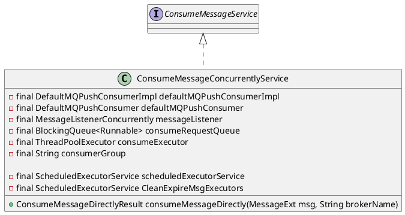

com.alibaba.rocketmq.client.impl.consumer.ConsumeMessageConcurrentlyService

## hierarchy

## define


## consume stack
```
consumeMessageDirectly:164, ConsumeMessageConcurrentlyService (com.alibaba.rocketmq.client.impl.consumer)
consumeMessageDirectly:1105, MQClientInstance (com.alibaba.rocketmq.client.impl.factory)
consumeMessageDirectly:187, ClientRemotingProcessor (com.alibaba.rocketmq.client.impl)
processRequest:75, ClientRemotingProcessor (com.alibaba.rocketmq.client.impl)
run:112, NettyRemotingAbstract$1 (com.alibaba.rocketmq.remoting.netty)
run:75, RequestTask (com.alibaba.rocketmq.remoting.netty)
call:511, Executors$RunnableAdapter (java.util.concurrent)
run$$$capture:266, FutureTask (java.util.concurrent)
run:-1, FutureTask (java.util.concurrent)

 - Async stack trace
<init>:151, FutureTask (java.util.concurrent)
newTaskFor:87, AbstractExecutorService (java.util.concurrent)
submit:111, AbstractExecutorService (java.util.concurrent)
processRequestCommand:159, NettyRemotingAbstract (com.alibaba.rocketmq.remoting.netty)
processMessageReceived:86, NettyRemotingAbstract (com.alibaba.rocketmq.remoting.netty)
channelRead0:604, NettyRemotingClient$NettyClientHandler (com.alibaba.rocketmq.remoting.netty)
channelRead0:600, NettyRemotingClient$NettyClientHandler (com.alibaba.rocketmq.remoting.netty)
channelRead:105, SimpleChannelInboundHandler (com.alibaba.rocketmq.shade.io.netty.channel)
invokeChannelRead:292, AbstractChannelHandlerContext (com.alibaba.rocketmq.shade.io.netty.channel)
fireChannelRead:278, AbstractChannelHandlerContext (com.alibaba.rocketmq.shade.io.netty.channel)
channelRead:86, ChannelInboundHandlerAdapter (com.alibaba.rocketmq.shade.io.netty.channel)
invokeChannelRead:292, AbstractChannelHandlerContext (com.alibaba.rocketmq.shade.io.netty.channel)
fireChannelRead:278, AbstractChannelHandlerContext (com.alibaba.rocketmq.shade.io.netty.channel)
channelRead:266, IdleStateHandler (com.alibaba.rocketmq.shade.io.netty.handler.timeout)
invokeChannelRead:292, AbstractChannelHandlerContext (com.alibaba.rocketmq.shade.io.netty.channel)
fireChannelRead:278, AbstractChannelHandlerContext (com.alibaba.rocketmq.shade.io.netty.channel)
fireChannelRead:277, ByteToMessageDecoder (com.alibaba.rocketmq.shade.io.netty.handler.codec)
channelRead:264, ByteToMessageDecoder (com.alibaba.rocketmq.shade.io.netty.handler.codec)
invokeChannelRead:292, AbstractChannelHandlerContext (com.alibaba.rocketmq.shade.io.netty.channel)
access$600:32, AbstractChannelHandlerContext (com.alibaba.rocketmq.shade.io.netty.channel)
run:283, AbstractChannelHandlerContext$7 (com.alibaba.rocketmq.shade.io.netty.channel)
run:36, DefaultEventExecutor (com.alibaba.rocketmq.shade.io.netty.util.concurrent)
run:112, SingleThreadEventExecutor$2 (com.alibaba.rocketmq.shade.io.netty.util.concurrent)
run:748, Thread (java.lang)
```