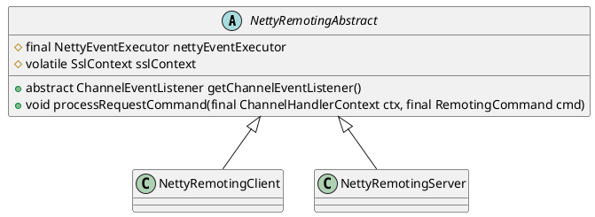

org.apache.rocketmq.remoting.netty.NettyRemotingAbstract

## hierarchy
```
NettyRemotingAbstract (org.apache.rocketmq.remoting.netty)
    NettyRemotingClient (org.apache.rocketmq.remoting.netty)
    NettyRemotingServer (org.apache.rocketmq.remoting.netty)
```

## define
