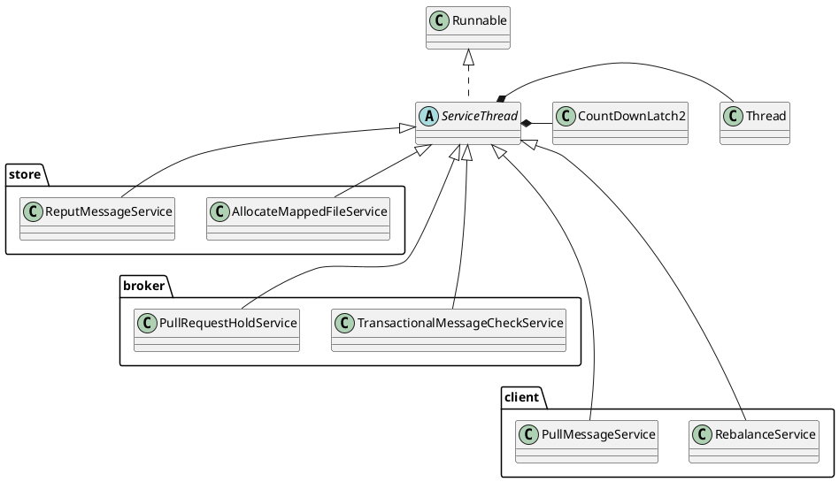

org.apache.rocketmq.common.ServiceThread
- CountDownLatch2
- AtomicBoolean
- volatile

## Hierarchy
```
ServiceThread (org.apache.rocketmq.common)
    AllocateMappedFileService (org.apache.rocketmq.store)
    WriteSocketService in HAConnection (org.apache.rocketmq.store.ha)
    ReadSocketService in HAConnection (org.apache.rocketmq.store.ha)
    PullRequestHoldService (org.apache.rocketmq.broker.longpolling)
    GroupTransferService in HAService (org.apache.rocketmq.store.ha)
    FlushConsumeQueueService in DefaultMessageStore (org.apache.rocketmq.store)
    RebalanceService (org.apache.rocketmq.client.impl.consumer)
    ReputMessageService in DefaultMessageStore (org.apache.rocketmq.store)
    FlushCommitLogService in CommitLog (org.apache.rocketmq.store)
    TransactionalMessageCheckService (org.apache.rocketmq.broker.transaction)
    StoreStatsService (org.apache.rocketmq.store)
    FileWatchService (org.apache.rocketmq.srvutil)
    PullMessageService (org.apache.rocketmq.client.impl.consumer)
    AcceptSocketService in HAService (org.apache.rocketmq.store.ha)
    HAClient in HAService (org.apache.rocketmq.store.ha)

```

## Define
