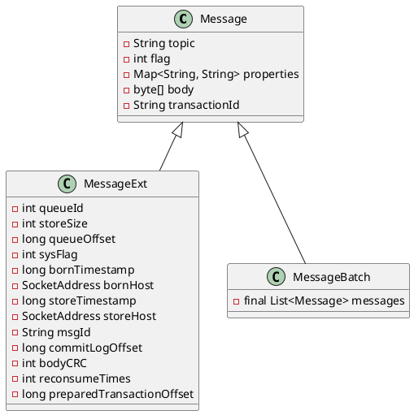

org.apache.rocketmq.common.message.Message

## hierarchy
```
Message (org.apache.rocketmq.common.message)
    MessageBatch (org.apache.rocketmq.common.message)
    MessageExt (org.apache.rocketmq.common.message)
        MessageClientExt (org.apache.rocketmq.common.message)
        MessageExtBatch (org.apache.rocketmq.common.message)
        MessageExtBrokerInner (org.apache.rocketmq.store)
```

## define


## fields
```java
    private String topic;
    private int flag;
    private Map<String, String> properties;
    private byte[] body;
    private String transactionId;
```

## methods

### Message
```java
    public Message(String topic, byte[] body) {
        this(topic, "", "", 0, body, true);
    }
        
    public Message(String topic, String tags, String keys, int flag, byte[] body, boolean waitStoreMsgOK) {
        this.topic = topic;
        this.flag = flag;
        this.body = body;

        if (tags != null && tags.length() > 0)
            this.setTags(tags);

        if (keys != null && keys.length() > 0)
            this.setKeys(keys);

        this.setWaitStoreMsgOK(waitStoreMsgOK);
    }
```

### Tags
```java
    public String getTags() {
        return this.getProperty(MessageConst.PROPERTY_TAGS); // PROPERTY_TAGS = "TAGS"
    }

    public void setTags(String tags) {
        this.putProperty(MessageConst.PROPERTY_TAGS, tags);
    }
```

### Keys
```java
    public String getKeys() {
        return this.getProperty(MessageConst.PROPERTY_KEYS); // PROPERTY_KEYS = "KEYS"
    }

    public void setKeys(Collection<String> keys) {
        StringBuffer sb = new StringBuffer();
        for (String k : keys) {
            sb.append(k);
            sb.append(MessageConst.KEY_SEPARATOR); // String KEY_SEPARATOR = " "
        }

        this.setKeys(sb.toString().trim());
    }
```

### DelayTimeLevel 延时消息
```java
    public int getDelayTimeLevel() {
        String t = this.getProperty(MessageConst.PROPERTY_DELAY_TIME_LEVEL);
        if (t != null) {
            return Integer.parseInt(t);
        }

        return 0;
    }

    public void setDelayTimeLevel(int level) {
        this.putProperty(MessageConst.PROPERTY_DELAY_TIME_LEVEL, String.valueOf(level));
    }
```

### WaitStoreMsgOK
```java
    public boolean isWaitStoreMsgOK() {
        String result = this.getProperty(MessageConst.PROPERTY_WAIT_STORE_MSG_OK);
        if (null == result)
            return true;

        return Boolean.parseBoolean(result);
    }

    public void setWaitStoreMsgOK(boolean waitStoreMsgOK) {
        this.putProperty(MessageConst.PROPERTY_WAIT_STORE_MSG_OK, Boolean.toString(waitStoreMsgOK));
    }
```