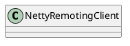

org.apache.rocketmq.remoting.netty.NettyRemotingClient

## hierarchy
```
NettyRemotingAbstract (org.apache.rocketmq.remoting.netty)
    NettyRemotingClient (org.apache.rocketmq.remoting.netty)
```

## define


## fields

```java
    private static final long LOCK_TIMEOUT_MILLIS = 3000;

    private final NettyClientConfig nettyClientConfig;
    private final Bootstrap bootstrap = new Bootstrap();
    private final EventLoopGroup eventLoopGroupWorker;
    private final Lock lockChannelTables = new ReentrantLock();
    private final ConcurrentMap<String /* addr */, ChannelWrapper> channelTables = new ConcurrentHashMap<String, ChannelWrapper>();

    private final Timer timer = new Timer("ClientHouseKeepingService", true);

    private final AtomicReference<List<String>> namesrvAddrList = new AtomicReference<List<String>>();
    private final AtomicReference<String> namesrvAddrChoosed = new AtomicReference<String>();
    private final AtomicInteger namesrvIndex = new AtomicInteger(initValueIndex());
    private final Lock lockNamesrvChannel = new ReentrantLock();

    private final ExecutorService publicExecutor;

    /**
     * Invoke the callback methods in this executor when process response.
     */
    private ExecutorService callbackExecutor;
    private final ChannelEventListener channelEventListener;
    private DefaultEventExecutorGroup defaultEventExecutorGroup;
    private RPCHook rpcHook;
```

## methods