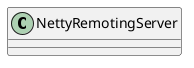

org.apache.rocketmq.remoting.netty.NettyRemotingServer

## hierarchy
```
NettyRemotingAbstract (org.apache.rocketmq.remoting.netty)
    NettyRemotingServer (org.apache.rocketmq.remoting.netty)
NettyRemotingServer (org.apache.rocketmq.remoting.netty)
    NettyRemotingAbstract (org.apache.rocketmq.remoting.netty)
        RemotingServer (org.apache.rocketmq.remoting)
            RemotingService (org.apache.rocketmq.remoting)
```

## define


## fields
```java
    private final ServerBootstrap serverBootstrap;
    private final EventLoopGroup eventLoopGroupSelector;
    private final EventLoopGroup eventLoopGroupBoss;
    private final NettyServerConfig nettyServerConfig;

    private final ExecutorService publicExecutor;
    private final ChannelEventListener channelEventListener;

    private final Timer timer = new Timer("ServerHouseKeepingService", true);
    private DefaultEventExecutorGroup defaultEventExecutorGroup;

    private RPCHook rpcHook;

    private int port = 0;

    private static final String HANDSHAKE_HANDLER_NAME = "handshakeHandler";
    private static final String TLS_HANDLER_NAME = "sslHandler";
    private static final String FILE_REGION_ENCODER_NAME = "fileRegionEncoder";
```

## methods

### start
```java
    @Override
    public void start() {
        this.defaultEventExecutorGroup = new DefaultEventExecutorGroup(
            nettyServerConfig.getServerWorkerThreads(),
            new ThreadFactory() {

                private AtomicInteger threadIndex = new AtomicInteger(0);

                @Override
                public Thread newThread(Runnable r) {
                    return new Thread(r, "NettyServerCodecThread_" + this.threadIndex.incrementAndGet());
                }
            });

        ServerBootstrap childHandler =
            this.serverBootstrap.group(this.eventLoopGroupBoss, this.eventLoopGroupSelector)
                .channel(useEpoll() ? EpollServerSocketChannel.class : NioServerSocketChannel.class)
                .option(ChannelOption.SO_BACKLOG, 1024)
                .option(ChannelOption.SO_REUSEADDR, true)
                .option(ChannelOption.SO_KEEPALIVE, false)
                .childOption(ChannelOption.TCP_NODELAY, true)
                .childOption(ChannelOption.SO_SNDBUF, nettyServerConfig.getServerSocketSndBufSize())
                .childOption(ChannelOption.SO_RCVBUF, nettyServerConfig.getServerSocketRcvBufSize())
                .localAddress(new InetSocketAddress(this.nettyServerConfig.getListenPort()))
                .childHandler(new ChannelInitializer<SocketChannel>() {
                    @Override
                    public void initChannel(SocketChannel ch) throws Exception {
                        ch.pipeline()
                            .addLast(defaultEventExecutorGroup, HANDSHAKE_HANDLER_NAME,
                                new HandshakeHandler(TlsSystemConfig.tlsMode))
                            .addLast(defaultEventExecutorGroup,
                                new NettyEncoder(),
                                new NettyDecoder(),
                                new IdleStateHandler(0, 0, nettyServerConfig.getServerChannelMaxIdleTimeSeconds()),
                                new NettyConnectManageHandler(),
                                new NettyServerHandler()
                            );
                    }
                });

        if (nettyServerConfig.isServerPooledByteBufAllocatorEnable()) {
            childHandler.childOption(ChannelOption.ALLOCATOR, PooledByteBufAllocator.DEFAULT);
        }

        try {
            ChannelFuture sync = this.serverBootstrap.bind().sync();
            InetSocketAddress addr = (InetSocketAddress) sync.channel().localAddress();
            this.port = addr.getPort();
        } catch (InterruptedException e1) {
            throw new RuntimeException("this.serverBootstrap.bind().sync() InterruptedException", e1);
        }

        if (this.channelEventListener != null) {
            this.nettyEventExecutor.start();
        }

        this.timer.scheduleAtFixedRate(new TimerTask() {

            @Override
            public void run() {
                try {
                    NettyRemotingServer.this.scanResponseTable();
                } catch (Throwable e) {
                    log.error("scanResponseTable exception", e);
                }
            }
        }, 1000 * 3, 1000);
    }
```

### shutdown
```java
    @Override
    public void shutdown() {
        try {
            if (this.timer != null) {
                this.timer.cancel();
            }

            this.eventLoopGroupBoss.shutdownGracefully();

            this.eventLoopGroupSelector.shutdownGracefully();

            if (this.nettyEventExecutor != null) {
                this.nettyEventExecutor.shutdown();
            }

            if (this.defaultEventExecutorGroup != null) {
                this.defaultEventExecutorGroup.shutdownGracefully();
            }
        } catch (Exception e) {
            log.error("NettyRemotingServer shutdown exception, ", e);
        }

        if (this.publicExecutor != null) {
            try {
                this.publicExecutor.shutdown();
            } catch (Exception e) {
                log.error("NettyRemotingServer shutdown exception, ", e);
            }
        }
    }
```