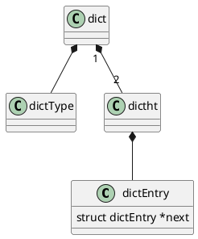

dict.h

dict.c

MurmurHash

## hierarchy



## define
- dictEntry 哈希表结点键值对
- dictType
- dictht
- dict
- dictIterator

```c
/*
 * 哈希表节点
 */
typedef struct dictEntry {
    
    // 键
    void *key;

    // 值
    union {
        void *val;
        uint64_t u64;
        int64_t s64;
    } v;

    // 指向下个哈希表节点，形成链表
    struct dictEntry *next;

} dictEntry;

/*
 * 字典类型特定函数
 */
typedef struct dictType {

    // 计算哈希值的函数
    unsigned int (*hashFunction)(const void *key);

    // 复制键的函数
    void *(*keyDup)(void *privdata, const void *key);

    // 复制值的函数
    void *(*valDup)(void *privdata, const void *obj);

    // 对比键的函数
    int (*keyCompare)(void *privdata, const void *key1, const void *key2);

    // 销毁键的函数
    void (*keyDestructor)(void *privdata, void *key);
    
    // 销毁值的函数
    void (*valDestructor)(void *privdata, void *obj);

} dictType;


/* This is our hash table structure. Every dictionary has two of this as we
 * implement incremental rehashing, for the old to the new table. */
/*
 * 哈希表
 *
 * 每个字典都使用两个哈希表，从而实现渐进式 rehash 。
 */
typedef struct dictht {
    
    // 哈希表数组
    dictEntry **table;

    // 哈希表大小
    unsigned long size;
    
    // 哈希表大小掩码，用于计算索引值
    // 总是等于 size - 1
    unsigned long sizemask;

    // 该哈希表已有节点的数量
    unsigned long used;

} dictht;

/*
 * 字典
 */
typedef struct dict {

    // 类型特定函数
    dictType *type;

    // 私有数据
    void *privdata;

    // 哈希表
    dictht ht[2];

    // rehash 索引
    // 当 rehash 不在进行时，值为 -1
    int rehashidx; /* rehashing not in progress if rehashidx == -1 */

    // 目前正在运行的安全迭代器的数量
    int iterators; /* number of iterators currently running */

} dict;

/* If safe is set to 1 this is a safe iterator, that means, you can call
 * dictAdd, dictFind, and other functions against the dictionary even while
 * iterating. Otherwise it is a non safe iterator, and only dictNext()
 * should be called while iterating. */
/*
 * 字典迭代器
 *
 * 如果 safe 属性的值为 1 ，那么在迭代进行的过程中，
 * 程序仍然可以执行 dictAdd 、 dictFind 和其他函数，对字典进行修改。
 *
 * 如果 safe 不为 1 ，那么程序只会调用 dictNext 对字典进行迭代，
 * 而不对字典进行修改。
 */
typedef struct dictIterator {
        
    // 被迭代的字典
    dict *d;

    // table ：正在被迭代的哈希表号码，值可以是 0 或 1 。
    // index ：迭代器当前所指向的哈希表索引位置。
    // safe ：标识这个迭代器是否安全
    int table, index, safe;

    // entry ：当前迭代到的节点的指针
    // nextEntry ：当前迭代节点的下一个节点
    //             因为在安全迭代器运作时， entry 所指向的节点可能会被修改，
    //             所以需要一个额外的指针来保存下一节点的位置，
    //             从而防止指针丢失
    dictEntry *entry, *nextEntry;

    long long fingerprint; /* unsafe iterator fingerprint for misuse detection */
} dictIterator;

```