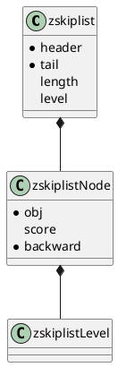

redis.c

redis.h

## hierarchy


## define
```c
/* ZSETs use a specialized version of Skiplists */
/*
 * 跳跃表节点
 */
typedef struct zskiplistNode {

    // 成员对象
    robj *obj;

    // 分值
    double score;

    // 后退指针
    struct zskiplistNode *backward;

    // 层
    struct zskiplistLevel {

        // 前进指针
        struct zskiplistNode *forward;

        // 跨度
        unsigned int span;

    } level[];

} zskiplistNode;

/*
 * 跳跃表
 */
typedef struct zskiplist {

    // 表头节点和表尾节点
    struct zskiplistNode *header, *tail;

    // 表中节点的数量
    unsigned long length;

    // 表中层数最大的节点的层数
    int level;

} zskiplist;
```