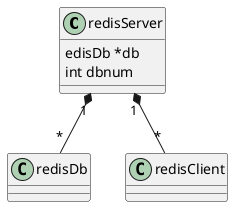

redis.h
redis.c


## hierarchy



## redisDb
[dict](/docs/30-distributed/src/redis/redis3.0/ds/dict.md)

```c
/* Redis database representation. There are multiple databases identified
 * by integers from 0 (the default database) up to the max configured
 * database. The database number is the 'id' field in the structure. */
typedef struct redisDb {

    // 数据库键空间，保存着数据库中的所有键值对
    dict *dict;                 /* The keyspace for this DB */

    // 键的过期时间，字典的键为键，字典的值为过期事件 UNIX 时间戳
    dict *expires;              /* Timeout of keys with a timeout set */

    // 正处于阻塞状态的键
    dict *blocking_keys;        /* Keys with clients waiting for data (BLPOP) */

    // 可以解除阻塞的键
    dict *ready_keys;           /* Blocked keys that received a PUSH */

    // 正在被 WATCH 命令监视的键
    dict *watched_keys;         /* WATCHED keys for MULTI/EXEC CAS */

    struct evictionPoolEntry *eviction_pool;    /* Eviction pool of keys */

    // 数据库号码
    int id;                     /* Database ID */

    // 数据库的键的平均 TTL ，统计信息
    long long avg_ttl;          /* Average TTL, just for stats */

} redisDb;

```
