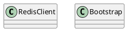

org.redisson.client.RedisClient

## Define


## Methods

###  createBootstrap
```java
    private Bootstrap createBootstrap(RedisClientConfig config, Type type) {
        Bootstrap bootstrap = new Bootstrap()
                        .resolver(config.getResolverGroup())
                        .channel(config.getSocketChannelClass())
                        .group(config.getGroup());

        bootstrap.handler(new RedisChannelInitializer(bootstrap, config, this, channels, type));
        bootstrap.option(ChannelOption.CONNECT_TIMEOUT_MILLIS, config.getConnectTimeout());
        bootstrap.option(ChannelOption.SO_KEEPALIVE, config.isKeepAlive());
        bootstrap.option(ChannelOption.TCP_NODELAY, config.isTcpNoDelay());
        return bootstrap;
    }
```