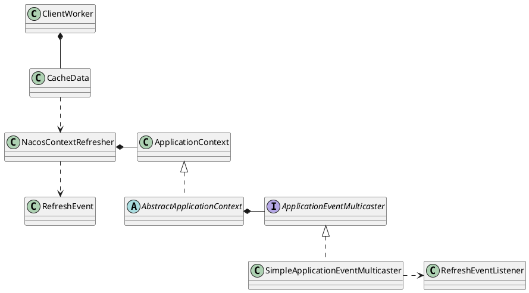

com.alibaba.nacos.client.config.impl.ClientWorker

## define



```java
public class ClientWorker implements Closeable {

    final ScheduledExecutorService executor;
    
    final ScheduledExecutorService executorService;
    
    /**
     * groupKey -> cacheData.
     */
    private final ConcurrentHashMap<String, CacheData> cacheMap = new ConcurrentHashMap<String, CacheData>();
    
    private final HttpAgent agent;
    
    private final ConfigFilterChainManager configFilterChainManager;
    
    private boolean isHealthServer = true;
    
    private long timeout;
    
    private double currentLongingTaskCount = 0;
    
    private int taskPenaltyTime;
    
    private boolean enableRemoteSyncConfig = false;
}

```


## methods

### constructor
```java
    public ClientWorker(final HttpAgent agent, final ConfigFilterChainManager configFilterChainManager,
            final Properties properties) {
        this.agent = agent;
        this.configFilterChainManager = configFilterChainManager;
        
        // Initialize the timeout parameter
        
        init(properties);
        
        this.executor = Executors.newScheduledThreadPool(1, new ThreadFactory() {
            @Override
            public Thread newThread(Runnable r) {
                Thread t = new Thread(r);
                t.setName("com.alibaba.nacos.client.Worker." + agent.getName());
                t.setDaemon(true);
                return t;
            }
        });
        
        this.executorService = Executors
                .newScheduledThreadPool(Runtime.getRuntime().availableProcessors(), new ThreadFactory() {
                    @Override
                    public Thread newThread(Runnable r) {
                        Thread t = new Thread(r);
                        t.setName("com.alibaba.nacos.client.Worker.longPolling." + agent.getName());
                        t.setDaemon(true);
                        return t;
                    }
                });
        // 每10ms检查配置
        this.executor.scheduleWithFixedDelay(new Runnable() {
            @Override
            public void run() {
                try {
                    checkConfigInfo();
                } catch (Throwable e) {
                    LOGGER.error("[" + agent.getName() + "] [sub-check] rotate check error", e);
                }
            }
        }, 1L, 10L, TimeUnit.MILLISECONDS);
    }
```

### checkConfigInfo
```java
    /**
     * Check config info.
     */
    public void checkConfigInfo() {
        // Dispatch tasks.
        int listenerSize = cacheMap.size();
        // Round up the longingTaskCount.
        // private static double perTaskConfigSize = 3000;
        int longingTaskCount = (int) Math.ceil(listenerSize / ParamUtil.getPerTaskConfigSize());
        if (longingTaskCount > currentLongingTaskCount) {
            for (int i = (int) currentLongingTaskCount; i < longingTaskCount; i++) {
                // The task list is no order.So it maybe has issues when changing.
                executorService.execute(new LongPollingRunnable(i));
            }
            currentLongingTaskCount = longingTaskCount;
        }
    }

```


## inner class

### LongPollingRunnable
1. 对本地缓存的配置做任务拆分，每一个批次是3000条
2. 针对每3000条`创建一个线程`去执行
3. 先把每一个批次的缓存和本地磁盘文件中的数据进行比较，
    - 如果和本地配置不一致，则表示该缓存发生了更新，直接通知客户端监听
    - 如果本地缓存和磁盘数据一致，则需要发起远程请求检查配置变化
4. 先以tenent/groupId/dataId拼接成字符串，发送到服务端进行检查，返回发生了变更的配置
5. 客户端收到变更配置列表，再逐项遍历发送到服务端获取配置内容。

```java

    void checkListenerMd5() {
        for (ManagerListenerWrap wrap : listeners) {
            if (!md5.equals(wrap.lastCallMd5)) {
                safeNotifyListener(dataId, group, content, type, md5, encryptedDataKey, wrap);
            }
        }
    }
```

/v1/cs/configs

http://10.10.4.40:8848/nacos/v1/cs/configs?dataId=demo-app.yaml&tenant=1444fce7-19e1-4a1d-8921-c3493b223e99&group=demo

