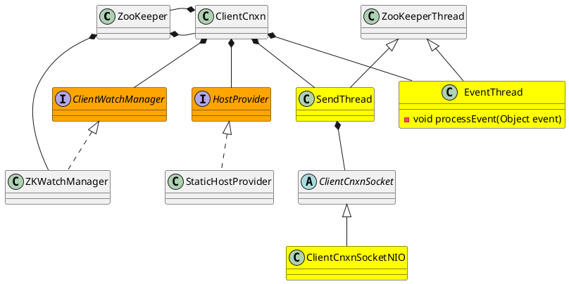

org.apache.zookeeper.ClientCnxn

* CopyOnWriteArraySet
* LinkedBlockingQueue

## Define



## Methods

### ClientCnxn
- ZooKeeperThread
  - SendThread
  - EventThread

```java
    public ClientCnxn(String chrootPath, HostProvider hostProvider, int sessionTimeout, ZooKeeper zooKeeper,
            ClientWatchManager watcher, ClientCnxnSocket clientCnxnSocket,
            long sessionId, byte[] sessionPasswd, boolean canBeReadOnly) {
        this.zooKeeper = zooKeeper;
        this.watcher = watcher;
        this.sessionId = sessionId;
        this.sessionPasswd = sessionPasswd;
        this.sessionTimeout = sessionTimeout;
        this.hostProvider = hostProvider;
        this.chrootPath = chrootPath;

        connectTimeout = sessionTimeout / hostProvider.size();
        readTimeout = sessionTimeout * 2 / 3;
        readOnly = canBeReadOnly;

        sendThread = new SendThread(clientCnxnSocket);
        eventThread = new EventThread();

    }
```

