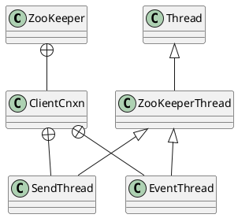

org.apache.zookeeper
- client
- jmx
- proto
- server
  - DataNode
  - DataTree
  - NettyServerCnxn
  - NettyServerCnxnFactory
  - NIOServerCnxn
  - NIOServerCnxnFactory
  - ZKDatabase
- [ZooKeeper](/docs/30-distributed/src/registry/zookeeperzookeeper/zookeeper/ZooKeeper.md)
- [ClientCnxn](/docs/30-distributed/src/registry/zookeeperzookeeper/zookeeper/ClientCnxn.md)
- ClientWatchManager
- Transaction
- [Watcher](/docs/30-distributed/src/registry/zookeeperzookeeper/zookeeper/Watcher.md)


## package
```
org.apache
    jute
        compiler
    zookeeper
        client
        common
        data
        jmx
        proto
        server
        txn
        version
        AsyncCallback
        ClientCnxn
        ClientCnxnSocket
        ClientCnxnSocketNIO
        ClientWatchManager
        CreateMode
        Environment
        JLineZNodeCompletor
        KeeperException
        Login
        MultiResponse
        MultiTransactionRecord
        Op
        OpResult
        Quotas
        ServerAdminClient
        Shell
        StatsTrack
        Transaction
        Version
        WatchedEvent
        Watcher
        ZKUtil
        ZooDefs
        ZooKeeper
        ZooKeeperMain
```

## content


## links
* [《从Paxos到Zookeeper 分布式一致性原理与实践》倪超](/99-book/notes/30-distributed/从Paxos到ZooKeeper.md)
