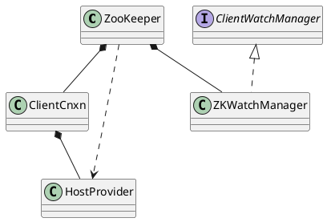

org.apache.zookeeper.ZooKeeper

## define

```plantuml
@startuml

class ZooKeeper

ZooKeeper *-- ClientCnxn
ZooKeeper *-- ZKWatchManager

ZooKeeper ..> HostProvider

ClientCnxn *-- HostProvider

interface ClientWatchManager
ClientWatchManager ^.. ZKWatchManager

@enduml
```

### 初始化阶段
1. 初始化ZooKeeper对象
2. 设置会话默认的Watcher
3. 构造ZooKeeper服务器地址列表管理器：HostProvider
4. 创建并初始化客户端连接器：ClientCnxn
5. 初始化SendThread和EventThread