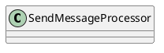

org.apache.rocketmq.broker.processor.SendMessageProcessor

## hierarchy
```
AbstractSendMessageProcessor (org.apache.rocketmq.broker.processor)
    SendMessageProcessor (org.apache.rocketmq.broker.processor)

SendMessageProcessor (org.apache.rocketmq.broker.processor)
    AbstractSendMessageProcessor (org.apache.rocketmq.broker.processor)
        NettyRequestProcessor (org.apache.rocketmq.remoting.netty)
    NettyRequestProcessor (org.apache.rocketmq.remoting.netty)
```

## define


```java
public class SendMessageProcessor extends AbstractSendMessageProcessor implements NettyRequestProcessor {

    private List<ConsumeMessageHook> consumeMessageHookList;

    public SendMessageProcessor(final BrokerController brokerController) {
        super(brokerController);
    }
}    
```

## methods

### processRequest
```java
    @Override
    public RemotingCommand processRequest(ChannelHandlerContext ctx,
                                          RemotingCommand request) throws RemotingCommandException {
        SendMessageContext mqtraceContext;
        switch (request.getCode()) {
            case RequestCode.CONSUMER_SEND_MSG_BACK:
                return this.consumerSendMsgBack(ctx, request);
            default:
                SendMessageRequestHeader requestHeader = parseRequestHeader(request);
                if (requestHeader == null) {
                    return null;
                }

                mqtraceContext = buildMsgContext(ctx, requestHeader);
                this.executeSendMessageHookBefore(ctx, request, mqtraceContext);

                RemotingCommand response;
                if (requestHeader.isBatch()) {
                    response = this.sendBatchMessage(ctx, request, mqtraceContext, requestHeader);
                } else {
                    response = this.sendMessage(ctx, request, mqtraceContext, requestHeader);
                }

                this.executeSendMessageHookAfter(response, mqtraceContext);
                return response;
        }
    }

```

### sendMessage
```java
    private RemotingCommand sendMessage(final ChannelHandlerContext ctx,
                                        final RemotingCommand request,
                                        final SendMessageContext sendMessageContext,
                                        final SendMessageRequestHeader requestHeader) throws RemotingCommandException {

        final RemotingCommand response = RemotingCommand.createResponseCommand(SendMessageResponseHeader.class);
        final SendMessageResponseHeader responseHeader = (SendMessageResponseHeader)response.readCustomHeader();

        response.setOpaque(request.getOpaque());

        response.addExtField(MessageConst.PROPERTY_MSG_REGION, this.brokerController.getBrokerConfig().getRegionId());
        response.addExtField(MessageConst.PROPERTY_TRACE_SWITCH, String.valueOf(this.brokerController.getBrokerConfig().isTraceOn()));

        log.debug("receive SendMessage request command, {}", request);

        final long startTimstamp = this.brokerController.getBrokerConfig().getStartAcceptSendRequestTimeStamp();
        if (this.brokerController.getMessageStore().now() < startTimstamp) {
            response.setCode(ResponseCode.SYSTEM_ERROR);
            response.setRemark(String.format("broker unable to service, until %s", UtilAll.timeMillisToHumanString2(startTimstamp)));
            return response;
        }

        response.setCode(-1);
        super.msgCheck(ctx, requestHeader, response); // 消息检查
        if (response.getCode() != -1) {
            return response;
        }

        final byte[] body = request.getBody();

        int queueIdInt = requestHeader.getQueueId();
        TopicConfig topicConfig = this.brokerController.getTopicConfigManager().selectTopicConfig(requestHeader.getTopic());

        if (queueIdInt < 0) {
            queueIdInt = Math.abs(this.random.nextInt() % 99999999) % topicConfig.getWriteQueueNums();
        }

        MessageExtBrokerInner msgInner = new MessageExtBrokerInner();
        msgInner.setTopic(requestHeader.getTopic());
        msgInner.setQueueId(queueIdInt);

        if (!handleRetryAndDLQ(requestHeader, response, request, msgInner, topicConfig)) {
            return response;
        }

        msgInner.setBody(body);
        msgInner.setFlag(requestHeader.getFlag());
        MessageAccessor.setProperties(msgInner, MessageDecoder.string2messageProperties(requestHeader.getProperties()));
        msgInner.setPropertiesString(requestHeader.getProperties());
        msgInner.setBornTimestamp(requestHeader.getBornTimestamp());
        msgInner.setBornHost(ctx.channel().remoteAddress());
        msgInner.setStoreHost(this.getStoreHost());
        msgInner.setReconsumeTimes(requestHeader.getReconsumeTimes() == null ? 0 : requestHeader.getReconsumeTimes());
        PutMessageResult putMessageResult = null;
        Map<String, String> oriProps = MessageDecoder.string2messageProperties(requestHeader.getProperties());
        String traFlag = oriProps.get(MessageConst.PROPERTY_TRANSACTION_PREPARED);
        if (traFlag != null && Boolean.parseBoolean(traFlag)) {
            if (this.brokerController.getBrokerConfig().isRejectTransactionMessage()) {
                response.setCode(ResponseCode.NO_PERMISSION);
                response.setRemark(
                    "the broker[" + this.brokerController.getBrokerConfig().getBrokerIP1()
                        + "] sending transaction message is forbidden");
                return response;
            }
            putMessageResult = this.brokerController.getTransactionalMessageService().prepareMessage(msgInner);
        } else {
            putMessageResult = this.brokerController.getMessageStore().putMessage(msgInner);
        }

        return handlePutMessageResult(putMessageResult, response, request, msgInner, responseHeader, sendMessageContext, ctx, queueIdInt);

    }
```