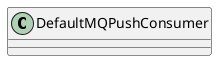

org.apache.rocketmq.client.consumer.DefaultMQPushConsumer

## hierarchy
```
ClientConfig (org.apache.rocketmq.client)
    DefaultMQPushConsumer (org.apache.rocketmq.client.consumer)
    DefaultMQPullConsumer (org.apache.rocketmq.client.consumer)
DefaultMQPushConsumer (org.apache.rocketmq.client.consumer)
    ClientConfig (org.apache.rocketmq.client)
    MQPushConsumer (org.apache.rocketmq.client.consumer)
        MQConsumer (org.apache.rocketmq.client.consumer)
```

## define


```java
public class DefaultMQPushConsumer extends ClientConfig implements MQPushConsumer {
    protected final transient DefaultMQPushConsumerImpl defaultMQPushConsumerImpl;
    private String consumerGroup;
    private MessageModel messageModel = MessageModel.CLUSTERING;
    private ConsumeFromWhere consumeFromWhere = ConsumeFromWhere.CONSUME_FROM_LAST_OFFSET;
}   
```

## fields


## methods

## MessageModel
```java
public enum MessageModel {
    BROADCASTING("BROADCASTING"),
    CLUSTERING("CLUSTERING");

    private String modeCN;

    MessageModel(String modeCN) {
        this.modeCN = modeCN;
    }

    public String getModeCN() {
        return modeCN;
    }
}
```