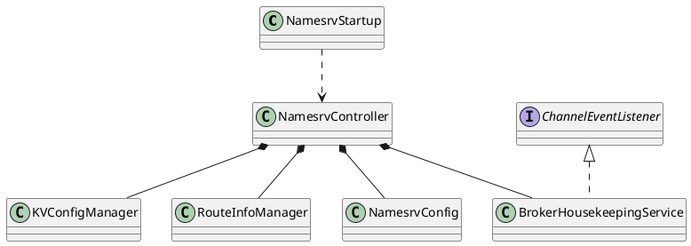

org.apache.rocketmq.namesrv

## package
```
kvconfig
    KVConfigManager
    KVConfigSerializeWrapper
processor
    ClusterTestRequestProcessor
    DefaultRequestProcessor
routeinfo
    BrokerHousekeepingService
    BrokerLiveInfo
    RouteInfoManager
NamesrvController
NamesrvStartup
```

## overview
