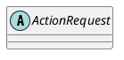

org.elasticsearch.action.ActionRequest

## Hierarchy
```
TransportMessage (org.elasticsearch.transport)
    TransportRequest (org.elasticsearch.transport)
        ActionRequest (org.elasticsearch.action)
            BulkRequest (org.elasticsearch.action.bulk)
            SearchRequest (org.elasticsearch.action.search)
            ReplicationRequest (org.elasticsearch.action.support.replication)
                ReplicatedWriteRequest (org.elasticsearch.action.support.replication)
                    DeleteRequest (org.elasticsearch.action.delete)
                    IndexRequest (org.elasticsearch.action.index)
            InstanceShardOperationRequest (org.elasticsearch.action.support.single.instance)
                UpdateRequest (org.elasticsearch.action.update)
```

## Define

