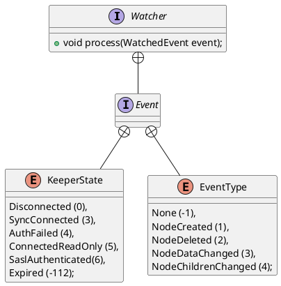

org.apache.zookeeper.Watcher

## hierarchy
```
Watcher (org.apache.zookeeper)
    ServerCnxn (org.apache.zookeeper.server)
    MyWatcher in ZooKeeperMain (org.apache.zookeeper)
    
    ZkClient (org.I0Itec.zkclient)
    
    ConnectionState (org.apache.curator)
    NamespaceWatcher (org.apache.curator.framework.imps)
    TreeNode in TreeCache (org.apache.curator.framework.recipes.cache)
```

## define
