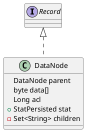

org.apache.zookeeper.server.DataNode

## hierarchy
```
DataNode (org.apache.zookeeper.server)
    Object (java.lang)
    Record (org.apache.jute)
```

## hierarchy

```plantuml
@startuml

interface Record
Record ^.. DataNode

class DataNode {
    DataNode parent
    byte data[]
    Long acl
    + StatPersisted stat
    - Set<String> children
}

@enduml
```