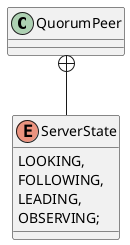

org.apache.zookeeper.server.quorum.QuorumPeer
## hierarchy
```
Thread (java.lang)
    ZooKeeperThread (org.apache.zookeeper.server)
        QuorumPeer (org.apache.zookeeper.server.quorum)
QuorumPeer (org.apache.zookeeper.server.quorum)
    ZooKeeperThread (org.apache.zookeeper.server)
        Thread (java.lang)
            Object (java.lang)
            Runnable (java.lang)
    Provider in QuorumStats (org.apache.zookeeper.server.quorum)
```
## define


