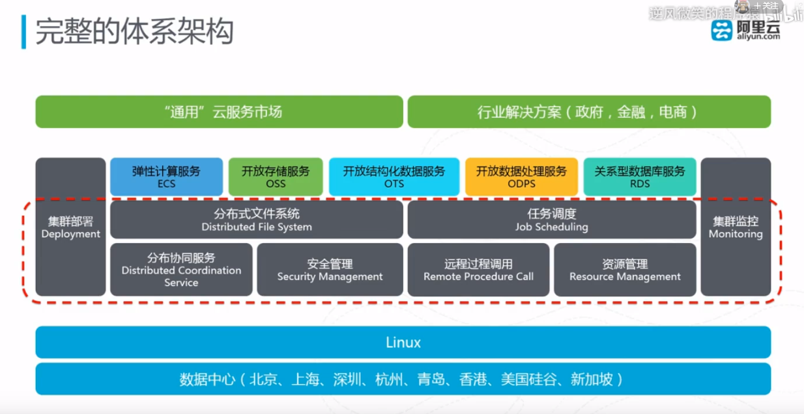
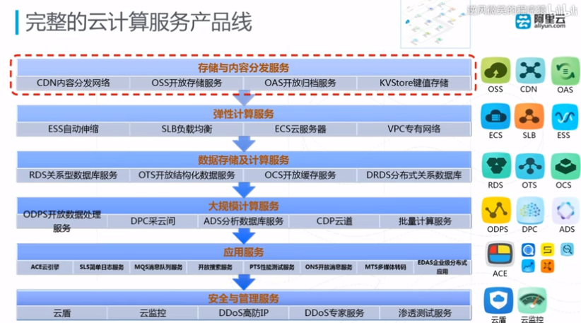

### 云计算专业认证
ACP Alibaba Cloud Certification Professional
面向使用阿里云云计算产品的架构、开发、运维类人员的专业技术认证，主要涉及阿里云的计算、存储、网络、安全类的核心产品。

### 阿里云知识体系
* 云服务器 ECS
* 弹性伸缩 Auto Scaling
* 负载均衡 SLB
* 专有网络 VPC
* 对象存储 OSS
* 内容分发网络CDN
* 安全（云盾、云安全）
* 云计算通用知识

五大特征：
1. 按需自助服务，很少的管理和交互
2. 按使用量付费的服务
3. 广泛的网络访问
4. 快速自动弹性伸缩、可配置
5. 多租户的资源池

### ACIDS

| name     | desc     |
| :------- | :------- |
| AI       | 人工智能 |
| Cloud    | 云计算   |
| IoT      | 物联网   |
| DT       | 大数据   |
| Security | 安全     |

#### 阿里云体系架构

#### 阿里云体系架构
