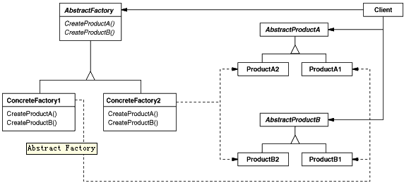

# View Image

this is generated files, just for view image conveniently...

## behaviour-chain-of-responsibility.gif

## behaviour-command.gif

## behaviour-interpreter.gif

## behaviour-iterator.gif

## behaviour-mediator.gif

## behaviour-memento.gif

## behaviour-observer.gif

## behaviour-state.gif

## behaviour-strategy.gif

## behaviour-template-method.gif

## behaviour-visitor.gif

## create-abstract-factory.gif

## create-builder.gif

## create-factory-method.gif

## create-prototype.gif

## create-singleton.gif

## struct-adapter-class-object.gif

## struct-bridge.gif

## struct-composite.gif

## struct-decorator.gif

## struct-facade.gif

## struct-flyweight.gif

## struct-proxy.gif

## usecase-uml.png

