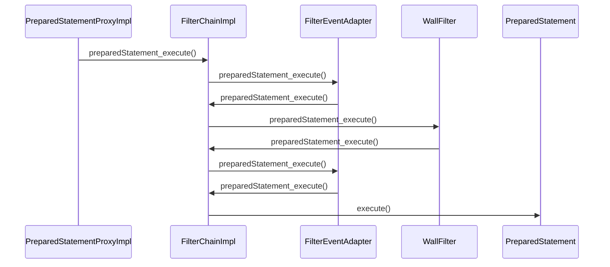

com.alibaba.druid.filter.FilterChain
## hierarchy
```
FilterChain (com.alibaba.druid.filter)
    FilterChainImpl (com.alibaba.druid.filter)
```

## define
```java
public class FilterChainImpl implements FilterChain {
    protected int                 pos = 0;
    private final DataSourceProxy dataSource;
    private final int             filterSize;
        
    @Override
    public boolean preparedStatement_execute(PreparedStatementProxy statement) throws SQLException {
        if (this.pos < filterSize) {
            return nextFilter().preparedStatement_execute(this, statement);
        }
        return statement.getRawObject().execute();
    }
}
```

## sequence


## stack
```
execute:1148, PreparedStatement (com.mysql.jdbc)
preparedStatement_execute:3051, FilterChainImpl (com.alibaba.druid.filter)
preparedStatement_execute:440, FilterEventAdapter (com.alibaba.druid.filter)
preparedStatement_execute:3049, FilterChainImpl (com.alibaba.druid.filter)
preparedStatement_execute:619, WallFilter (com.alibaba.druid.wall)
preparedStatement_execute:3049, FilterChainImpl (com.alibaba.druid.filter)
preparedStatement_execute:440, FilterEventAdapter (com.alibaba.druid.filter)
preparedStatement_execute:3049, FilterChainImpl (com.alibaba.druid.filter)
execute:167, PreparedStatementProxyImpl (com.alibaba.druid.proxy.jdbc)
execute:498, DruidPooledPreparedStatement (com.alibaba.druid.pool)
invoke:-1, GeneratedMethodAccessor185 (sun.reflect)
invoke:43, DelegatingMethodAccessorImpl (sun.reflect)
invoke:498, Method (java.lang.reflect)
```
