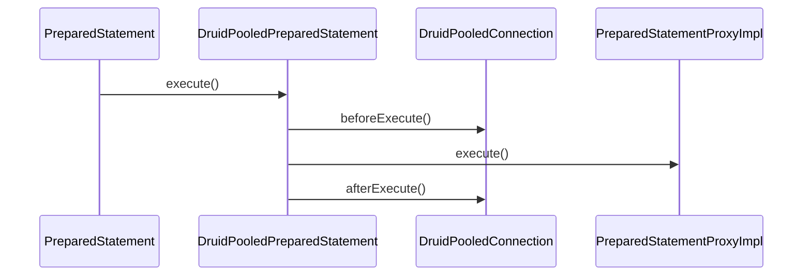

## hierachy

@startuml

interface Statement
interface PreparedStatement

class DruidPooledStatement {
    - final Statement stmt
    # DruidPooledConnection conn
}

class DruidPooledPreparedStatement {
    # PreparedStatement stmt
}

Statement <|-- PreparedStatement
DruidPooledStatement <|-- DruidPooledPreparedStatement

Statement <|.. DruidPooledStatement
PreparedStatement <|.. DruidPooledPreparedStatement

@enduml

## execute

