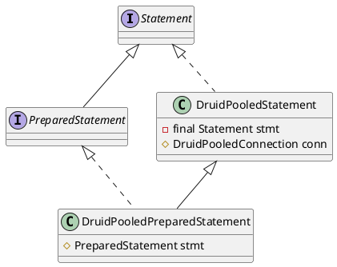
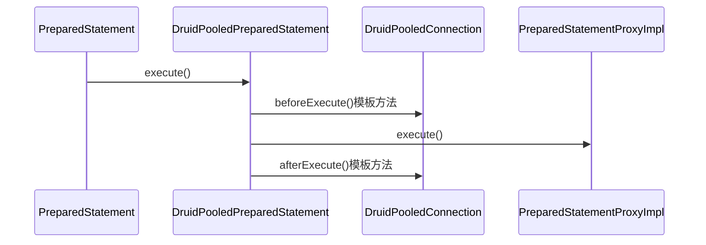

com.alibaba.druid.pool.DruidPooledPreparedStatement

## hierachy
```
PoolableWrapper (com.alibaba.druid.pool)
    DruidPooledStatement (com.alibaba.druid.pool)
        DruidPooledPreparedStatement (com.alibaba.druid.pool)
            DruidPooledCallableStatement (com.alibaba.druid.pool)
DruidPooledStatement (com.alibaba.druid.pool)
    PoolableWrapper (com.alibaba.druid.pool)
        Object (java.lang)
        Wrapper (java.sql)
        Statement (java.sql)
    PreparedStatement (java.sql)
        Statement (java.sql)
            Wrapper (java.sql)
            AutoCloseable (java.lang)
```

## define


## execute

