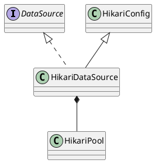

com.zaxxer.hikari.HikariDataSource

## hierarchy
```
HikariConfig (com.zaxxer.hikari)
    HikariDataSource (com.zaxxer.hikari)
HikariDataSource (com.zaxxer.hikari)
    HikariConfig (com.zaxxer.hikari)
        HikariConfigMXBean (com.zaxxer.hikari)
    DataSource (javax.sql)
        CommonDataSource (javax.sql)
        Wrapper (java.sql)
    Closeable (java.io)
```

## define
- AtomicBoolean
- 



## fields
```java
   private final PoolEntryCreator POOL_ENTRY_CREATOR = new PoolEntryCreator(null);
   private final Collection<Runnable> addConnectionQueue;
   private final ThreadPoolExecutor addConnectionExecutor;
   private final ThreadPoolExecutor closeConnectionExecutor;
   private ScheduledExecutorService houseKeepingExecutorService;

   private final ConcurrentBag<PoolEntry> connectionBag;

   private final ProxyLeakTask leakTask;
   private final SuspendResumeLock suspendResumeLock;

   private MetricsTrackerDelegate metricsTracker;
```
