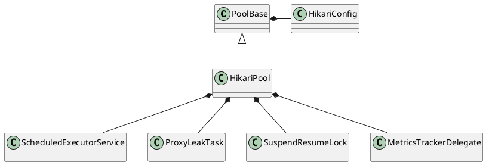

com.zaxxer.hikari.pool.HikariPool

## hierarchy
```
PoolBase (com.zaxxer.hikari.pool)
    HikariPool (com.zaxxer.hikari.pool)
HikariPool (com.zaxxer.hikari.pool)
    PoolBase (com.zaxxer.hikari.pool)
    HikariPoolMXBean (com.zaxxer.hikari)
    IBagStateListener in ConcurrentBag (com.zaxxer.hikari.util)
```

## define
