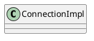

com.mysql.jdbc.ConnectionImpl

### Hierarchy
```
ConnectionImpl (com.mysql.jdbc)
    ConnectionPropertiesImpl (com.mysql.jdbc)
    MySQLConnection (com.mysql.jdbc)
        Connection (com.mysql.jdbc)
            Connection (java.sql)
            ConnectionProperties (com.mysql.jdbc)
        ConnectionProperties (com.mysql.jdbc)

```

## Define


## Methods

### ConnectionImpl
```java
    public ConnectionImpl(String hostToConnectTo, int portToConnectTo, Properties info, String databaseToConnectTo, String url) throws SQLException {
        try {
            this.dbmd = getMetaData(false, false);
            initializeSafeStatementInterceptors();
            createNewIO(false);
            unSafeStatementInterceptors();
        } catch (SQLException ex) {
            cleanup(ex);
    
            // don't clobber SQL exceptions
            throw ex;
        } catch (Exception ex) {
            cleanup(ex);
        }
    }
```