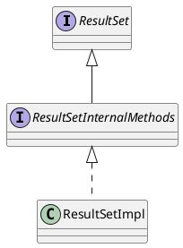

com.mysql.jdbc.ResultSetImpl

## define


```java
public class ResultSetImpl implements ResultSetInternalMethods {
}
```


## methods

### getBoolean
```java
    public boolean getBoolean(String columnName) throws SQLException {
        return getBoolean(findColumn(columnName));
    }

    public boolean getBoolean(int columnIndex) throws SQLException {
        // ...
        switch (sqlType) {
            case Types.BOOLEAN:
                if (field.getMysqlType() == -1) { // from dbmd
                    String stringVal = getString(columnIndex);

                    return getBooleanFromString(stringVal);
                }

                long boolVal = getLong(columnIndex, false);

                return (boolVal == -1 || boolVal > 0);
            case Types.BIT:
            case Types.TINYINT:
            case Types.SMALLINT:
            case Types.INTEGER:
            case Types.BIGINT:
            case Types.DECIMAL:
            case Types.NUMERIC:
            case Types.REAL:
            case Types.FLOAT:
            case Types.DOUBLE:
                boolVal = getLong(columnIndex, false);

                return (boolVal == -1 || boolVal > 0);
        // ...
    }

```