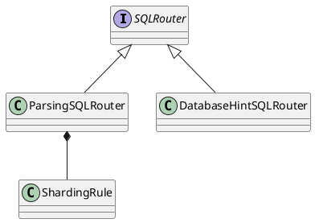

io.shardingjdbc.core.routing.router.ParsingSQLRouter

## hierarchy
```
SQLRouter (io.shardingjdbc.core.routing.router)
    ParsingSQLRouter (io.shardingjdbc.core.routing.router)
    DatabaseHintSQLRouter (io.shardingjdbc.core.routing.router)
```

## define


## methods

### parse
- SQL解析

```java
    @Override
    public SQLStatement parse(final String logicSQL, final int parametersSize) {
        SQLParsingEngine parsingEngine = new SQLParsingEngine(databaseType, logicSQL, shardingRule);
        SQLStatement result = parsingEngine.parse();
        if (result instanceof InsertStatement) {
            ((InsertStatement) result).appendGenerateKeyToken(shardingRule, parametersSize);
        }
        return result;
    }
```


### route
- SQL路由结果
- SQL改写

```java
    @Override
    public SQLRouteResult route(final String logicSQL, final List<Object> parameters, final SQLStatement sqlStatement) {
        SQLRouteResult result = new SQLRouteResult(sqlStatement);
        if (sqlStatement instanceof InsertStatement && null != ((InsertStatement) sqlStatement).getGeneratedKey()) {
            processGeneratedKey(parameters, (InsertStatement) sqlStatement, result);
        }
        RoutingResult routingResult = route(parameters, sqlStatement);
        SQLRewriteEngine rewriteEngine = new SQLRewriteEngine(shardingRule, logicSQL, databaseType, sqlStatement);
        boolean isSingleRouting = routingResult.isSingleRouting();
        if (sqlStatement instanceof SelectStatement && null != ((SelectStatement) sqlStatement).getLimit()) {
            processLimit(parameters, (SelectStatement) sqlStatement, isSingleRouting);
        }
        SQLBuilder sqlBuilder = rewriteEngine.rewrite(!isSingleRouting);
        if (routingResult instanceof CartesianRoutingResult) {
            for (CartesianDataSource cartesianDataSource : ((CartesianRoutingResult) routingResult).getRoutingDataSources()) {
                for (CartesianTableReference cartesianTableReference : cartesianDataSource.getRoutingTableReferences()) {
                    result.getExecutionUnits().add(new SQLExecutionUnit(cartesianDataSource.getDataSource(), rewriteEngine.generateSQL(cartesianTableReference, sqlBuilder)));
                }
            }
        } else {
            for (TableUnit each : routingResult.getTableUnits().getTableUnits()) {
                result.getExecutionUnits().add(new SQLExecutionUnit(each.getDataSourceName(), rewriteEngine.generateSQL(each, sqlBuilder)));
            }
        }
        if (showSQL) {
            SQLLogger.logSQL(logicSQL, sqlStatement, result.getExecutionUnits(), parameters);
        }
        return result;
    }
```