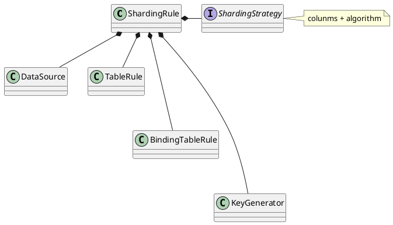

io.shardingjdbc.core.rule

- 绑定数据规则
- 数据节点
- 主备规则
- 分片规则
- 表规则

## Overview

```plantuml
@startuml

class ShardingRule

interface ShardingStrategy
note right: colunms + algorithm

ShardingRule *-- DataSource
ShardingRule *-- TableRule
ShardingRule *- ShardingStrategy
ShardingRule *--- BindingTableRule
ShardingRule *---- KeyGenerator

@enduml
```