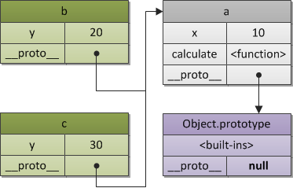

# View Image

this is generated files, just for view image conveniently...

## 2018-react.png

## brower.png

## constructor-proto-chain.png

## execution-context2.png

## jquery-pattern.png

## jquery-sizzle.jpg

## js-core.png

## js-framework.png

## js-loader.png

## js-prototype-chain.png

## js-prototype.png

## js-方法.png

## js-构建.png

## js-模块化.png

## js-模式.png

## js-网络.png

## js-设计模式.png

## libuv-architecture.png

## mvc-mvp-mvvm.png

## prototype-chain.png

