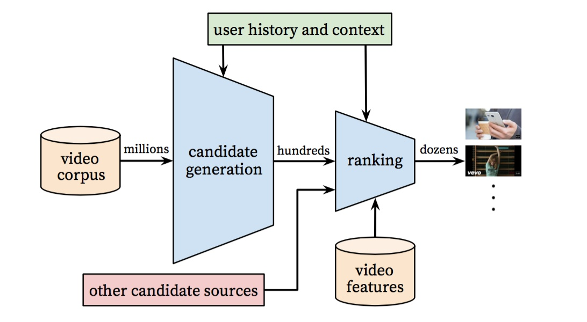
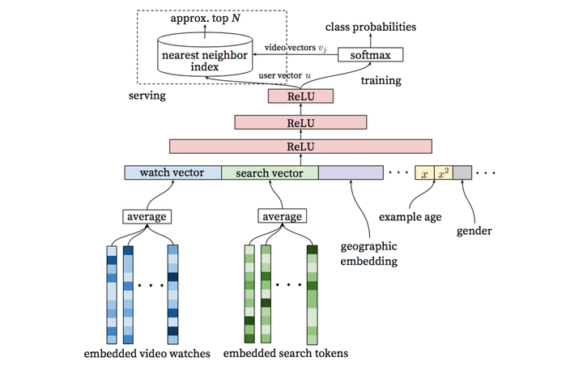

https://zhuanlan.zhihu.com/p/25343518

Deep Neural Network for YouTube Recommendation

## 1. 系统概览
YouTube的推荐系统架构使用经典的**召回（Match或Candidate Generation）和排序（Ranking）**经典的二级架构：

整个推荐系统分为candidate generation（淘宝称为Matching，后面用Matching代替）和Ranking两个阶段。
- Matching阶段通过i2i/u2i/u2u/user profile等方式“粗糙”的召回候选商品，Matching阶段视频的数量是百万级别了；
- Ranking阶段对Matching后的视频采用更精细的特征计算user-item之间的排序分，作为最终输出推荐结果的依据。

之所以把推荐系统划分成Matching和Ranking两个阶段，主要是从性能方面考虑的。
Matching阶段面临的是百万级视频，单个视频的性能开销必须很小；
而Ranking阶段的算法则非常消耗资源，不可能对所有视频都算一遍，实际上即便资源充足也完全没有必要，因为往往来说通不过Matching粗选的视频，大部分在Ranking阶段排名也很低。

## 2. Matching

### 2.1 问题建模
### 2.2 模型架构

整个模型架构是包含三个隐层的DNN结构。输入是用户浏览历史、搜索历史、人口统计学信息和其余上下文信息concat成的输入向量；输出分线上和离线训练两个部分。

### 2.3 主要特征
### 2.4 label and context selection
### 2.5 不同网络深度和特征的实验

## 3. Ranking
Ranking阶段的最重要任务就是精准的预估用户对视频的喜好程度。
不同于Matching阶段面临的是百万级的候选视频集，Ranking阶段面对的只是百级别的商品集，因此我们可以使用更多更精细的feature来刻画视频（item）以及用户与视频（user-item）的关系。

### 3.1 模型架构
Ranking阶段的模型和Matching基本相似，不同的是training最后一层是一个weighted LR层，而serving阶段激励函数用的是$e^2$

### 3.2 特征表达
### 3.3 建模期望观看时长
### 3.4 不同隐层的实验