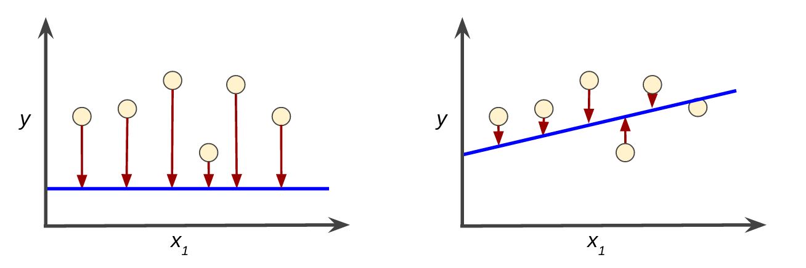
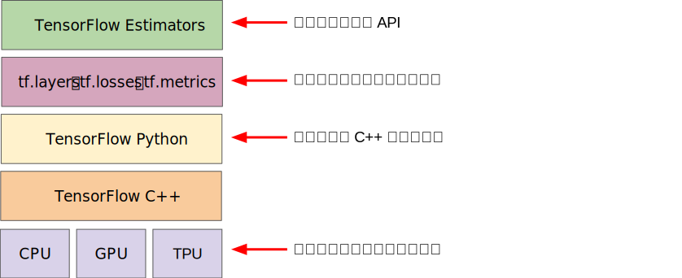
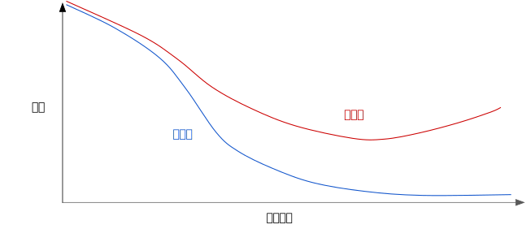
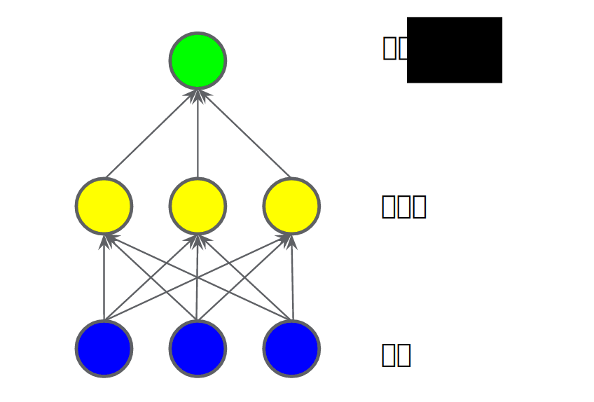
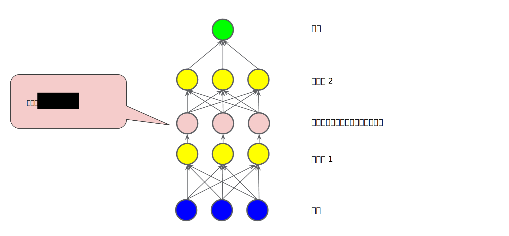
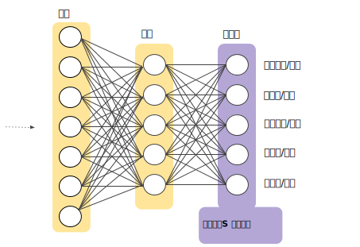
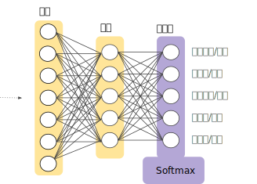
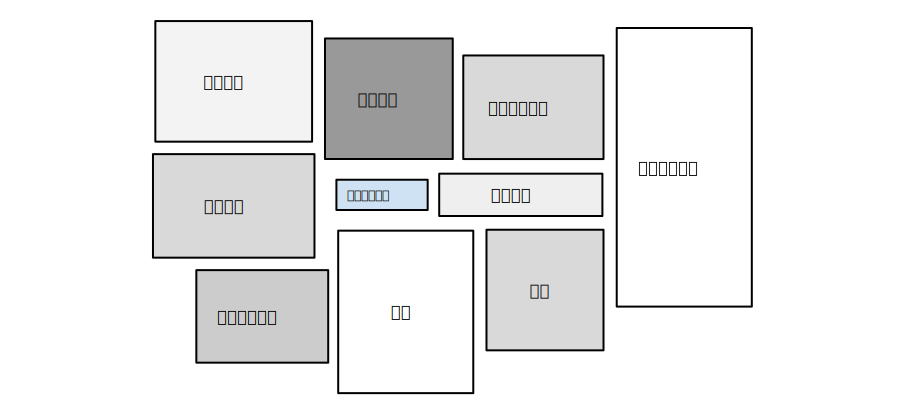

https://developers.google.cn/machine-learning/crash-course/ml-intro

## 1. 机器学习概念

### 框架处理
机器学习系统通过学习如何组合输入信息来对从未见过的数据做出有用的预测。

#### 标签
标签是我们要预测的事物，即简单线性回归中的 y 变量。标签可以是小麦未来的价格、图片中显示的动物品种、音频剪辑的含义或任何事物。

#### 特征
特征是输入变量，即简单线性回归中的 x 变量。简单的机器学习项目可能会使用单个特征，而比较复杂的机器学习项目可能会使用数百万个特征。

#### 样本
样本是指数据的特定实例：x。
- 有标签样本 同时包含特征和标签，使用有标签样本来训练模型。
- 无标签样本 包含特征，但不包含标签。

#### 模型
模型定义了特征与标签之间的关系。模型生命周期的两个阶段：
- **训练**是指创建或学习模型。
- **推断**是指将训练后的模型应用于无标签样本。

#### 回归与分类
回归模型可预测**连续值**。例如，回归模型做出的预测可回答如下问题：
加利福尼亚州一栋房产的价值是多少？
用户点击此广告的概率是多少？

分类模型可预测**离散值**。例如，分类模型做出的预测可回答如下问题：
某个指定电子邮件是垃圾邮件还是非垃圾邮件？
这是一张狗、猫还是仓鼠图片？

```py
y = f(x)
- y 标签
- x 特征
- 样本 x的特定实例，如x0, x1, ...
- f 模型
```

### 深入理解机器学习

#### 线性回归
线性回归是一种找到最适合一组点的直线或超平面的方法。
y = m * x + b

#### 训练与损失
训练模型表示通过**有标签样本**来学习（确定）所有权重和偏差的理想值。
在监督式学习中，机器学习算法通过以下方式构建模型：检查**多个样本**并尝试**找出**可最大限度地**减少损失**的模型；这一过程称为经验风险最小化。

损失是一个数值，表示对于单个样本而言模型预测的准确程度。
如果模型的预测完全准确，则损失为零，否则损失会较大。训练模型的目标是从所有样本中找到一组平均损失“较小”的权重和偏差。




#### 平方损失：一种常见的损失函数
线性回归模型使用的是一种称为平方损失（又称为 L2 损失）的损失函数。
```
  = the square of the difference between the label and the prediction
  = (observation - prediction(x))2
  = (y - y')2
```
均方误差 (MSE) 指的是每个样本的平均平方损失。

### 降低损失

#### 迭代方法
机器学习算法用于训练模型的迭代试错过程：


这种学习过程会持续迭代，直到该算法发现损失可能最低的模型参数。
通常，可以不断迭代，直到总体损失不再变化或至少变化极其缓慢为止。这时候，我们可以说该模型已**收敛**。

#### 梯度下降法

- 梯度下降法的第一个阶段是为w1选择一个起始值（起点）。
- 然后，梯度下降法算法会计算损失曲线在起点处的梯度。梯度是偏导数的矢量，具有大小和方向。
- 梯度始终指向损失函数中增长最为迅猛的方向。梯度下降法算法会沿着负梯度的方向走一步，以便尽快降低损失。
- 一个梯度步长将我们移动到损失曲线上的下一个点。
- 梯度下降法会重复此过程，逐渐接近最低点。


#### 学习速率
梯度矢量具有方向和大小。梯度下降法算法用梯度乘以一个称为学习速率（有时也称为步长）的标量，以确定下一个点的位置。

超参数是编程人员在机器学习算法中用于调整的旋钮。大多数机器学习编程人员会花费相当多的时间来调整学习速率。
- 如果您选择的学习速率过小，就会花费太长的学习时间
- 如果您指定的学习速率过大，下一个点将永远在 U 形曲线的底部随意弹跳

#### 随机梯度下降法
在梯度下降法中，**批量**指的是用于在单次迭代中计算梯度的样本总数。到目前为止，我们一直假定批量是指整个数据集。


### 使用TF的基本步骤



```python
import tensorflow as tf

# Set up a linear classifier.
classifier = tf.estimator.LinearClassifier()

# Train the model on some example data.
classifier.train(input_fn=train_input_fn, steps=2000)

# Use it to predict.
predictions = classifier.predict(input_fn=predict_input_fn)
```

### 泛化
过拟合模型在训练过程中产生的损失很低，但在预测新数据方面的表现却非常糟糕。

### 训练集和测试集
- 训练集 - 用于训练模型的子集。
- 测试集 - 用于测试训练后模型的子集。

请勿对测试数据进行训练。 如果您的评估指标取得了意外的好结果，则可能表明您不小心对测试集进行了训练。例如，高准确率可能表明测试数据泄露到了训练集。

### 验证集
使用验证集评估训练集的效果。然后，在模型“通过”验证集之后，使用测试集再次检查评估结果。

### 表示法
传统编程的关注点是代码。在机器学习项目中，关注点变成了**特征表示**。也就是说，开发者通过添加和改善特征来调整模型。
- 将原始数据映射到特征
- 映射数值
- 映射分类值

### 特征组合
对非线性规律进行编码

特征组合是指通过将两个或多个输入**特征相乘来**对特征空间中的非线性规律进行编码的合成特征。“cross”（组合）这一术语来自 cross product（向量积）。

创建很多不同种类的特征组合。例如：
- [A X B]：将两个特征的值相乘形成的特征组合。
- [A x B x C x D x E]：将五个特征的值相乘形成的特征组合。
- [A x A]：对单个特征的值求平方形成的特征组合。

### 正则化：简单性



某个模型的训练损失逐渐减少，但验证损失最终增加。换言之，该泛化曲线显示该模型与训练集中的数据过拟合。根据奥卡姆剃刀定律，或许我们可以通过**降低复杂模型的复杂度**来防止**过拟合**，这种原则称为正则化。

```py
# 并非只是以最小化损失（经验风险最小化）为目标：
minimize(Loss(Data|Model))

# 而是以最小化损失和复杂度为目标，这称为结构风险最小化：
minimize(Loss(Data|Model) + complexity(Model))
```
训练优化算法是一个由两项内容组成的函数：一个是**损失项**，用于衡量模型与数据的拟合度，另一个是**正则化项**，用于衡量模型复杂度。

通过以下方式来调整正则化项的整体影响：用正则化项的值乘以名为 lambda（又称为正则化率）的标量。
```py
minimize(Loss(Data|Model) + lamda * complexity(Model))
```

### 逻辑回归

逻辑回归会生成一个介于 0 到 1 之间（不包括 0 和 1）的概率值，而不是确切地预测结果是 0 还是 1。
以用于检测垃圾邮件的逻辑回归模型为例。如果此模型推断某一特定电子邮件的值为 0.932，则意味着该电子邮件是垃圾邮件的概率为 93.2%。
更准确地说，这意味着在无限训练样本的极限情况下，模型预测其值为 0.932 的这组样本实际上有 93.2% 是垃圾邮件，其余的 6.8% 不是垃圾邮件。


### 分类

### 正则化：稀疏性
稀疏矢量通常包含许多维度。创建特征组合会导致包含更多维度。由于使用此类高维度特征矢量，因此模型可能会非常庞大，并且需要大量的 RAM。

### 神经网络
神经网络是更复杂版本的特征组合。实质上，神经网络会学习适合的相应特征组合。
- 隐藏层
- 激活函数

输入 -> 隐藏层1 -> 非线性转换层（激活函数） -> 隐藏层2 -> 输出

#### 隐藏层
在下图所示的模型中，我们添加了一个表示中间值的“隐藏层”。隐藏层中的每个黄色节点均是蓝色输入节点值的加权和。输出是黄色节点的加权和。


#### 激活函数
要对非线性问题进行建模，我们可以直接引入非线性函数。我们可以用非线性函数将每个隐藏层节点像管道一样连接起来。


#### 总结
现在，我们的模型拥有了人们通常所说的“神经网络”的所有标准组件：
- 一组节点，类似于神经元，位于层中。
- 一组权重，表示每个神经网络层与其下方的层之间的关系。下方的层可能是另一个神经网络层，也可能是其他类型的层。
- 一组偏差，每个节点一个偏差。
- 一个激活函数，对层中每个节点的输出进行转换。不同的层可能拥有不同的激活函数。

### 训练神经网络
反向传播算法是最常见的一种神经网络训练算法。借助这种算法，梯度下降法在多层神经网络中将成为可行方法。TensorFlow 可自动处理反向传播算法，因此您不需要对该算法作深入研究。

### 多类别神经网络
二元分类模型，该模型可从两个可能的选项中选择其一，例如：
- 特定电子邮件是垃圾邮件还是非垃圾邮件。
- 特定肿瘤是恶性肿瘤还是良性肿瘤。

在本单元中，我们将研究多类别分类，这种模型可从多种可能的情况中进行选择。例如：
- 这条狗是小猎犬、巴吉度猎犬还是寻血猎犬？
- 这朵花是西伯利亚鸢尾花、荷兰鸢尾花、蓝旗鸢尾花还是有髯鸢尾花？
- 那架飞机是波音 747、空中客车 320、波音 777 还是 Embraer 190？
- 这是一张苹果、熊、糖果、狗狗还是鸡蛋的图片？

#### 多类别神经网络 (Multi-Class Neural Networks)：一对多
借助深度神经网络（在该网络中，每个输出节点表示一个不同的类别）创建明显更加高效的一对多模型。



#### 多类别神经网络 (Multi-Class Neural Networks)：Softmax

逻辑回归可生成介于 0 和 1.0 之间的小数。例如，某电子邮件分类器的逻辑回归输出值为 0.8，表明电子邮件是垃圾邮件的概率为 80%，不是垃圾邮件的概率为 20%。很明显，一封电子邮件是垃圾邮件或非垃圾邮件的概率之和为 1.0。

Softmax 将这一想法延伸到多类别领域。也就是说，在多类别问题中，Softmax 会为每个类别分配一个用小数表示的概率。这些用小数表示的概率相加之和必须是 1.0。与其他方式相比，这种附加限制有助于让训练过程更快速地收敛。

Softmax 层是紧挨着输出层之前的神经网络层。Softmax 层必须和输出层拥有一样的节点数。



### 嵌套 (Embedding)
嵌套是一种相对低维的空间，您可以将高维矢量映射到这种低维空间里。
通过使用嵌套，可以让在大型输入（比如代表字词的稀疏矢量）上进行机器学习变得更加容易。在理想情况下，嵌套可以将语义上相似的不同输入映射到嵌套空间里的邻近处，以此来捕获输入的语义。
一个模型学习到的嵌套，也可以被其他模型重用。


#### 嵌套 (Embedding)：协同过滤的目的

协同过滤是一项可以预测用户兴趣（根据很多其他用户的兴趣）的任务。


#### 嵌套 (Embedding)：分类输入数据
分类数据是指用于表示一组有限选项中的一个或多个离散项的输入特征。

分类数据的最高效表示方式是使用稀疏张量（一种含有极少非零元素的张量）。

#### 嵌套 (Embeddings)：转换到低维度空间

#### 嵌套 (Embeddings)：获取嵌套

## 2. 机器学习工程

生产系统机器学习系统：


- 机器学习代码是现实世界生产环境机器学习系统的核心，但它通常最多只占整个生产环境机器学习系统整体代码的 5%
- 生产环境机器学习系统会将大量资源投入到输入数据中 - 收集输入数据、对其进行验证以及从中提取特征
- 尽可能重复使用常规机器学习系统组件
- TensorFlow、Spark、Hadoop

### 静态训练与动态训练

从广义上讲，训练模型的方式有两种：
- 静态模型采用离线训练方式。也就是说，我们只训练模型一次，然后使用训练后的模型一段时间。
- 动态模型采用在线训练方式。也就是说，数据会不断进入系统，我们通过不断地更新系统将这些数据整合到模型中。

静态模型 - 离线训练
- 易于构建和测试 - 使用批量训练和测试，对其进行迭代，直到达到良好效果。
- 仍然需要对输入进行监控
- 模型容易过时

动态模型 - 在线训练
- 随着时间推移不断为训练数据注入新数据，定期同步更新版本。
- 使用渐进式验证，而不是批量训练和测试
- 需要监控、模型回滚和数据隔离功能
- 会根据变化作出相应调整，避免了过时问题

从广义上讲，静态训练和动态训练的选择由以下几点决定：
- 静态模型更易于构建和测试。
- 动态模型可以适应不断变化的数据。世界瞬息万变。基于去年的数据作出的销售预测很可能无法成功预测下一年的情况。

### 静态推理与动态推理

推理策略：
- 离线推理，指的是使用 MapReduce 或类似方法批量进行所有可能的预测。然后，将预测记录到 SSTable 或 Bigtable 中，并将它们提供给一个缓存/查询表。
- 在线推理，指的是使用服务器根据需要进行预测。

离线推理
- 使用 MapReduce 或类似方法批量进行所有可能的预测。
- 记录到表格中，然后提供给缓存/查询表。
- 优点：不需要过多担心推理成本；可以使用批量方法；可以在推送之前对预测之星后期验证
- 缺点：只能对知晓的数据进行预测，更新可能延迟数小时或数天

在线推理
- 使用服务器根据需要进行预测。
- 优点：可以在新项目加入时对其进行预测，非常适合存在长尾的情况
- 缺点：计算量非常大，对延迟较为敏感，可能会限制模型的复杂度；监控需求更多

### 数据依赖性
机器学习系统的行为取决于其**输入特征**的行为和品质。当这些特征的输入数据发生更改时，模型也会随之变化。有时，这种变化是可取的，有时则反之。

在传统的软件开发中，更多地放在**代码**而非数据上。在机器学习开发中，虽然编码仍是工作的一部分，但必须同时**关注数据**。
例如，在传统的软件开发项目中，编写单元测试来验证代码是一种最佳做法。而在机器学习项目中，还必须不断地对输入数据进行测试、验证和监控。

### 公平性
评估机器学习模型
- 计算损失指标
- 训练数据是否存在偏差

偏差类型
- 报告偏差 如果数据集中收集的事件、属性和/或结果的频率未准确反映它们的真实频率
- 自动化偏差
- 选择偏差 如果数据集中选择的样本未能反映样本的真实分布情况
  - 覆盖偏差：未以典型方式选择数据。
  - 未回答偏差（或参与偏差）：由于数据收集过程中存在参与缺口，导致收集的数据不具代表性。
  - 采样偏差：收集数据的过程中未适当地随机化。
- 群体归因偏差 倾向于将个体的真实情况泛化到其所属的整个群体
  - 群内偏差：偏向于您所属群体或具有共同特征的群体内成员。
  - 群外同质性偏差：倾向于对您不属于的某个群体的个体成员抱有成见，或者认为他们都差不多。
- 隐性偏差 如果根据不一定普遍适用的个人心智模型和个人经验做出假设，便会出现隐性偏差。
  - 确认偏差 模型构建者无意中以认可已有观念和假设的方式处理数据
  - 实验者偏差

识别偏差
- 特征值缺失
- 异常特征值
- 数据倾斜

评估偏差
评估模型时，针对整个测试集或验证集计算的指标并不总能准确反映出模型的公平性。


