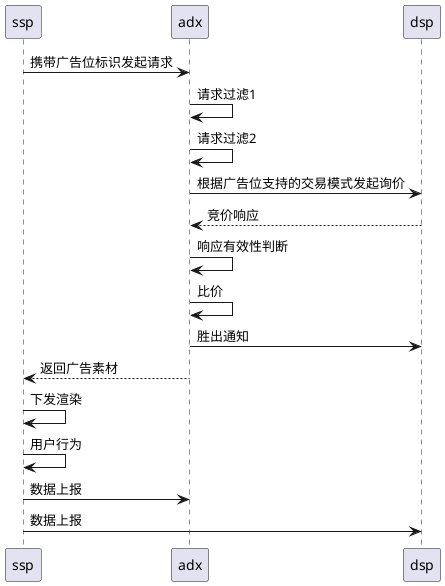
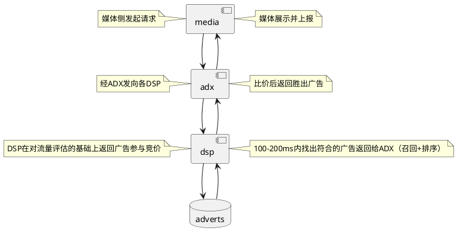

[知乎-产品随想录-广告系列](https://zhuanlan.zhihu.com/p/53912316)

产品随想录
产品的思考感悟和天马行空， 公众号 产品交流汇
1. 广告动态化
2. 目标转化出价
3. 数据管理平台（DMP）
4. 广告的拍卖内核
5. 机制设计
6. 最优机制
7. 最优机制的经济学解释
8. 市场保留价

## 1. 广告动态化

广告是要把合适的内容在合适的时间以合适的方式呈现给合适的人。

程序化创意/动态创意指不同用户看到不同的创意素材，同一用户在不同阶段（首次/非首次看到广告，未转化用户/已转化用户）展示不同的创意，以更符合当时用户的场景。

DPA：动态商品广告，通过对接商品库，根据访客的不同动态/阶段展示不同商品。


## 2. 目标转化出价
计费方式：CPM（展现）、CPC（点击）、CPA（行为）、CPS（分成）、CPD（时间）

OCPX：目标转化出价，广告主设定特定的转化目标及预估的价格，DSP按照转化数据模型优化。

整体业务流程的逻辑：广告主部署监测代码-回传转化数据-平台数据建模-广告主确定优化目标及价格-平台拟合预测数据-动态优化调整。


## 3. 数据管理平台（DMP）

如何确定广告投放的人群就是合适的人

DMP（数据管理平台），目的是通过标签画像细分人群以满足广告主的精准定向，实现广告的有效投放


## 4. 广告的拍卖内核
拍卖的商品是曝光，竞拍者（这里可以具体为广告主）参与拍卖的目的是为了获得曝光，将他们的产品展现在受众面前。

拍卖的主要机制包含两个方面：分配规则和支付规则。

分配规则决定拍卖品如何分配。规则可以是先到先得、随机抽取、价高者得，最后者得，全看拍卖者的心情，在拍卖理论中报价最高者得是一种标准拍卖；

支付规则决定竞拍者如何支付费用。规则可以是支付最高报价（FP）、支付第二高价（SP）、支付由于自己参与给别人造成的损失（VCG）。

```javascript
ECPM竞价排名：
ECPM = 1000 * pCTR * bid
bid是针对点击的出价，pCTR指广告的预估点击率。
```

## 5. 机制设计

估价
报价

配置规则：报价最高者得
支付规则：买家i 支付的数额等于由于自身参与给其他买家带来的损失之和

## 6. 最优机制
直接机制不能保证每次竞拍使得拍卖者的收益最大化。最优机制使得每次收益最大化。

分配规则：
价高者得，此时的价指买家虚拟估价的价格，即把拍卖品分配给虚拟估价最高的竞拍者，因为没有假设买家是对称的，所以不同买家有不同的虚拟估价函数，不同函数的斜率可能不同，估价最高的买家虚拟估价不一定是最高的，所以说在最优机制下的拍卖不是一个公平的机制。

支付规则：

二价结算，假设买家i的虚拟估价最高，那么此时买家i的支付为：
T = Y ^ -1 (A)
其中 Y ^ -1 是买家 i 虚拟估价函数的反函数，Y-i 是除买家 i 以外虚拟估价最高者，称该机制是不带保留价的最优机制。


## 7. 最优机制的经济学解释
分配规则是虚拟估价最高者得，支付规则是二价计费

## 8. 市场保留价
在一次拍卖中如果所有买家的报价均小于卖家的估价时，则拍卖品不出售由卖家保留，此时卖家的估价就是保留价，也叫底价，全称市场保留价

卖家设置保留价的原因是什么
- 不想亏本
- 为了增加拍卖时竞价环境的激烈程度，保障卖家收益。

设置保留价对拍卖的整体的影响是什么
- 拍卖可能不再有效
- 竞得者的支付函数可能发生变化

保留价有诸多好处，卖家在具体某次拍卖中如何设置保留价
- 定价太高则拍卖品卖不出去，此时卖家效用为 `u=0` ；
- 定价太低在竞价不充分时则买家 `i` 可能以很低的价格获得物品，此时卖家效用 `u` 没有达到预期。

对于广告系统而言，粗一些的做法是根据广告主们的历史竞价情况，取一个使填充率没有明显下降的固定值作为保留价，相对比较简单，一定程度上也可以防止广告主无限下探出价，降低平台收益；
精细一些就是针对不同广告主设置不同的动态底价，这对数据和模型的要求比较高，当然广告平台的收益也会相应增加，有本事多赚钱的道理

## 9. 动态保留价
从计算上讲，动态保留价与固定保留价相比，主要差别在于针对**不同的广告主**设置不同的价格上，更加精细，千人千面就需要了解广告主的特性及对广告曝光的估价分布。

## 10. 价格挤压因子
$$ecpm = 1000 * pCTR^p * bid_c $$ $$其中 p > 0, 0 < pCTR > 1, bid_c > r, r为保留价$$

## 11. 预算消耗控制 (上)
中小广告主每天预算是有限额的，按照ecpm排序分配流量，则很多广告主会短时间内快速消耗完预算停止竞价，只能等新周期开始才能重新参与。

## 12. 预算消耗控制 (中)
计算实际累计消耗和计划累计消耗，实际消耗大于计划则降低参竞率，小于计划则提升参竞率，每次目标请求发起时通过概率丢弃部分广告请求。

## 13. 预算消耗控制 (下)
各层按照不同的参竞率来参与竞价，从而实现控制预算消耗的速度，同时有效提升广告效果。

## 14. ADX (上) ADX的定位及广告交易主流程
ADX，它对接上下游，工作主要包括以下方面：
- 一手接入流量（SSP/媒体）帮供给端完成流量变现；
- 一手接入广告（DSP）帮需求端完成广告曝光。

### ADX的定位
交互中DSP是有很大广告主成分，提供广告素材、出价、定向要求等，SSP有很大程度媒体成分，限定广告位底价、素材样式、过滤策略等，
双方在ADX提出各自要求，ADX进行匹配、过滤、比价、分配，最终把某个广告分配给某个位置上的一次展示，完成交易满足各方需求。
产品定位确定用户和需求，用户需求确定产品功能，由此可以得出如下结论：
> ADX是广告交易撮合人，通过比价的方式促成广告交易。


## 15. ADX（中） ADX与DSP之间的交互
ADX与DSP之间的交互。
> 二者交互是为了保证询价-出价-竞价-竞得的顺利进行，并最终促成广告曝光的发生。

## 16. ADX (下) ADX与DSP实时竞价
广告交易中请求-询价-出价-竞价都在实时进行：请求用户、广告场景，广告预算、报价，参与比价的DSP数量、竞价的激烈程度都会不同，反映了最新的情况，这也是RTB广告的精髓。

## 16. ADX (尾) ADX的请求、流量分配与计费

## 20. 召回与排序
实时竞价广告整体链路中，媒体侧发起请求，经ADX发向各DSP，DSP在对流量评估的基础上返回广告参与竞价，ADX比价后返回胜出广告，媒体展示并上报完成一次广告全流程。其中DSP在接收到广告请求后，需要在100-200ms内找出符合的广告返回给ADX，广告库中的候选数量庞大，一般在几十万-几百万之间，要在极短时间内完成对海量广告的打分评估，业界普遍的做法与推荐系统类似分为两个主要环节：召回+排序。


### 召回
召回的目的在于减少候选的数量(尽量控制在1000以内)，方便后续排序环节使用复杂模型精准排序。
因为在短时间内评估海量候选，所以召回的关键点是个快字，受限与此与排序相比，召回的算法模型相对简单，使用的特征比较少。
业界普遍采用的方式是多路召回，即从多个维度出发在海量库里把相关度高的候选尽可能找出来。多路同时召回是出于多方面的考虑：
- 多样性，从不同维度出发去找到相关的候选；
- 鲁棒性，即使一路召回出现问题，其他召回通路也会正常运行不至于阻塞主流程；
- 可解释与灵活性，每一路从单独维度出发可以很好解释召回的逻辑，如果效果不理想调整起来复杂度低更加灵活。

### 排序
如果说召回是提供可能性，则排序是提供确定性：把最合适的候选找出来推给用户。
排序细化可以分为粗排、精排、重排。
- 粗排是召回阶段返回的候选数量还是太多，精排直接处理性能上不能满足，粗排用简单模型再做一次过滤减少数量，是个可选环节；
- 重排则是出于业务考虑，对精排后的结果进行处理：多样性、频控、类别控制、特定结果提权等；
- 精排是整个排序的关键，是各路模型的主战场，也是我们讨论的主角。

## 21. 召回与排序（二） 召回排序的异同与目标一致性问题
召回与排序的异同
- 相同点 召回与排序都是通过特征选取、模型构造，对候选集进行打分/排序/截断，将不符合的候选过滤，符合条件的候选进入下一环节，总体来讲召回排序环节选出了合适的候选。
- 差异点
  - 数据环境的差异
  - 模型处理的差异

召回与排序目标一致性
推荐和广告在很多方面有相似性，其实二者之间是有本质区别的。
> 推荐：推荐系统产生的背景是因为商品/内容量级太大，用户想找到感兴趣的内容需要花费一定成本/时间，基于此提出推荐系统帮助用户快速找到感兴趣的内容，在相关性的基础上需要同时考虑内容的多样性、新颖和时效性，不能只根据用户行为历史生成推荐内容，否则容易造成用户审美疲劳，所以既要利用已知又要探索新的内容。从根本上讲属于用户体验问题，服务于用户满意度，最终提升用户活跃和留存，所以推荐的整体目标是：**把用户喜欢的东西推荐给用户**。

> 广告：广告是从商业化角度出发，为了变现获取收益，与推荐相比广告的目标/诉求更加纯粹：**收益最大化**。在实时竞价广告中拍卖的商品是曝光，所以具化为曝光收益最大化。实际场景中考虑了收益最大化以外的因素一般都是广告和其他业务/场景在折中妥协后的结果(搜索场景的相关性/展示场景的类别/次数限制等)，换个角度看也是为了广告走的更长远。

## 22. 召回与排序（三） 机器学习

机器学习是根据已知(数据)去训练假设模型，训练就是不断优化模型的过程，当损失函数最小时对真相的拟合达到最优，此时去预估结果。

1、问题建模。
2、采样训练数据。
3、特征提取和选择。
4、模型选择。
5、构造损失函数。
6、训练/优化。
7、性能评估。
8、线上AB测试。

## 23. 召回与排序（四）样本数据和特征提取

## 24. 召回与排序（五）模型的发展

- LR
- MLR
- DT
- FM
- FFM
- NN
- 双塔结构
- Embedding
- Attention
- Pooling
- wide&deep
- deepFM
- DCN
- PNN


## 25. 分配与定价

## 26. 分配与定价（二）

## 27. 分配与定价（三）
拍卖本质上是一种有效的价格发现机制，借助参与人的策略(报价)来间接反映其类型(估价)，而非让参与人直接报告其类型属于间接机制。

## 28. 分配与定价（四）
对于互联网广告而言，用户行为序列基本如下：
- 搜索广告：搜索-浏览-点击-浅度转化(咨询/关注/下载)-深度转化(付费/激活/留存)。
- 展示广告：浏览-点击-浅度转化-深度转化。
- 当用户行为到达最后一步转化时广告传播完成了任务。


