## 1. 什么是机器学习
机器学习是从**数据中自动分析获得模型**，并利用**模型**对未知数据进行**预测**。

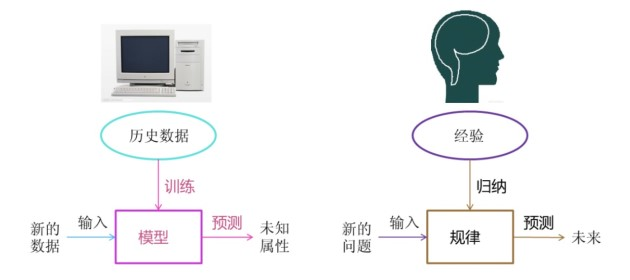

## 2. 机器学习工作流程
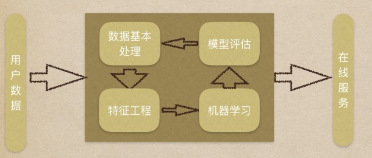

1. 获取数据
2. 数据基本处理
3. 特征工程
4. 机器学习（模型训练）
5. 模型评估
   - 结果达到要求，上线服务
   - 没有达到要求，重新上述步骤

### 2.1 获取到的数据集
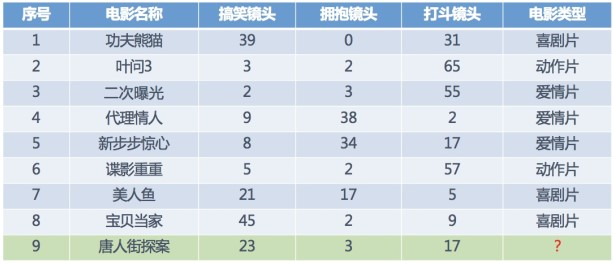

在数据集中一般：
- 一行数据称为一个样本
- 一列数据称为一个特征
- 有些数据有目标值（标签值），有些数据没有目标值

数据类型构成
- 数据类型一：特征值 + 目标值（目标值是连续的和离散的）
- 数据类型二：只有特征值，没有目标值

数据分隔：
- 机器学习一般的数据集会划分为两个部分：
  - 训练数据：用于训练，构建模型
  - 测试数据：在模型检验时使用，用于评估模型是否有效
- 划分比例：
  - 训练集：70% 80% 75%
  - 测试集：30% 20% 25%

### 2.2 数据基本处理
即对数据进行缺失值、去除异常值等处理

### 2.3 特征工程
#### 2.3.1 什么是特征工程
特征工程是使用专业背景知识和技巧处理数据，使得特征能在机器学习算法上发挥更好的作用的过程。
- 意义：会直接影响机器学习的效果

#### 2.3.2 为什么需要特征工程（Feature Engineering）

#### 2.3.3 特征工程包含内容
- 特征提取
将任意数据（如文本或图像）转换为可用于机器学习的数字特征
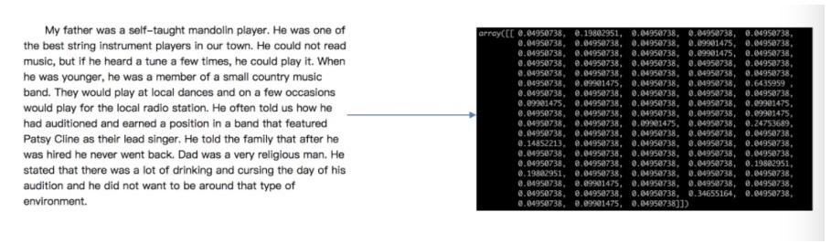

- 特征预处理
通过一些转换函数将特征数据转换成更加适合算法模型的特征数据过程
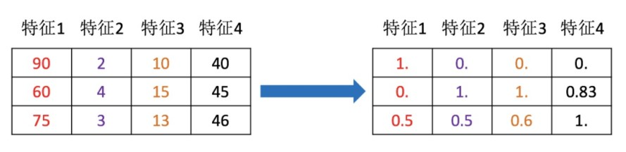

- 特征降维
指在默写特定条件下，降低随机变量（特征）个数，将得到一组“不想关”主变量的过程
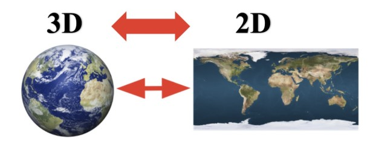

### 2.4 机器学习（模型训练）
选择合适的算法对模型进行训练。
根据数据集组成不同，可以把机器学习算法分为：监督学习、无监督学习、半监督学习、强化学习

#### 2.4.1 监督学习
输入数据是由输入特征值和目标值所组成的。
- 回归 函数的输出可以是一个连续的值
- 分类 函数的输出是一个离散的值

##### 2.4.1.1 回归问题
例如：预测房价，根据样本集你和出一条**连续**曲线。

##### 2.4.1.2 分类问题
例如：根据肿瘤特征判断良性还是恶性，得到结果是“良性”或者“恶性”，是**离散**的。
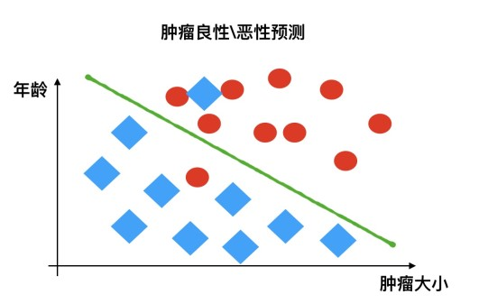

#### 2.4.1 无监督学习
输入数据是由输入特征值组成，没有目标值
- 输入数据没有被标记，也没有确定的结果。样本数据类别未知
- 需要根据样本间的相似性对样本集继续类别划分

监督学习与无监督学习对比：
- 监督学习，输入的数据有特征值，有目标值
  - 目标值连续：回归
  - 目标值离散：分类
- 无监督学习，输入的数据有特征值，无目标值

#### 2.4.1 半监督学习
训练集同时包含有标记样本数据和未标记样本数据。

监督学习训练方式：
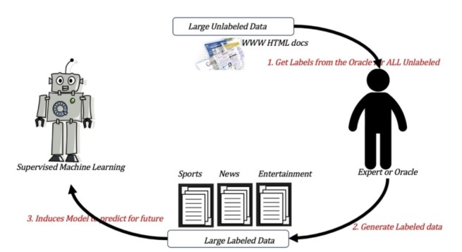

半监督学习训练方式：
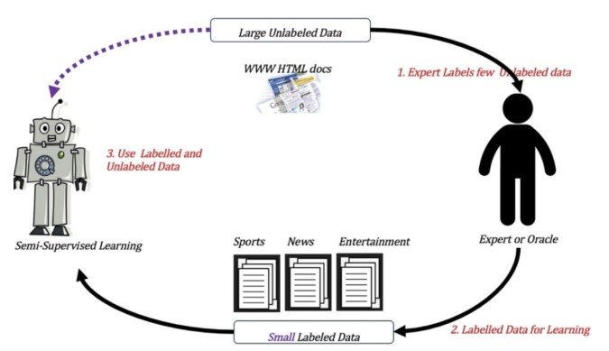

#### 2.4.1 强化学习
实质是make decisions问题，即自动进行决策，并且可以做连续决策。强化学习的目标就是**获得最多的累计奖励**。

举例：小孩想要走路，但在这之前，他需要先站起来，站起来之后还要保持平衡，接下来还要先迈出一条腿，是左腿还是右腿，迈出一步后还要迈出下一步。

小孩就是 agent，他视图通过采取行动（即行走）来操纵环境（行走的表面），并且从一个状态转变到另一个状态（即他走的每一步），当他完成任务的子任务（即走了几步）时，
孩子得到奖励（给吃巧克力），并且当他不能走路时，就不会给吃巧克力。

主要包含五个元素：agent、action、reward、environment、observation

强化学习是智能体（Agent）以“试错”的方式进行学习，通过与环境进行交互获得的奖赏指导行为，目标是使智能体获得最大的奖赏。

围棋AI：AlphaGo、绝艺、DeepZenGo

监督学习与强化学习的对比：
|          | 监督学习                                                     | 强化学习                                                                         |
| :------- | :----------------------------------------------------------- | :------------------------------------------------------------------------------- |
| 反馈映射 | 输出的是之间的关系，可以告诉算法什么样的输入对应什么样的输出 | 输出的是给机器的反馈reward function，即用来判断这个行是好是坏                    |
| 反馈时间 | 做了比较坏的选择会立刻反馈给算法                             | 结果反馈有延时，有时候会可能需要走了很多多步以后才知道以前的某一步的选择是好是坏 |
| 输入特征 | 输入是独立同分布的                                           | 面对的输入总是在变化，每当算法做出一个行为，它影响下一次决策的输入               |

小结：
|            | In                     | Out  | 目的               | 案例               |
| :--------- | :--------------------- | :--- | :----------------- | :----------------- |
| 监督学习   | 有标签                 |      | 预测结果           | 猫狗分类、房价预测 |
| 无监督学习 | 无标签                 |      | 发现潜在结构       | 物以类聚、人以群分 |
| 半监督学习 | 部分有标签，部分无标签 |      | 降低数据标记的难度 |                    |
| 强化学习   | 决策流程及激励系统     |      | 长期利益最大化     | 学下棋             |

### 2.5 模型预估
对训练好的模型进行预估。按照数据集的目标值不同，可以把模型预估分为**分类模型**和**回归模型**评估。

#### 2.5.1 分类模型预估

准确率：预测正确的数占样本总数的比例
其他评价指标：精确率、召回率、F1-score、AUC指标等

#### 2.5.2 回归模型评估
均方根误差（Root Mean Squared Error，RMSE）
- RMSE是一个衡量回归模型误差率的常用公式，不过，它仅能比较误差是相同单位的模型。

$$ RMSE = \sqrt { \frac { \sum_{i=1}^n (p_i - a_i)^2 }{n} } $$
a = actual target
p = predicted target

其他评价指标：相对平方误差（Relative Squared Error， RSE）、平均绝对误差（Mean Absolute Error，MAE）、相对绝对误差（Relative Absolute Error，RAE）

#### 2.5.3 拟合
模型评估用于评价训练好的模型的表现效果，其表现效果大致可分为两类：过拟合、欠拟合。

在训练模型中，可能会遇到如下问题：
训练数据训练的很好啊，误差也不大，为什么在测试集上面有问题呢？
当算法在某个数据集中出现这种情况，可能就出现了拟合问题。

##### 2.5.3.1 欠拟合
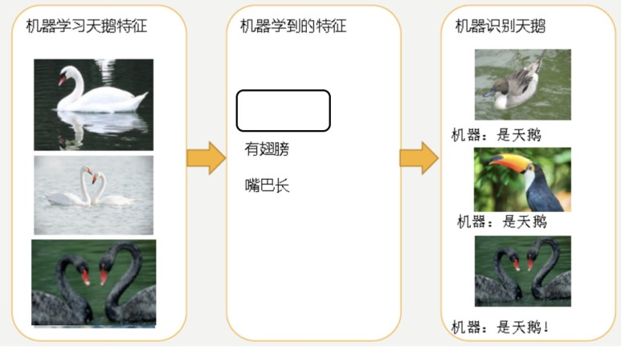

因为机器学习到的天鹅特征太少了，导致区分标准太粗糙，不能准确识别出天鹅。

欠拟合（under-fitting）：模型学习的太过粗糙，连训练集中的杨文数据特征关系都没有学出来。
- 学习到的东西太少
- 模型学习的太过粗糙

##### 2.5.3.2 过拟合
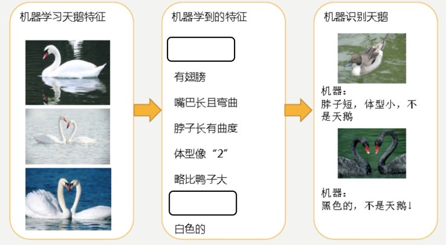

机器已经基本能识别天鹅和其他动物了。然后，很不巧已有的天鹅图标全是白天鹅的，于是机器经过学习后，
会认为天鹅的羽毛都是白色的，以后看到羽毛是黑色的天鹅就会认为那不是天鹅。

过拟合（over-fitting）：所建的机器学习模型或者是深度学习模型在训练样本中表现的过于优越，导致在测试数据集中表现不佳。
- 学习到的东西太多
- 学习到的特征多，不好泛化