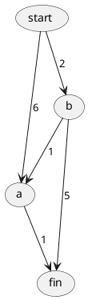

《算法图解》袁国忠译 中国工信出版社 人民邮电出版社

* 数据结构、查找、排序
  * 算法简介 二分查找、大O表示法
  * 选择排序 数组和链表
  * 递归 栈和队列
  * 快速排序 **分而治之**
  * 散列表 冲突、装载因子
* 算法
  * 广度优先算法 图、队列、双端队列
  * 狄克斯特拉算法
  * 贪婪算法
  * 动态规划
  * K最近邻算法
* 接下来
  * 树
  * 反向索引
  * 傅里叶变换
  * 并行算法
  * MapReduce
  * 布隆过滤器和HyperLogLog
  * SHA算法
  * 局部敏感的散列算法
  * Diffie-Hellman密钥交换
  * 线性规划

## 第1章 算法简介
### 1.1 引言
### 1.2 二分查找
### 1.3 大O表示法
#### 1.3.3　大O表示法指出了最糟情况下的运行时间
#### 1.3.4　一些常见的大O运行时间
从快到慢大O运行时间
* O(log n) 对数时间，这样的算法包括二分查找
* O(n) 线性时间，这样的算法包括简单查找
* O(n * log n) 快速排序，速度较快的排序算法
* O(n^2) 选择排序，速度较慢的排序算法
* O(n!) 旅行商问题

大O的启示 
* 算法的速度指的并非时间，而是操作数的增速
* 谈论算法的速度时，我们说的是随着输入的增加，其运行时间将以什么样的速度增加
* 算法的运行时间用大O表示法表示
* O(log n)比O(n)快，当需要搜索的元素越多时，前者比后者快得越多

## 第2章 选择排序
### 2.1 内存的工作原理
### 2.2 数组和链表

|      | 数组 | 链表 |
| :--- | :--- | :--- |
| 读取 | O(1) | O(n) |
| 插入 | O(n) | O(1) |
| 删除 | O(n) | O(1) |

```
O(n) = 线性时间 
O(1) = 常量时间
```

* 数组 随机访问 用的较多，读取速度快
* 链表 顺序访问

### 2.3 选择排序
* 遍历列表，选出最大的，添加到新列表中
* 再遍历列表，选出次大的，添加到新列表中
* O(n^2)

```python
def findSmallest(arr):
    smallest = arr[0]
    smallest_index = 0
    for i in range(1, len(arr)):
        if arr[i] < smallest:
            smallest = arr[i]
            smallest_index = i
    return smallest_index

def selectionSort(arr):
    newArr = []
    for i in range(len(arr)):
        smallest = findSmallest(arr)
        newArr.append(arr.pop(smallest))
    return newArr

print selectionSort([5, 3, 6, 2, 10])
```

## 第3章 递归
### 3.1 递归
recursion
### 3.2 基线条件和递归条件
编写递归函数时，必须告诉它如何停止递归。
递归条件指的是函数调用自己，而基线条件则指的是函数不再调用自己，从而避免形成无限循环。

### 3.3 栈
#### 3.3.1 调用栈
call stack
#### 3.3.2 递归调用栈

```python
def fact(x):
    if x == 1:
        return 1
    else:
        return x * fact(x - 1)
```

## 第4章 快速排序
divide and conquer, D&C
### 4.1 分而治之
D&C两个步骤
1. 找出基线条件，这种条件必须尽可能简单
2. 不断将问题分解（或者缩小规模），直到符合基线条件

递归记录了状态
##### 函数式编程
Haskell等函数式编程没有循环，只能使用递归编写。
### 4.2 快速排序
1. 从数组中选择一个元素，这个元素被称为基准值（pivot）
2. 找出比基准值小的元素以及比基准值大的元素，称之为分区（partitioning）
   * 一个由所有小于基准值的元素组成的子数组
   * 基准值
   * 一个由所有大于基准值的元素组成的子数组
3. 对这两个子数组进行快速排序（递归地调用快速排序）

```python
def quicksort(array):
    if len(array) < 2:
        return array
    else:
        pivot = array[0]
        less = [i for i in array[1:] if <= pivot]
        greater = [i for i in array[1:] if i > pivot]
        return quicksort(less) + [pivot] + quicksort(greator)

print quicksort([10, 5, 2, 3])
```

### 4.3 再谈大O表示法
选择排序，其运行时间为`O(n^2)`
合并排序（merge sort）的排序算法，其运行时间为`O(nlog n)`，比选择排序快得多。
#### 4.3.1 比较合并排序和快速排序
在大O表示法O(n)中，n实际上指的：`c * n`。
c是算法所需的固定时间量，被称为常量。通常不考虑，但有时候常量影响可能很大，比如快速查找。

#### 4.3.2 平均情况和最糟情况
快速排序的性能高度依赖如你选择的基准值。


## 第5章 散列表
散列表的内部机制：实现、冲突和散列函数。
### 5.1 散列函数
无论你给它什么数据，它都还你一个数字。
散列函数将输入映射到数字。

散列函数准确、快速地指出存储位置
* 1散列函数总是将**相同的输入**映射到**相同的索引**
* 1散列函数将不同的输入映射到不同的索引
* 散列函数知道数组有多大，只返回有效的索引

散列表也被称为散列映射、映射、字典和关联数组。

### 5.2 应用案例
#### 5.2.1 将散列表用于查找
HashMap
#### 5.2.2 防止重复
幂等操作
#### 5.2.3 将散列表用作缓存
Redis
### 5.3 冲突
数组 + 链表
### 5.4 性能

|      | 平均情况 | 最糟情况 |
| :--- | :------- | :------- |
| 查找 | O(1)     | O(n)     |
| 插入 | O(1)     | O(n)     |
| 删除 | O(1)     | O(n)     |

查找时间
1. 简单查找 线性时间 O(n)
2. 二分查找 对数时间 O(log n)
3. 散列表   常量时间 O(1)

#### 5.4.1 填装因子
```python
填装因子 = 散列表包含的元素数 / 位置总数
```

#### 5.4.2 良好的散列函数

## 第6章 广度优先搜索
广度优先搜索让你能够找出两样东西之间的最短距离。
### 6.1 图简介
### 6.2 图是什么
图由节点（node）和边（edge）组成。
### 6.3 广度优先搜索
#### 6.3.1 查找最短路径
在广度优先搜索的执行过程中，搜索范围从**起点开始**逐渐**向外延伸**，即先检查一度关系，再检查二度关系。
#### 6.3.2 队列
两种操作：入队和出队。队列，先进先出FIFO；栈，后进先出LIFO。
### 6.4 实现图
有向图，有箭头，关系是单向的。
无向图，没有箭头，直接相连的节点互为邻居。

### 6.5 实现算法
双端队列（deque，全名double-ended queue）是一个限定插入和删除操作的数据结构，具有队列和栈的性质。双端队列中的元素可以从两端弹出，其限定插入和删除操作在表的两端进行。

```python
def search(name):
    search_queue = deque();
    search_queue += graph[name]
    searched = []
    while search_queue:
        person = search_queue.popleft()
        if person not in searched:
            if person is_seller(person):
                print person + " is a mango seller!"
            else:
                search_queue += graph[person]
                searched.append(person)
    return False

search("you")
```

## 第7章 狄克斯特拉算法
Dijkstra's algorithm
最短路径，最快路径。
### 7.1 使用狄克斯特拉算法
狄克斯特拉算法步骤
1. 找出最便宜的节点，即可在最短时间内前往的节点
2. 对于该节点的邻居，检查是否有前往他们的更短路径，如果有，就更新其开销
3. 重复这个过程，知道对图中的每个节点都这样做了
4. 计算最终路径
   
### 7.2 术语
狄克斯特拉算法用于每条边都有关联数字的图，这些数字称为权重（weight）。
带权重的图成为加权图（weighted graph），不带权重的图称为非加权图（unweighted graph）。

要计算非加权图中的最短路径，可使用广度优先算法。要计算加权图中的最短路径，可使用狄克斯特拉算法。

无向图意味着**两个节点彼此指向对方**，其实就是环。在无向图中，每条边都是一个环。

狄克斯特拉算法只适用于有向无环图（directed acyclic graph，DAG）。
### 7.3 换钢琴
### 7.4 负权边
在包含负权边的图中，要找出最短路径，可使用贝克曼-福德算法（Bellman-Ford algorithm）。

### 7.5 实现


```python
# graph
graph = {}
graph["start"] = {}
graph["start"]["a"] = 6
graph["start"]["b"] = 2

graph["a"] = {}
graph["a"]["fin"] = 1

graph["b"] = {}
graph["b"]["a"] = 3
graph["b"]["fin"] = 5

graph["fin"] = {}

# costs
infinity = float("inf")
costs = {}
costs["a"] = 6
costs["b"] = 2
costs["fin"] = infinity

# parents
parents = {}
parents["a"] = "start"
parents["b"] = "start"
parents["fin"] = None

# processed = []
node = find_lowest_cost_node(consts)
while node is not None:
    cost = consts[node]
    neighbors = graph[node]
    for n in neighbors.keys():
        new_cost = cost + neighbors[n]
        if costs[n] > new_cost:
            consts[n] = new_cost
            parents[n] = node
    processed.append(node)
    node = find_lowest_cost_node(costs)

def find_lowest_cost_node(costs):
    lowest_cost = float("inf")
    lowest_cost_node = None
    for node in costs:
        cost = costs[node]
        if cost < lowest_cost and node not in processed:
            lowest_cost = cost
            lowest_cost_node = node
    return lowest_cost_node
```

## 第8章 贪婪算法
### 8.1 教室调度问题
贪婪算法的优点：简单易行。每步都采取最优的做法。
每步都选择局部最优解，最终得到的就是全局最优解。

### 8.2 背包问题
### 8.3 集合覆盖问题
#### 近似算法
集合类似于列表，只是不能包含重复的元素；可以执行一些集合运算，如并集、交集和差集。
贪婪算法：广度优先算法、狄克斯特拉算法；

### 8.4 NP完全问题
NP完全问题(NP-C问题)，是世界七大数学难题之一。 
NP的英文全称是Non-deterministic Polynomial的问题，即多项式复杂程度的非确定性问题。
简单的写法是 NP=P？，问题就在这个问号上，到底是NP等于P，还是NP不等于P。

#### 8.4.1 旅行商问题详解
#### 8.4.2 如何识别NP完全问题

## 第9章 动态规划
### 9.1 背包问题
动态规划先解决子问题，再逐步解决大问题。
### 9.2 背包问题FAQ
### 9.3 最长公共子串
动态规划法启示
* 动态规划可帮助你在**给定约束条件**下找到最优解。在背包问题中，你必须在背包容量给定的情况下，偷到价值最高的商品。
* 在问题可分解为彼此独立且离散的子问题时，就可使用动态规划来解决。

动态规划法小贴士
* 每种动态规划解决方案都涉及网格
* 单元格中的值通常就是你要优化的值。
* 每个单元格都是一个子问题，因此你应该考虑如何将问题分成子问题，有助于找出网络的坐标轴。

#### 9.3.1 绘制网格
有些算法并非精确的解决步骤，而只是帮助你理清思路的框架。
#### 9.3.2 填充网格
#### 9.3.3 揭晓答案
#### 9.3.4 最长公共子序列
#### 9.3.5 最长公共子序列之解决方案

动态规划的实际应用：
* 生物学家根据最长公共序列来确定DNA链的相似性
* git diff等命令，指出两个文件的差异
* 编辑距离指出了两个字符串的相似程度。拼写检查是否盗版
* Microsoft Word的断字功能，什么地方断字保证行长一致

## 第10章 K最近邻算法
* 学习K最近邻算法创建分类系统。
* 学习特征抽取
* 学习回归，即预测数值。
  
K最近邻(k-Nearest Neighbor，KNN)分类算法，是一个理论上比较成熟的方法，也是最简单的机器学习算法之一。
该方法的思路是：如果一个样本在特征空间中的k个最相似(即特征空间中最邻近)的样本中的大多数属于某一个类别，则该样本也属于这个类别。 
### 10.1 橙子还是柚子
### 10.2 创建推荐系统
#### 10.2.1 特征抽取
#### 10.2.2 回归
使用KNN来做两项基本工作：分类和回归。分类就是编组；回归就是预测数据。
#### 10.2.3 挑选合适的特征
### 10.3 机器学习简介
#### 10.3.1 OCR
OCR指的是光学字符识别（optical character recognition），这意味着你可拍摄印刷页面的照片，计算机将自动化识别出其中的文字。
Google使用OCR来实现图书数字化。

如何自动识别数字，可使用KNN：
1. 浏览大量的数字图像，将这些数字的特征提取出来
2. 遇到新图像时，提取该图像的特征，再找出它最近邻的邻居都是谁

OCR提取线段、点和曲线等特征。
OCR的第一步是查看大量的数字图像并提取特征，这被称为训练（training）。
大多数机器学习算法都包含训练的步骤：要让计算机完成任务，必须训练它。

#### 10.3.2 创建垃圾邮件过滤器
#### 10.3.3 预测股票市场

## 第11章 接下来如何做
### 11.1 树
数组 二分查找

二叉查找树 对于其中每个节点，左子节点的值都比它小，右子节点的值都比它大

有序数组和二叉查找树

|      | 数组     | 二叉查找树 |
| :--- | :------- | :--------- |
| 查找 | O(log n) | O(log n)   |
| 插入 | O(n)     | O(log n)   |
| 删除 | O(n)     | O(log n)   |

B树、红黑树、堆、延展树

### 11.2 反向索引
搜索引擎的原理。一个散列表，将单词映射到包含它的页面，这种数据结构称为反向索引。

### 11.3 傅里叶变换

### 11.4 并行算法
多核处理器时代。
并行算法设计起来很难，要确保它们能够正确地工作并实现期望的速度提升也很难。
速度的提升并非是线性的。
* 并行性管理的开销
* 负载均衡

### 11.5 MapReduce
有一种特殊的并行算法正越来越流行，它就是分布式算法。MapReduce是一种流行的分布式算法。
#### 11.5.1 分布式算法为何很有用
分布式算法非常适合用于在短时间内完成海量工作，其中的MapReduce基于两个简单的理念：映射（map）函数和归并（reduce）函数。
#### 11.5.2 映射函数
它接受一个数组，并对其中的**每个元素**执行同样的处理。
#### 11.5.3 归并函数
归并，其理念是将很多项归并为一项。映射是将一个数组转换为另一个数组。

### 11.6 布隆过滤器和HyperLogLog
给定一个元素，你需要判断它是否包含在这个集合中。为了快速做出这种判断，可以使用散列表。

布隆过滤器是一种**概率型数据结构**，它提供的答案有可能不IDUI，但很可能是正确的。
为判断网页以前是否已搜索，可以不是用散列表，而使用布隆过滤器。
* 可能出现错报的情况
* 不可能出现漏报的情况

布隆过滤器的有点在于占用的存储空间很小。

### 11.7 SHA算法
#### 11.7.1 比较文件
安全散列算法（secure hash algorithm）函数，给定一个字符串，SHA返回其散列值。
#### 11.7.2 检查密码
单向散列算法。可根据字符串计算出散列值，但无法根据散列值计算原始字符串。

### 11.8 局部敏感的散列算法
SHA局部不敏感性，修改其中的一个字符，散列值将截然不同。

simhash局部敏感性，字符串细微修改，生成的散列值只存在细微的差别。可通过比较散列值判断两个字符串的相似程度。
判断网页是否已搜集，检查两项内容的相似程度。

### 11.9 Diffie-Hellman密钥交换
Diffie-Hellman使用两个密钥：公钥和私钥。

RSA
### 11.10 线性规划
线性规划用于在给定约束条件下最大限度地改善指定的指标。
如目标是利润最大化，约束条件是拥有的原材料的数量；目标是支持票数最大化，约束条件是时间和预算。

所有的图算法都可使用线性规划来实现。线性规划是一个宽泛得多的框架，图问题只是其中的一个子集。
线性规划使用Simplex算法。

