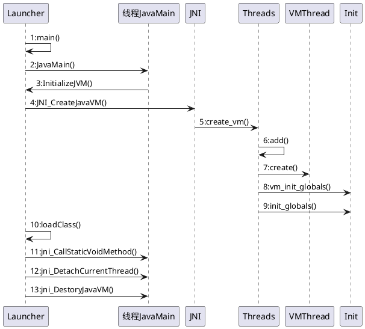
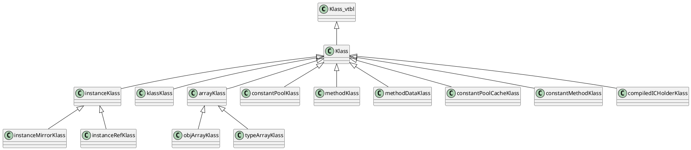
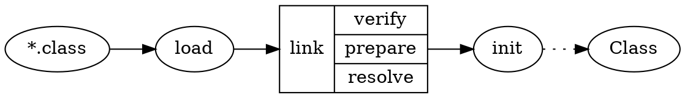

《HotSpot实战》 陈涛 著 人民邮电出版社

网易宝

* 运行时 oop、classfile
  * 启动 Prims Services Runtime
  * 类与对象 对象表示机制（OOP-Klass Klass与instanceKlass）、类加载、对象创建
* 内存管理 堆、栈、方法区 memory、gc 
  * 运行时数据区 堆 线程私有区域 方法区 性能监控数据区：PerfData 转储
  * 垃圾收集 堆与GC 垃圾收集器
  * 栈 硬件寄存器、Java栈、栈帧、栈顶缓存
* 解释器和即时编译器、指令集、执行引擎 interpreter、c1、code
* 虚拟机监控工具

## 第1章 初试HotSpot
### 1.1 JDK概述
#### 1.1.3 Java7的语法变化
* switch使用string
* 允许数值以下划线分隔 10_000_000
* 允许数值以二进制表示 0b0100
* 异常处理增强
* TWR try-with-resources
* 简化泛型定义、简化变长参数的方法调用

### 1.2 动手编译虚拟机
### 1.3 实战：在Hotspot内调试Helloworld

## 第2章 启动
### 2.1 HotSpot内核
#### 2.1.1 如何阅读源代码
语言差异：
1. 宏 编译c/c++代码前，预处理器将宏代码展开。

（1）功能相似的数据结构  
（2）函数定义  
（3）共同基类  
（4）循环条件  
（5）调试技术  

2. 内联函数 用于消除函数调用和返回时的寄存器存储和恢复开销，它通常应用于频繁执行的函数中。
3. 内部锁
4. 可移植性

操作系统 linux、windows、solaris
体系结构 sparc、arm、x86、PowerPC

5. VM选项

* 基本配置类 Java堆的大小、垃圾收集器的选择、编译模式的选择等
* 调优类 对虚拟机组件或策略进行较为细致的配置
* 性能监控类 开启性能监控选项 -Xloggc、-XX:ErrorFile
* 内部校检类 增强虚拟机内部过程校检
* 调试和跟踪类

#### 2.1.2 HotSpot内核框架   
数据结构包括结构体、枚举、类和接口，它定义了数据成员，用以支撑算法的实现。算法反应了功能的实现逻辑。

HotSpot由多个顶层模块组成，主要包括Service、Prims、Rutime、Classfile、Interperter、Code、Memory、Compiler、
Oops、C1/Opto/Shark和GC。

Classfile模块
* 类文件解析模器 ClassFileParser子模块，解析*.class格式文件
* parse_constant_pool()解析常量
* parse_interfaces()解析接口
* parse_fields()解析字段
* parse_methods()解析java方法
* parse_localvariable_table()解析局部变量表

#### 2.1.3 Prims
定义外部接口
1. JNI jni_*为前缀命名的函数，允许JDK或外部程序调用由c/c++实现的库函数。
2. JVM模块 JVM_*  本地库的Java API；支持字节码验证和class文件格式校检；各种io和网络操作
3. JVMTI模块 虚拟机工具接口（java virtual machine tool interface）
4. Perf模块 监控虚拟机内部Perf Data

#### 2.1.4 Services
Services模块为JVM提供JMX等工具，为支持对Java应用程序进行管理和监控的一套体系结构、设计模式、API以及服务。
1. Management模块 提供JMX地城实现的基础
2. MemoryService模块 内存管理，堆的分配和内存池的管理
3. MemoryPool模块 内存池管理模块。内存池表示由JVM管理的内存区域，是内存管理的基本单元。
4. MemoryManger模块 内存管理器。一个内存管理负责管理一个或多个内存池。垃圾收集器也是一个内存管理器，它负责回收不可达对象的内存空间。
   * CopyMemoryManager
   * MSCMemoryManager
   * ParNewMemoryManager 
   * CMSMemoryManager
   * PSSacvengeMemoryManager
   * PSMarkSweepMemeoryManager
   * G1YoungGenMemoryManager
   * G1OldGenMemoryManager
5. RuntimeServices模块 提供Java运行时的性能监控和管理服务，如applicationTime、JVMCapabilities等。
6. ThreadService模块 提供线程和内部同步系统的性能监控和管理服务，包括维护线程列表、线程相关的性能统计、线程快照、线程堆栈跟踪和线程转储等功能。
7. ClassLoadingService模块 提供累加载模块的性能监控和管理服务
8. AttachListener模块 为客户端的JVM监控工具提供连接（attach）服务
9. HeapDumper模块

#### 2.1.5 Runtime
运行时模块，为其他系统组件提供运行时支持。线程、安全点、PerfData、Stub例程、反射、VMOperation以及互斥锁等。
1. Thread模块 定义了各种线程类型，包含JVM内部工作线程以及Java业务线程。还定义了Threads子模块，维护着系统的有效线程队列
2. Arguments模块 记录和传递VM参数和选项
3. StubRoutines和StubCodeGenerator模块
4. Frame模块 物理栈帧（活动记录），定义了表示物理栈帧的数据结构frame。frame始于cpu类型相关的，既可以表示c帧，也可以表示java帧。
   一个frame可由栈指针、PC指针、CodeBlob指针和状态位藐视。栈之中_sp指向栈顶元素；pc指针_pc指向下一条要执行的指令地址；codeblob指针指向相应的指令机器码的codeblob。
5. CompilationPolicy模块 配置编译策略
6. Init模块 用于系统初始化
7. VmThread模块 单例原生线程VM Thread（虚拟机线程），派生其他的线程。维护一个虚拟机操作队列（VMOperationQueue），接受其他线程请求虚拟机级别的操作（VMOperation）。
8. VMOperation模块

### 2.2 启动
#### 2.2.1 Launcher
#### 2.2.2 虚拟机生命周期




#### 2.2.3 入口：main函数
#### 2.2.4 主线程
#### 2.2.5 InitializeJVM函数
#### 2.2.6 JNI_CreateJavaVM函数
#### 2.2.7 调用Java主方法
#### 2.2.8 JVM退出路径
### 2.3 系统初始化
#### 2.3.1 配置OS模块
#### 2.3.2 配置系统属性
#### 2.3.3 加载系统库
#### 2.3.4 启动线程
#### 2.3.5 vm_init_globals函数：初始化全局数据结构
#### 2.3.6 init_globas函数：初始化全局模块
1. JMX：management模块
   1. Managemoent模块 启动名为“ServiceThread”的守护线程
   2. RuntimeService 提供运行时性能监控和管理服务
   3. ThreadService 提供线程和内部同步系统的性能监控和管理服务
   4. ClassLoadingService 提供类加载模块的性能监控和管理服务
2. Code Cache 代码高速缓存，用来生成和存储本地代码
3. StubRoutines 
4. Universe
5. 解释器
6. 模板表
7. stubs

## 第3章 类与对象
* OOP-Klass二分模型
* 对象的创建
* 对象的内存布局
* 对象的访问定位
* 类的加载
* 系统字典
  
面向对象如何在HotSpot里实现？对象与类如何实现？
### 3.1 对象的表示机制
#### 3.1.1 OOP-Klass二分模型
* OOP：ordinary object pointer, oops 普通对象指针，用来描述对象实例信息
* Klass：Java类的C++对等体，用来描述Java类  

对于OOPS对象来说，主要职能在于表示对象的是实例数据，没必要持有任何虚函数；而在描述Java累的Klass对象中含有VTBL，那么Klass就能够根据Java对象的实际类型
进行C++分发（dispatch）。  
Klass对象向JVM提供两个功能：实现语言层面的Java类；实现Java对象的分发功能。

#### 3.1.2 Oops模块
OOP框架和Klass框架
* oop 定义了oops共同基类
  * constantPoolOop
  * cpCacheOop
  * arrayOop
  * instanceOop 表示一个Java类型实例
  * methodOop 表示一个Java方法
  * markOop 表示对象头
  * typeArrayOop
  * constMehodOop
  * methodOop
  * klassOop 描述一个与Java类对等的C++类
  * objArrayOop
* Klass klassOop的一部分。用来描述语言层的类型
  * instanceKlass 在虚拟机层面描述一个Java类
  * methodDataKlass 
  * constMethodKlass
  * methodKlass 表示methodOop的klass
  * klassKlass 作为klass链的断点，klassKlass的Klass就是它自身
  * instanceKlassKlass
  * instanceRefKlass
  * instanceMirrorKlass
  * arrayKlassKlass
  * objArrayKlassKlass
  * typeArrayKlassKlass
  * arrayKlass
  * objArrayKlass
  * typeArrayKlass
  * constantPoolKlass
  * constantPoolCacheKlass

#### 3.1.3 OOP框架与对象访问机制
在Java应用程序运行过程中，每创建一个Java对象，在JVM内部也会相应创建一个OOP对象来表示Java对象。OOPS类的共同基类为oopDesc。
```c++
// oops类层次共同基类 oopDesc的定义
class oopDesc {
    private:
        volatile markOop _mark;
        union _metadata {
            wideKlassOop _klass;
            narrowOop _compressed_klass;
        } _metadata;
}
```
instanceOopDesc表示类实例，arrayOopDesc表示数组

在虚拟机内部，通过instanceOopDesc表示一个Java对象。对象在内存中的布局可以分为连续的两部分：instanceOopDesc和实例数据。
其中，instanceOopDesc或arrayOopDesc又被称为对象头，instanceOopDesc对象头包括以下两部分信息。
* mark word：
* 元数据指针：指向描述类型的Klass对象的指针。

在对象引用（栈）中存放的是指向对象（instanceOop，堆）的指针，对象本身则持有指向类（instanceKlass，方法区）的指针。

#### 3.1.4 Klass与instanceKlass


1. 核心数据结构：Klass  

2. 黑心数据结构：instanceKlass  
JVM在运行时，需要一种用来标识Java内部类型的机制。在Hotspot中的解决方案是：为每一个已加载的Java类创建一个instanceKlass对象，用来
在JVM表示Java类。

3. 实例数据的存储顺序  


#### 3.1.5 实战：用HSDB雕饰HotSpot

### 3.2 类的状态转换
#### 3.2.1 入口：Class文件
class文件格式：
* magic
* minior version, major version
* constant pool
* access flags
* this class
* super class
* interfaces
* fields
* methods
* attributes

1. 常量池
2. 字段表
3. 方法表
4. 属性表

#### 3.2.2 类的状态


#### 3.2.3 加载
1. 初始化类加载器
类加载器在初始化时，首先将初始化与类加载相关的一些PerfData计数器。接下来搜索lib库，先确保加载本地库libverify（verify.dll
或libverify.so）和libjava（java.dll或libjava.so），紧接着加载libzip库（zip.dll或libzip.so）。  
加载libzip库完毕，接下来在sun.boot.class.path表示的类路径下初始化启动类加载路径。  

2. 加载
加载的含义是从class文件字节流中提取类型信息。HotSpot的Classfile模块为虚拟机提供加载功能。
* ClassFileParser 类解析器，用来解析*.class文件。
* Verifier 验证器，用来验证*.class文件中字节码。它将为每个类创建一个classVerifier实例来验证
* ClassLoader 类加载器
* SystemDictionary 系统字典，用来记录已加载的所有类
* SymboleTable 字符表

```c++
// 加载 ClassFileParser类ParseClassFile()函数
// 1. 字节流的读取是从获取魔数开始的
u4 magic = cfs->get_u4_fast(); // cfs是一个ClassFileStream；get_u<n>_fast()表示从流当前位置继续读取<n>字节数据
// 2. 读取Class文件主、次版本号及验证
u2 minor_version = cfs->get_u2_fast();
u2 major_version = cfs->get_u2_fast();
// 3. 读取常量池
constantPoolHandle cp = parse_constant_pool(CHECK_(nullHandle));
// 4. 读取访问标识（Access flags）
// 5. 读取当前类索引，并按索引在常量池项中找到当前累的全限定名
instanceKlassHandle super_klass;
u2 this_class_index = cfg->get_u2_fast();
Symbol* class_name = cp->unresolved_klass_at(this_class_index);
// 6. 读取父类索引，并按索引在常量池中找到父类的全限定名和父类句柄
// 7. 调用parse_infterfaces()函数读取接口信息，接口类型包括本地接口和父类传递接口
// 8. 调用parse_fields()函数读取字段信息，并计算出域大小和偏移量（oop-map）信息，并根据域分配策略对字段存储顺序进行分配。
// 9. 调用parse_methods()函数读取方法信息。根据从Class中解析出的method信息创建methodOop对象。
// 10. 通过klassVtable、klassItable模块提供的算法，根据已解析的父类、方法、接口等信息计算得到Java vtable和itable大小
// 11. 创建当前类instanceKlass并按照上述步骤已经解析好的信息为该对象赋值
klassOop ik = oopFactory::new_instanceKlass(name, vtable_size, itable_size, static_field_size, total_oop_map_count, rt, CHECK_(nullHandle));
instanceKasssHandle this_klass(THREAD, ik);
// 12. 创建Java镜像类并初始化静态域
java_lang_Class::create_mirror(this_klass, CHECK_(nullHandle));
// 13. 通知类已加载更新PerfData计数器

```

#### 3.2.4 链接
符号引用十一字符串的形式存在的。在每个class文件中，都有一个常量池，用来存放该类中用到的符号引用。当完成加载以后，来自于class
文件的常量池则会在jvm内部关联上一个位于运行时内存中的常量池数据结构，即运行时常量池。

```c++
instanceKlass::link_class_impl()
```

1. 验证
2. 准备 为类静态变量分配内存空间，赋予变量语言级别初始值，并不会执行任何字节码
3. 解析 将常量池中的符号引用转换为直接引用，即运行时实际内存地址。
   * 类、接口、字段、类方法和接口方法 4类符号引用

#### 3.2.5 初始化
类或接口的初始化其实就是执行它的初始化方法。  
在instanceKlass类中定义了初始化过程initialize_impl()，在初始化过程正式开始之前，必须保证该类型已经历过连接阶段，必须经过验证
和准备环节，且有可能已经被解析过。  
此外，由于虚拟机支持多线程，所以在类初始化过程中需要实现者处理好线程同步问题。

#### 3.2.6 实战：类的“族谱”
_super、_subKlass和_next_sibling记录类之间“族谱”关系的。
#### 3.2.7 实战：系统字典
系统字典记录了系统加载的所有的类。系统字典持有系统已经加载类、类加载器、公共类klass等重要信息。
hotspot/src/share/vm/classfile/systemDictionary.hpp

### 3.3 创建对象
字节码new 
* 虚拟机遇到该指令，从栈顶取得目标对象的在常量池中索引，接着定位到目标对象类型
* 虚拟机根据该类的状态，采取相应的内存分票技术，在内存中分配实例空间，并完成实例数据和对象头的初始化
  
#### 3.3.1 实例对象的创建流程
* 快速分配 类已被加载和正确解析 TLAB(UseTLAB) -> Eden需要加锁；对象头（设置MarkWord，设置类型指针）
* 慢速分配 尚未解析

对象创建的基本流程：
1. 验证类已被解析
2. 获取instanceKlass，确保klass已完全初始化
3. 若满足快速分配条件，则进入快速分配流程
4. 若不满足快速分配条件，或者快速分配失败，则进入慢速分配流程

#### 3.3.2 实战：探测JVM内部对象

## 第4章 运行时数据区
堆与方法区所占的内存空间，由JVM负责管理，内存分配由HotSpot的内存管理模块维护，内存释放有垃圾收集器自动完成。
### 4.1 堆
#### 4.1.1 Java的自动内存管理
#### 4.1.2 堆的管理
1. 分代
2. Universe模块

### 4.2 线程私有区域
#### 4.2.1 PC
#### 4.2.2 JVM栈

### 4.3 方法区
方法区由虚拟机的所有线程共享。方法区类似于传统语言编译后的代码存储区域，或者unix进程的“正文段”。它存储每个类的结构信息
#### 4.3.1 纽带作用
方法区存储信息：类型基本描述信息和域（字段域和方法域）信息
#### 4.3.2 常量池
#### 4.3.3 常量池缓存：ConstantPollCache
#### 4.3.4 方法的表示：methodOop
#### 4.3.5 方法的解析：将符合引用转换成直接引用
#### 4.3.6 代码放在哪里：ConstMethodOop
#### 4.3.7 实战：探测运行时常量池

### 4.4 性能监控数据区：PerfData
JVM中开辟的共享内存，存放关于性能统计的计数器。使用共享内存的方式向外部进程提供通信手段，允许外部监控进程attach至虚拟机进程，并从共享内存中读取这些PerfData
### 4.5 转储

## 第5章 垃圾收集
### 5.1 堆与GC
#### 5.1.1 垃圾收集
1. 垃圾收集器
2. 收集算法

#### 5.1.2 分代收集
#### 5.1.3 快速分配
大量连续内存，**碰撞指针**
#### 5.1.4 栈上分配和逸出分析
分析局部变量的作用域仅限于方法内部，则JVM直接在栈帧内分配对象空间，避免在堆中分配。
#### 5.1.5 GC公共模块

### 5.2 垃圾收集器
#### 5.2.1 设计演进
1. 串行收集器：Serial
2. 并行收集器：ParNew
3. 吞吐量优先收集器：Parallel Scanvenge
4. 堆的类型
5. 收集策略

#### 5.2.2 CMS收集器
#### 5.2.3 G1收集器

### 5.3 实战：性能分析方法
#### 5.3.1 获取GC日志
#### 5.3.2 GC监控信息
#### 5.3.3 内存分析工具
#### 5.3.4 选择合适的收集器与GC性能评估
#### 5.3.5 不要忽略JVM Crash日志

## 第6章 栈
### 6.1 硬件背景：了解真实机器
#### 6.1.1 程序是如何运行的
#### 6.1.2 x86与栈帧
真实机器中处理器、寄存器与栈
寄存器是CPU计算单元的存储单元，用来保存计算过程中的各种操作数：立即数、整数、存储器引用地址等。
多数指令具有一个或多个操作数（operand），操作数表示执行该指令操作中要引用的**源数据值**，以及放置指令执行结果的目标数据。
x86支持3种操作数格式：
1. 立即数（），即常量；
2. 寄存器（register），表示寄存器中存的值；
3. 存储器引用，根据某个有效地址访问某个存储器
指令读取操作数方式的不同决定了指令具有不同的寻址模式。

#### 6.1.3 ARM对Java硬件级加速：Jazelle技术
### 6.2 Java栈
寄存器式指令集：许多硬件体系围绕着寄存器存取中间运算数据，相应地，在寻址方式上也是围绕着寄存器进行设计。
#### 6.2.1 寄存器式指令集与栈式指令集
寄存器的优点是访问效率高，缺点是数量有限。
#### 6.2.2 HotSpot中的栈
1. 栈帧 用于支持虚拟机进行方法调用和方法执行的数据结构，它是JVM运行时数据区中的虚拟机栈元素。

#### 6.2.3 栈帧
#### 6.2.4 充分利用寄存器资源
#### 6.2.5 虚拟机如何调用Java函数
1. 入口：JavaCalls
2. 实际例程：CallStub
3. Stub Rountiness
4. CallStub的运行过程

#### 6.2.6 优化：栈顶缓存
栈顶缓存（Top of Stack Cashing，TOSCA/TOS）。将频繁访问的栈顶元素存储在CPU硬件寄存器中，大幅减少内存访问次数，提升性能。

## 第7章 解释器和即时编译器
```
一般编译器   源码   -> 可执行机器语言
java编译器   .java  -> .class(bytecode)
java解释器   .class -> machine code
即时编译器   .class -> machine code     热点代码编译为机器代码
```

### 7.1 概述
Java源程序经编译后成为字节码，由运行环境对字节码进行解释执行。提供解释功能的JVM组件成为解释器。  
* 解析器 解释bytecode，访问栈
  * 字节码表
  * 模板表
  * 转发表
* JIT编译器 编译java方法、bytecode，访问非堆（方法区）

Hotspot运行模式
* 解释模式 -Xint
* 编译模式 -Xcomp
* 混合模式 -Xmixed，默认模式

不管是解释执行，还是编译执行，最终执行的代码单元都是可以直接在真实机器上运行的机器码，或称为本地代码。

1. 解释器  
边翻译边执行，效率低。简单和易于实现，允许上层高级语言使用富于表现力的语法。python、perl、ruby以及各种shell脚本工具。
* 解释器（interpreter） 默认的模板解释器（templateInterpreter），c++解释器（cppInterpreter）
* 代码生成器（code generator） 利用解释器的宏汇编器，向代码缓存空间写入生成的代码
* InterpreterCodelet 由解释器运行的代码片段。
* 转发表（dispatch table） 为方便找到与字节码对应的机器码

2. 编译器
* client模式 -client c1
* server模式 -server c2 编译比c1耗时，但是生成比c1更高效的代码

### 7.2 解释器如何工作
#### 7.2.1 Interpreter模块
* AbstractInterpreter
  * TemplateInterpreter
  * BytecodeInterpreter
  * CppInterpreter
* 解释器
  * Interpreter
  * Bytecodes
  * TemplateTable
* 运行时
  * Invocation
  * OopMapCache
  * InterpreterRuntime
* 代码生成
  * TemplateInterpreterGenerator
  * InterpreterGenerator
* Rewriter 提高解释器性能，提供了常量池cache功能，实现字段和方法的快速定位。rewrite提供重写字节码功能，将原本指向常量池的索引调整为指向常量池cache索引
* LinkResolver

#### 7.2.2 Code模块
code指机器码，code模块，指在jvm中管理code的存储、定位和执行的系统组件。
* codeCache 代码高速缓存
* codeBlob 用做描述codeCache中所有的缓存项
* NMethod 继承自codeBlob，表示编译为本地代码的java方法
* vMReg 管理cpu寄存器的模块
* pcDesc 映射物理pc到源码范围内的字节码索尼以
* stubs和vtableStubs，管理stub（系统生成的code片段）

#### 7.2.3 字节码表
#### 7.2.4 CodeCache
#### 7.2.5 InterpreterCodelet与Stub队列
#### 7.2.6 Code生成器
#### 7.2.7 模板表与转发表

### 7.3 即时编译器
#### 7.3.1 概述
#### 7.3.2 编译器模块
编译器实现了3个模块，分别是c1、opto和shark。c1实现了c1编译器；opto实现了c2编译器；此外，在shark模块中，实现了一个机遇LLVM的编译器。
c1模块的主要子模块：
* compile
* compilation
* macroAssembler
* CFGPrinter
* CodeStubs
* Instruction 定义了指令的类型层次
* IR模块 实现中间描述IR
* LIR模块 实现低级中间描述LIR
* LIRGenerator模块
* LIRAssembler模块
* LinearScan
* Runtime1

#### 7.3.3 编译器的基本结构
字节码 -> HIR -> LIR -> 机器码
* 编译器前端将Java字节码解释成一种抽象格式HIR（High-level Intermediate Representation，高级中间表示）
* 编译器后端将HIR转换成LIR，使用虚拟寄存器替代HIR中的变量引用
* 对完成底层优化后的LIR，采用线性扫描寄存器分配算法，进行寄存器的分配。将物理寄存器替换掉LIR中的虚拟寄存器后，生成符合目标机器体系结构的机器码
* 编译器选择合适的时机将机器码写入到code buffer中，也成为发射。

1. IR
   中间表示（intermediate representation，编译原理领域常称为IR），是由编译器**前端**生成的一种代码形态。编译器**后端**利用IR作为输入，
   在生成目标代码时，充分利用目标机的体系结构生成最优的机器码，并提高了编译器的可移植性。
   * HIR 高级中间表示 级别越低越接近目标机器码
   * MIR 中级中间表示
   * LIR 低级中间表示 与目标机指令几乎是一一对应的，经常与体系结构相关
   Hotspot编译器利用了HIR和LIR两种形式。Hotspot LIR接近三元式机器码。LIR指令使用显式声明的操作数，如虚拟寄存器、物理寄存器、内存地址、栈空间或常量。
   LIR比HIR更适合低级优化，如寄存器分配。
2. CFG
   控制流图（control flow graph，简称CFG），是由编译器内部维护的抽象数据结构，它描述构成程序片段的指令序列块之间的跳转关系。
3. SSA
4. 寄存器分配
   将以IR格式表示的变量替换成物理寄存器。
5. 编译目标
6. 编译过程实现

## 第8章 指令集
如何实现JVM指令集
### 8.1 再说栈式指令集
* 寄存器型指令集 有利于代码生成，但是操作数需要命名和显示的指定，指令较长
* 堆栈型指令集 简洁直观、指令短小、易于实现，不利于代码优化
* 累加型指令集

一般来说，一条指令的执行周期（取值、译码、执行）
* 取值
* 指令译码
* 取操作数
* 执行
* 存储结果
* 获取下一条指令

指令集系统：CISC、RISC

### 8.2 数据传送
### 8.3 类型转换
### 8.4 对象的创建和操作
### 8.5 程序流程控制
### 8.6 运算
#### 8.6.1 加法：iadd
#### 8.6.2 取负：ineg
### 8.7 函数的调用和返回
* invokevirtual 调用普通实例方法
* invokeinfterface 调用接口实现的方法
* invokespecial 调用特殊处理的实例方法，init、private或超类方法
* invokestatic 静态方法（类方法）
* invokedynamic 动态语言支持，java7新增

#### 8.7.1 Java函数分发机制：VTABLE与ITABLE
在Java中，虚拟机利用vtable实现多态性。vtable的作用类似c++中的虚函数表。为支持java接口的函数分发，虚拟机还另外提供了类似vtable的
接口表----itable。  
若Java方法是覆盖父类方法，虚拟机将更新虚函数表中相同顺序的元素，使其指向覆盖后的实现方法；
若遇到重载方法，或者自增新的方法，虚拟机将按顺序添加到虚函数表中。  
itable表由一组偏移表和方法表组成，这两组表的元素都是变长的。

#### 8.7.2 invoke系列指令
#### 8.7.3 动态分发：覆盖
面向对象特点：抽象，封装，继承，多态
函数的覆盖和重载是多态性的不同表现。覆盖描述的是父类与子类直接的多态性，重载描述的一个类多个函数直接的多态性。
#### 8.7.4 静态分发：重载
### 8.8 异常

## 第9章 虚拟机监控工具
* jps
* jinfo
* jmap
* jhat
* jstat
* jstack

### 9.1 Attach机制
虚拟机通过一种称为连接机制的技术为监控程序访问虚拟机进程提供了可能。从本质上说，连接到目标JVM的过程，建立一个进程间通信通道，通过通道，
由客户进程向JVM进程**下发**命令，JVM进程向客户进程**返回**数据的过程。
#### 9.1.1 AttachProvider与VisualMachine
#### 9.1.2 命令的下发：execute()
#### 9.1.3 命令的执行：Attach Listener守护线程

### 9.2 查看JVM进程
jsp
### 9.3 查看和配置JVM
jinfo
### 9.4 堆内存转储工具
jmap
#### 9.4.1 Heap Dump
head dump文件是二进制文件，保持了某一时刻JVM堆中对象的内存使用情况，可分析是否存在内存溢出等情况。
#### 9.4.2 原理
### 9.5 堆转储分析
jhat, mat, jstat
#### 9.5.1 Heap Dump分析工具：jhat
分析heap dump文件，启动一个http服务器，将堆中对象的信息以动态网页的形式呈现
#### 9.5.2 实战：MAT分析过程
1. 生成heap dump
2. 查看对象分配了多少空间
3. 内存泄漏

### 9.6 线程转储分析
#### 9.6.1 jstack
#### 9.6.2 实战：如何分析资源等待
1. 获取线程转储信息
2. 判断是否死锁
3. 定位资源瓶颈 明确应用程序所等待的资源
4. 对症下药
