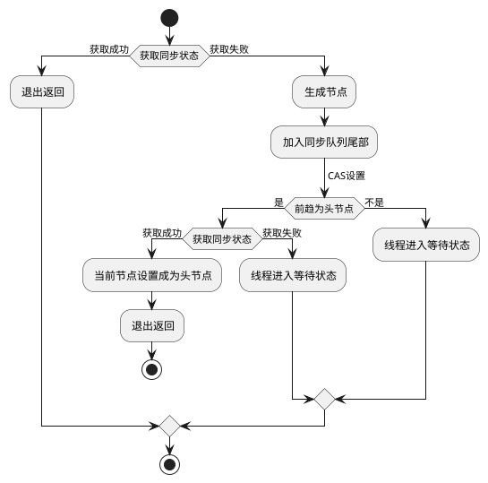

 《Java并发编程的艺术》 放腾飞 魏鹏 程晓明 机械工业出版社

## 第1章 并发编程的挑战
### 1.1 上下文切换
### 1.2 死锁
### 1.3 资源限制的挑战

## 第2章 Java并发机制的底层实现原理
### 2.1 volatile
### 2.2 synchronized的实现原理与应用
### 2.3 原子操作的实现原理
1. 术语定义
2. 处理器如何实现原子操作
   1. 使用总线锁
   2. 通过缓存锁定
3. Java如何实现原子操作
   1. 循环CAS cmpxchg 
      1. ABA问题（AtomicStampedReference）
      2. 循环时间长开销大（pause指令）
      3. 只能保证一个共享变量的原子操作（AtomicReference多个变量放在一个对象里）
   2. 锁机制 偏向锁、轻量级锁、互斥锁

## 第3章 Java内存模型
### 3.1 Java内存模型的基础
### 3.2 重排序
### 3.3 顺序一致性
### 3.4 volatile的内存语义
### 3.5 锁的内存语义
### 3.6 final域的内存语义
### 3.7 happens-before
### 3.8 双重检查锁定与延迟初始化
### 3.9 Java内存模型综述
#### 3.9.1 处理器的内存模型
* TSO Total Store Ordering          sparc-TSO, x64
* PSO Partial Store Order           sparc-PSO
* RMO Relaxed Memory Order          ia64
* PowerPC                           PowerPC

JMM屏蔽了不同处理器内存模型的差异

#### 3.9.2 各种内存模型之间的关系
#### 3.9.3 JMM的内存可见性保证

## 第4章 Java并发编程基础
### 4.1 线程简介
### 4.2 启动和终止线程
### 4.3 线程间通信
### 4.4 线程应用实例

## 第5章 Java中的锁
### 5.1 Lock接口
### 5.2 队列同步器
* int成员变量表示同步状态
* FIFO队列完成资源获取线程的排队工作
* 继承方式使用

#### 5.2.1 队列同步器的接口与示例

#### 5.2.2 队列同步器的实现分析
1.同步队列

当前线程获取同步状态失败时，同步器会将当前线程以及等待状态等信息构造成为一个结点，并将其加入同步队列，同时会阻塞当前线程；
当同步状态释放时，会把首节点中的线程唤醒，使其再次尝试获取同步状态。
* 入队 加入尾节点 CAS的设置尾节点 compareAndSetTail(Node expect, Node update)
* 出队 首节点获取同步状态成功的节点，将会唤醒后继节点；
* 后继节点成为新的首节点 设置首节点是通过获取同步状态成功的线程来完成（只有一个线程会成功），不需要CAS保证，

2.独占式同步状态获取与释放
```java
   public final void acquire(int arg) {
         if (!tryAcquire(arg) &&
            acquireQueued(addWaiter(Node.EXCLUSIVE), arg))
            selfInterrupt();
   }
   // 尝试获取同步状态
   // 构造节点加入到同步队列的尾部
   // 循环方式获取同步状态。如果获取不到则阻塞节点中的线程，而被阻塞线程的获取主要依靠前趋节点的出队或者阻塞线程被中断
   // 只有前趋节点是头节点才能够尝试获取同步状态
```



3.共享式同步状态获取与释放
```java
   // 共享式自旋过程中，成功获取到同步状态并退出自旋的条件是tryAcquireShared(arg)返回值大于等于0
   public final void acquireShared(int arg) {
        if (tryAcquireShared(arg) < 0)
            doAcquireShared(arg);
   }  

   // 释放同步状态之后，将会唤醒后续处于等待状态的节点
   public final boolean releaseShared(int arg) {
        if (tryReleaseShared(arg)) {
            doReleaseShared();
            return true;
        }
        return false;
   }
```

4.超时获取同步状态与释放
超时获取同步状态，即在指定的时间段内获取同步状态，如果获取到同步状态则返回true。


5.自定义同步组件----TwinsLock
* 确定访问模式
* 定义资源数 satus>1，表示同步资源数
* 组合自定义同步器

### 5.3 重入锁
### 5.4 读写锁
#### 5.4.1 读写锁的接口与示例
#### 5.4.2 读写锁的实现分析
1. 读写状态的设计
   * 读写状态就是其同步器的同步状态。ReentrantLock中同步状态表示一个线程重复获取的次数。
   * “按位切割使用” 一个整型变量（4字节，32个bit）上维护多种状态。高16位表示读，低16位表示写。
   * 通过位运算确定读写各自的状态。
2. 写锁的获取与释放
3. 读锁的获取与释放
4. 锁降级
   * 写锁降级成为读锁 持有写锁，再获取读锁，随后释放写锁
   读锁的获取的必要性。保证数据的可见性。
   如果当前线程不获取读锁而是直接释放写锁，假设此刻另一个线程T获取了写锁并修改了数据，那么当前线程无锁感知线程T的数据更新。
   如果当前线程获取读锁，即遵循锁降级步骤，则线程T将会被阻塞，知道当前线程使用数据并释放读锁之后，线程T次啊能获取写锁进行数据更新。
   * 不支持锁升级 持有读锁，获取写锁，释放读锁。不支持的目的试试为了保证数据可见性

### 5.5 LockSupport工具
线程阻塞和唤醒的功能
* park()
* parkNanos(long nanos)
* parkUntil(long deadline)
* unpark(Thread thread)

### 5.6 Condition接口
任意一个Java对象，都拥有一组监视器方法（java.lang.Object上），与synchronized同步关键字配合，实现等待通知模式。
#### 5.6.1 Condition接口与示例
* Condition接口定义了等待/通知两种类型的方法，当前线程调用这些方法时，需要提前获取到Condition对象关联的锁。
* Condition对象是有Lock对象创建出来的。

#### 5.6.2 Condition的实现分析
1. 等待队列
FIFO队列，在队列中每个节点都包含了一个线程引用，该线程就是在Condition对象上等待的线程。
如果一个对象调用了Condition.await()方法，那么该线程将会释放锁，构造节点加入等待队列并进入等待状态。
* 加入尾节点 不用CAS，因为调用await()方法的线程必定是**获取了锁的线程**。加入队尾的过程用锁来保证线程安全。
* 在Object的监视器模型上，一个对象拥有**一个**同步队列和等待队列
* 并发包Lock（同步器）拥有一个同步队列和**多个**等待队列

2. 等待
await() 当前线程进入等待队列并释放锁，同时线程状态变为等待状态。

3. 通知
signal()，将会唤醒在等待队列中等待时间最长的节点，在唤醒节点之前，会将节点移动到同步队列。

## 第6章 Java并发容器和框架
### 6.1 ConcurrentHashMap的实现原理与使用
#### 6.1.1 为什么要使用ConcurrentHashMap
#### 6.1.2 ConcurrentHashMap的结构
#### 6.1.3 ConcurrentHashMap的初始化
#### 6.1.4 定位Segment
#### 6.1.5 ConcurrentHashMap的操作
### 6.2 ConcurrentLinkedQueue
### 6.3 Java中的阻塞队列
#### 6.3.1 什么是阻塞队列
#### 6.3.2 Java里的阻塞队列
* ArrayBlockingQueue
* LinkedBlockingQueue
* LinkedTransferQueue
* LinkedBlockingDueue
* SynchronousQueue 不存储元素的阻塞队列。每个put操作必须等待一个take操作，否则不能添加。
* PriorityBlockingQueue
* DelayQueue

#### 6.3.3 阻塞队列的实现原理
### 6.4 Fork/Join框架
用于并行执行任务的框架，是一个把大任务分割成若干个小任务，最终汇总每个小任务结果后得到大任务结果的框架。

## 第7章 Java中的13个原子操作类
### 7.1 原子更新基本类型类
### 7.2 原子更新数组
### 7.3 原子更新引用类型
### 7.4 原子更新字段类

## 第8章 Java中的并发工具类
### 8.1 等待多线程完成的CountDownLatch
允许一个或多个线程等待其他线程完成操作。
### 8.2 同步屏障CyclicBrrier
让一组线程到达一个屏障时被阻塞，直到最后一个线程到达屏障时，屏障才会开门，所有被屏障拦截的线程才会继续进行。
### 8.3 控制并发线程数的Semaphore
应用场景：流量控制
### 8.4 线程间交换数据的Exchanger

## 第9章 Java中的线程池
1. 降低资源消耗
2. 提高响应速度
3. 提高线程的可管理性

### 9.1 线程池的实现原理
### 9.2 线程池的使用
#### 9.2.1 线程池的创建
* corePoolSize
* runnableTaskQueue
  * ArrayBlockingQueue
  * LinkedBlockingQueue
  * SynchronousQueue
  * PriorityBlockingQueue
* maximunPoolSize
* ThreadFactory
* RejectedExecutionHandler
* KeepAliveTime
* TimeUnit

#### 9.2.2 向线程池提交任务
* execute
* submit 有返回值

#### 9.2.3 关闭线程池
遍历线程池中的线程，然后逐个调用线程的interrupt方法来中断线程
* shutdown 线程池状态设置成SHUTDOWN状态，中断所有没有正在执行任务的线程
* shutdownNow 线程池状态设置成STOP状态，停止所有正在执行或暂停任务的线程，并返回等待执行任务的列表

#### 9.2.4 合理地设置线程池
#### 9.2.5 线程池的监控

## 第10章 Executor框架
### 10.1 Executor框架简介
#### 10.1.1 Executor框架的两级调度模型
#### 10.1.2 Executor框架的结构与成员
Executor框架的结构
* 任务 Runnable、Callable
* 任务的执行 Executor、ExecutorService
* 异步计算的结构 Future、FutureTask

Executor框架的成员
* ThreadPoolExecutor
  * FixedThreadPoolExecutor LinkedBlockingQueue
  * SingledThreadExecutor LinkedBlockingQueue
  * CachedThreadPool SynchronousQueue
* ScheduledThreadPoolExecutor 延期执行、定时执行
  * DelayedWorkQueue
* Future
* Runnable, Callable

### 10.2 ThreadPoolExecutor详解
#### 10.2.1 FixedThreadPool
#### 10.2.2 SingleThreadExecutor
#### 10.2.3 CacheThreadPool
### 10.3 ScheduledThreadPoolExecutor详解
* schedule 上一次实际执行完成的时间点
* scheduleAtFixedRate 按照上一次开始的时间点，存在并发性


### 10.4 FutureTask详解

## 第11章 Java并发编程实践
### 11.1 生产者-消费者模式
### 11.2 线上问题定位
### 11.3 性能测试
### 11.4 异步任务池

