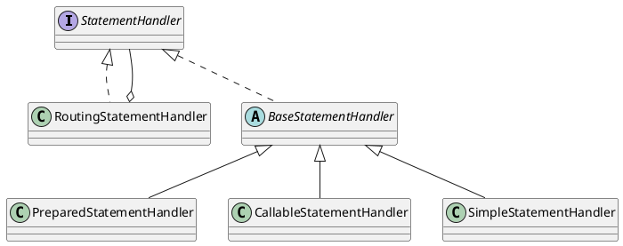
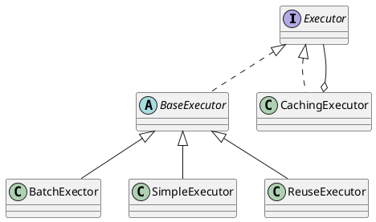
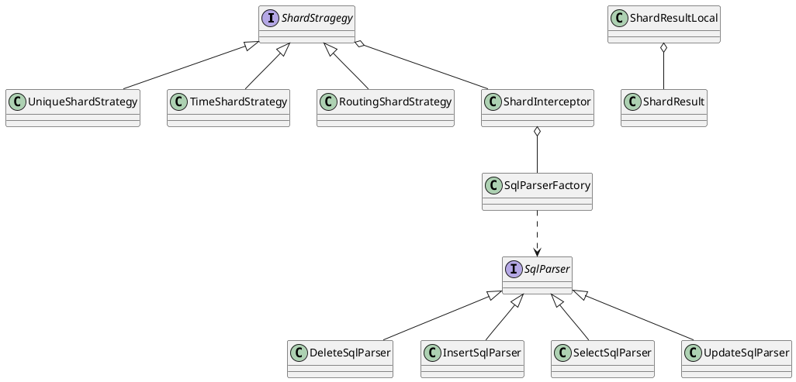

《MyBatis技术内幕》徐郡明 中国工信出版集团 电子工业出版社

* 接口层 SqlSession
* 核心处理层 配置解析、参数映射、SQL解析、SQL执行、结果集映射、插件
* 基础支持层 数据源、事务管理、缓存、binding、反射、类型转换、日志、资源加载、解析器

## 第1章 Mybatis快速入门
### 1.1 ORM简介
应用程序与关系型数据库之间进行交互时，数据在对象和关系结构中的表、列、字段等之间进行转换。

JDBC是Java与数据库交互的统一API，实际上它分为两组API，一组是面向Java应用程序开发人员的API，另一组是面向数据库驱动程序开发人员的API。
### 1.2 常见的持久化框架
* Hibernate
* JPA
* spring JDBC 使用模板方式对原生JDBC封装。template、Callback
* MyBatis
  
### 1.4 Mybatis整体架构

#### 1.4.1 基础支持层
* 反射模块
* 类型转换模块 别名机制，JDBC类型与Java类型之间
* 日志模块
* 资源加载模块 类加载器的封装，确定类加载器的使用顺序，并提供了加载文件以及其他资源文件的功能
* 解析器模块 XPath、动态SQL占位符
* 数据源模块 连接池
* 事务管理
* 缓存模块 一级、二级缓存，Mybatis的两级缓存与整个应用运行在同一个JVM中，共享同一块堆内存。Redis、Memcache
* Binding模块 自定义的Mapper接口与映射配置文件关联起来，通过调用自定义的Mapper接口中的方法执行响应的SQL语句；动态代理

#### 1.4.2 核心处理层
* 配置解析 mybatis-config.xml、映射配置文件、Mapper接口中的注解
* 参数映射
* sql解析与scripting模块
* **sql执行** Executor、StatementHandler、ParameterHandler、ResultSetHandler
  * Executor 主要负责维护一级、二级缓存，提供事务管理的操作，将数据库的操作委托给StatementHandler
  * StatementHandler 通过ParameterHandler完成SQL语句的实参绑定，通过java.sql.Statement对象执行SQL语句并得到结果集
  * 最后通过ResultSetHandler完成结果集映射
* 插件

#### 1.4.3 接口层
* SqlSession

## 第2章 基础支持层
### 2.1 解析器模块
* DOM document object model 基于树形结构的XML解析方式，将整个XML文档读入内存中并构建一个DOM树
* SAX simple api for xml 基于事件模型的xml解析方式，不需要将整个xml加载，当sax解析到某个类型节点事，触发注册到该类型节点上的回调函数
* StAX streaming api for xml JAXP是JDK提供，支持DOM和SAX解析方式。

#### 2.1.1 XPath简介
是使用DOM解析，并结合使用Xpath解析XML。XPath之于XML好比SQL语言之于数据库。  
XPath使用路径表达式来选取XML文档中指定的节点或节点集合。  

### 2.2 反射工具箱
#### 2.2.1 Reflector&ReflectorFactory
#### 2.2.2 TypeParameterResolver
#### 2.2.3 ObjectFactory
#### 2.2.4 Property工具集
#### 2.2.5 MetaClass
#### 2.2.6 ObjectWrapper
包装器模式

### 2.3 类型转换
#### 2.3.1 TypeHandler
#### 2.3.2 TypeHandlerRegistry
#### 2.3.3 TypeAliasRegistry

### 2.4 日志模块
#### 2.4.1 适配器模式
设计原则
1. 单一职责
2. 开放-封闭原则
3. 里氏替换
4. 接口隔离 一个类对另一个类的依赖应该建立在最小的接口上。
5. 依赖倒转
6. 迪米特原则 一个类应该对其他对象保持最少的了解。

#### 2.4.2 日志适配器
#### 2.4.3 代理模式与JDK动态代理
#### 2.4.4 JDBC调试

### 2.5 资源加载
#### 2.5.1 类加载器简介
Java虚拟机中的类加载器负责加载来自文件系统、网络或其他来源的类文件。双亲委派模式，聚合的方式实现。
1. BootstrapClassLoader 加载jdk自带的rt.jar包中的类文件，无父加载器
2. ExtensionClassLoader 加载扩展类库，jre/lib/ext或者java.ext.dirs
3. SystemClassLoader 加载classpath环境变量中

保证两点：子加载器可以使用父加载器已加载的类，而父加载器无法使用自加载起已加载的类；父加载器已加载过的类无法被子加载器再次加载。
保证JVM的安全性和稳定性。

Tomcat中CommonClassLoader集成SystemClassLoader，负责加载Tomcat使用的类和jar包以及应用通用的一些类和jar包。
Tomcat的CatalinaClassLoader和SharedLoader负载加载响应的配置，默认与CommonClassLoader为同一类加载器。
Tomcat为每个部署的应用创建一个唯一的类加载器，WebAppClassLoader，负载加载该应用的WEB-INF/lib目录下的jar包以及WEB-INF/classes目录下的class文件。
使不同的Web应用之间互相隔离（资源隔离），彼此之间看不到对方使用的类文件。

#### 2.5.2 ClassLoaderWrapper
#### 2.5.3 ResolverUtil
#### 2.5.4 单例模式
双重检查 + synchronized + volatile
#### 2.5.5 VFS
虚拟文件系统，用来查找指定路径下的资源。

### 2.6 DataSource
#### 2.6.1 工厂方法模式
定义一个用于创建对象的工厂接口，并根据工厂接口的**具体实现类**决定具体实例化哪一个**具体产品类**。
#### 2.6.2 DateSourceFactory
#### 2.6.3 UnpooledDataSource
#### 2.6.4 PooledDataSource

### 2.7 Transaction
* Transaction
  * JdbcTransaction
  * ManagedTransaction
* TransactionFactory
  * JdbcTransactionFactory
  * ManagedTransactionFactory

### 2.8 binding模块
#### 2.8.1 MapperRegistry&MapperProxyFactory
#### 2.8.2 MapperProxy
实现了InvocationHandler接口。
* SqlSession
* mapperInterface
* invoke 判断Object内置方法；缓存中获取MapperMethod对象，如果缓存未命中，创建新的并添加到缓存
  * MapperMethod.execute(sqlSession, args)

#### 2.8.3 MapperMethod
封装了Mapper接口中对应**方法**的信息，以及对应**SQL语句**的信息。
可看做是Mapper接口以及映射配置文件中定义的sql语句的桥梁。
* SqlCommand SqlCommandType（insert、update、delete、select、flush）
* ParamNameResovler
* MethodSignature

PS：指令集操作码、操作数。
### 2.9 缓存模块
#### 2.9.1 装饰器模式
装饰器模块可以动态的为对象添加功能，基于组合的方式实现。
#### 2.9.2 Cache接口及其实现
* PerpetualCache HashMap实现
* BlockingCache 加锁，保证只有一个线程到数据库中查询指定key对应的数据
* FifoCache & LruCache 
  * LinkedList 
  * LinkedHashMap get()方法访问到元素，会将这个元素移动到队列尾部
* SoftCache & WeakCache
  * ReferenceQueue 引用队列收集一个对象的可达性变化
  * SoftReference 创建SoftReference对象时，可以为其关联到一个引用队列，当ReferenceQueue所引用的对象被GC回收时，
  jvm就会将SoftReference对象添加到与之关联的引用队列中。
  * WeakReference
* ScheduledCache & LoggingCache & SynchronizedCache & SerializedCache

#### 2.9.3 Cachekey

## 第3章 核心处理层
配置解析、参数映射、SQL解析、SQL执行、结果集映射、插件
### 3.1 Mybatis初始化
#### 3.1.1 建造者模式
将一个复杂对象的构建过程与它的表示分离，从而使得同样的构建过程可以创建不同的表示。
#### 3.1.2 BaseBuilder
#### 3.1.3 XMLConfigBuilder
1. 解析&lt;properties&gt;节点
2. 解析&lt;settings&gt;节点
3. 解析&lt;typeAliases&gt;、&lt;typeHandlers&gt;节点
4. 解析&lt;plugins&gt;节点
5. 解析&lt;objectFactory&gt;节点
6. 解析&lt;environments&gt;节点
7. 解析&lt;databaseIdProvider&gt;节点
8. 解析&lt;mappers&gt;节点

#### 3.1.4 XMLMapperBuilder
1. 解析&lt;cache&gt;节点
2. 解析&lt;cache-ref&gt;节点
3. 解析&lt;parameterMap&gt;节点
4. 解析&lt;resultMap&gt;节点
5. 解析&lt;sql&gt;节点

#### 3.1.5 XMLStatementBuilder
1. 解析&lt;include&gt;节点
2. 解析&lt;selectKey&gt;节点
3. 解析SQL节点

#### 3.1.6 绑定Mapper接口
每个配置文件的命名空间可以绑定一个Mapper接口，并注册到MapperRegistry中。MapperAnnotationBuilder.parse()方法解析Mapper接口中的注解信息。
#### 3.1.7 处理incomplete*集合

### 3.2 SqlNode&SqlSource
sql节点被解析成MappedStatement对象，sql语句被解析成**SqlSource对象**，sql语句中的动态sql节点、文本节点，由**SqlNode接口**的相应实现表示。

DynamicSqlSource处理动态sql，RawSqlSource处理静态语句，两者最终都会被处理后的sql语句封装成staticSqlSource返回。

#### 3.2.1 组合模式
将对象组合成树形结构，已表示“部分--整体”的层次结构，用户可以像处理一个简单对象一样来处理一个复杂对象。
#### 3.2.2 OGNL表达式简介
1. 表达式
2. root对象
3. OgnlContext 上下文对象

在Mybatis中，使用OgnlCache对原生的OGNL进行封装。

#### 3.2.3 DynamicContext
用于记录sql语句之后产生的sql语句片段，可以认为他是一个用于记录动态sql语句解析结果的容器。
#### 3.2.4 SqlNode
#### 3.2.5 SqlSourceBuilder
#### 3.2.6 DynamicSqlSource
#### 3.2.7 RawSqlSource

### 3.3 ResultSetHandler
#### 3.3.1 handleResultSets()方法
#### 3.3.2 ResultSetWrapper
#### 3.3.3 简单映射
#### 3.3.4 嵌套映射
#### 3.3.5 嵌套查询&延迟加载
MyBatis中的延迟加载是通过动态代理实现的。
1. cglib 字节码技术实现动态代理
2. javassist 开源的生成java字节码的类库
3. ResultLoader&ResultLoaderMap
4. ProxyFactory JavassitProxyFactory, CglibProxyFactory
5. DefaultResultSetHandler的相关实现

#### 3.3.6 多结果集处理
#### 3.3.7 游标
使用Cursor接口表示游标，Cursor接口继承了Iterable接口。
#### 3.3.8 输出类型的参数

### 3.4 KeyGenerator
### 3.4.1 Jdbc3keyGenerator
### 3.4.2 SelectkeyGenerator

### 3.5 StatementHandler
StatementHandler 接口中的功能很多，例如创建 Statement 对象，为 SQL 语句绑定实参，执行 select、 insert、 update 、 delete 等多
种类型的 SQL 语句，批量执行 SQL 语句，将结果集映射成结果对象。

* StatementHandler
  * RoutingStatementHandler
  * BaseStatementHandler
    * PreparedStatementHandler
    * CallableStatementHandler
    * SimpleStatementHandler

#### 3.5.1 RoutingStatementHandler
策略模式
#### 3.5.2 BaseStatementHandler
模板方法
#### 3.5.3 ParameterHandler
#### 3.5.4 SimpleStatementHandler
#### 3.5.5 PreparedStatementHandler

StatementHandler 依赖 ParameterHandler 和 ResultSetHandler完成了 MyBatis 的核心功能，它控制着参数绑定 、 SQL 语句执行、结果集
映射等一系列核心流程。

### 3.6 Executor
* Executor
* CachingExecutor
* BaseExecutor
  * BatchExector
  * SimpleExecutor
  * ReuseExecutor

#### 3.6.1 模板方法模式
将模板方法一起固定不变的基本方法同一封到父类中，而将变化的部分封装到子类中实现。
#### 3.6.2 BaseExecutor
使用了模板方法模式。主要提供了缓存管理和事务管理的基本功能。
继承BaseExecutor的子类只要实现四个基本方法来完成数据库的相关操作，doUpdate()、doQuery()、doQueryCursor()、doFlushStatement()

##### 一级缓存 
会话级别的缓存，每创建一个SqlSession对象，就表示开启一次数据库会话。一级缓存生命周期与SqlSession相同，伴随一次session的打开与关闭。
PrepetualCache，一级缓存还可以通过DeferedLoad实现延迟加载的功能。

#### 3.6.3 SimpleExecutor
一级缓存等固定不变的操作都封装到了BaseExecutor中，SimpleExecutor只专注实现4个基本方法。
#### 3.6.4 ReuseExecutor
重用Statement功能
#### 3.6.5 BatchExecutor
jdbc中的批处理只支持insert、update、delete等类型的sql语句，不支持select类型。
#### 3.6.6 CachingExecutor
CachingExecutor是一个Executor接口的装饰器，它为Executor对象增加了二级缓存的相关功能。
##### 二级缓存 
应用级别的缓存，它的生命周期与应用程序的生命周期相同。
1. mybatis-config.xml配置文件中cacheEnabled配置，二级缓存的总开关。
2. 映射配置文件中的&lt;cache&gt;节点或&lt;cached-ref&gt;节点。
3. &lt;select&gt;节点中的useCache属性，默认true

顺序，先查找二级缓存，再查找一级缓存。
##### TransactionCache & TransactionalCacheManger
##### CacheingExecutor实现
* 每次查询结果都直接写入到一级缓存缓存。
* 在事务提交时，才将TransactionCache.entriesToAddOnCommit集合中缓存的数据写入到二级缓存。防止出现“脏读”，类似于“不可重复读”
如果事务未提交就写入二级缓存，另一个事务线程来直接读取二级缓存，出现“脏读”（读未提交）。

### 3.7 接口层
* SqlSessionFactory
  * DefaultSqlSessionFactory
  * SqlSessionManager
* SqlSession
  * DefaultSqlSession

#### 3.7.1 策略模式
策略模式定义了一系列算法，将每一个算法封装起来，由不同的类进行管理，并让他们之间可以相互替换。
#### 3.7.2 SqlSession
selectOne, selectMap, selectList -> selectList -> Executor.query
#### 3.7.3 DefaultSqlSessionFactory
#### 3.7.4 SqlSessionManager
SqlSessionManager 同时实现了 SqlSession 接口和 SqlSessionFactory 接口 ，也就同时提供了SqlSessionFactory 创建 SqlSession 对象
以及 SqlSession 操纵数据库的功能。

## 第4章 高级主题
### 4.1 插件模块
涉及动态代理、责任链模式

#### 4.1.1 责任链模块
使多个对象都有机会处理请求，从而避免请求的发送者和接收者之间的耦合关系。将这些对象连成一条链，并沿着这条链传递该请求，直到有一个对象处理它为止。

#### 4.1.2 Interceptor
#### 4.1.3 应用场景分析
1. 分页插件
2. JsqlParse介绍
3. 分表插件

选择具体的分表功能是通过在Mybatis中添加一个分表插件实现的，在该插件中拦截Executor.update()方法和Executor.query()方法，根据参数计算分表的编号后缀。
之后插件会将表名与编号名组合形成分表名称，解析并修改sql语句，最终得到可以在大过年前分库中直接执行的sql语句。

* ShardInterceptor 持有分片策略和sql解析工厂
  * ShardStragegy
  * SqlParserFactory

1. 策略模式
2. 简单工厂模式
3. 单例模式
4. 访问者模式

> 访问者模式 抽象处理某种**数据结构**中各元素的操作，可以在不改变数据结构的前提下，添加处理数据结构中指定**元素的新操作**。

缺点：限制了数据结构的扩展

4. 其他场景
sql白名单、黑名单；生成全局唯一ID。

### 4.2 Mybatis与Spring集成
#### 4.2.1 Spring基本概念
#### 4.2.2 Spring MVC介绍
#### 4.2.3 集成环境搭建
#### 4.2.4 Mybatis-Spring剖析
1. SqlSessionFactoryBean
SqlSessionFactoryBuilder通过XMLConfigBuilder等对象读取mybatis-config.xml配置文件及映射配置信息，得到Configuration对象，然后创建SqlSessionFactory对象。与spring集成时，SqlSessionFactory对象由SqlSessionFactoryBean对象创建。

2. SpringManagedTransaction
3. SqlSessionTemplate & SqlSessionDaoSupport
4. MapperFactoryBean & MapperScannerConfigurer

### 4.3 拾遗
#### 4.3.1 应用&lt;sql&gt;节点
#### 4.3.2 OgnlUtils工具类
#### 4.3.3 SQL语句生成器
#### 4.3.4 动态SQL脚本插件
#### 4.3.5 mybatis-generator逆向工程
