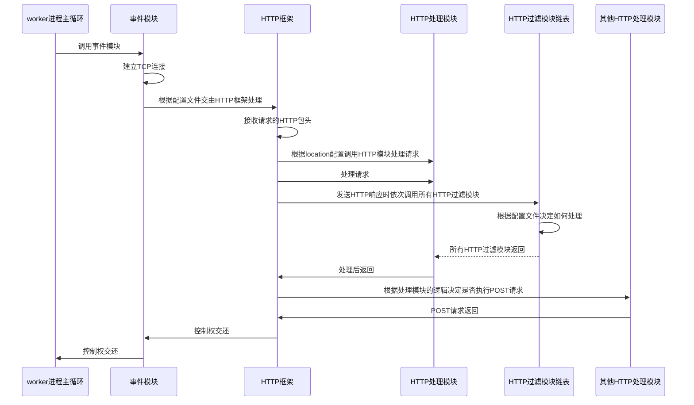

《深入理解Nginx 模块开发与架构解析》第2版 陶辉 著 机械工业出版社

# 第一部分 Nginx能帮我们做什么
## 第1章 研究Nginx前的准备工作
## 第2章 Nginx的配置
### 2.1 运行中的Nginx进程间的关系
一个master进程管理多个worker基础，一般情况下，worker进程的数量与服务器上的cpu核心数相等。
每一个worker进程都是繁忙的，它们在真正地提供互联网服务，master进程则很清闲，只负责监控管理worker进程。
worker进程之间通过共享内存、原子操作等一些**进程间通信机制**来实现负载均衡等功能。

### 2.5 用HTTP proxy module配置一个反向代理服务器
反向代理方式是指用代理服务器接受Internet上的连接请求，然后将请求转发给内部网络上的服务器，
并将从上游服务器上得到的结果返回给Internet上请求连接的客户端，此时代理服务器对外的表现就是
一个Web服务器。

# 第二部分 如何编写Http模块
## 第3章 开发一个简单的Http模块
### 3.1 如何调用HTTP模块
* worker进程主循环
* 事件模块
* HTTP框架
* HTTP处理模块
* HTTP过滤模块链表

## 第4章 配置、error日志和请求上下文
## 第5章 访问第三方服务
## 第6章 开发一个简单的http过滤模块
## 第7章 Nginx提供的高级数据结构
### 7.1 Nginx提供的高级数据结构概述
### 7.2 ngx_queue_t双向链表
### 7.3 ngx_array_t动态数组
### 7.4 ngx_list_t单向链表
### 7.5 ngx_rbtree_t红黑树
### 7.6 ngx_radix_tree_t基数树
### 7.7 支持通配符的散列表

# 第三部分 深入Nginx
## 第8章 Nginx基础架构
### 8.1 Web服务器设计中的关键约束
1. 性能
2. 可伸缩性
3. 简单性
4. 可修改性
5. 可见性
6. 可移植性
7. 可靠性

### 8.2 Nginx的架构设计
#### 8.2.1 优秀的模块化设计
#### 8.2.2 事件驱动架构
#### 8.2.3 请求的多阶段异步处理
#### 8.2.4 管理进程、多工作进程设计
#### 8.2.5 平台无关性的代码实现
#### 8.2.6 内存池的设计
#### 8.2.7 使用统一管道过滤器模式的HTTP过滤模块
#### 8.2.8 其他一些用户模块

## 第9章 事件模块
### 9.1 事件处理框架概述
事件处理框架所要解决的问题是如何收集、 管理、 分发事件。 这里所说的事件， 主要以网络事件和定时器事件
为主， 而网络事件中又以TCP网络事件为主。

通常事件驱动机制还有个名字， 叫做I/O多路复用

## 第10章 http框架的初始化
## 第11章 http框架的执行流程
## 第12章 upstream机制的设计与实现
## 第13章 邮件代理模块
## 第14章 进程间的通信机制
## 第15章 变量
## 第16章 slab共享内存