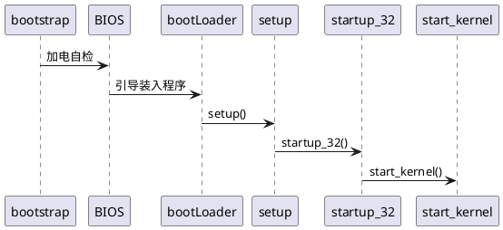

《深入理解Linux内核》陈莉君 张琼声 张宏伟 译 中国电力出版社

- 进程、中断和异常、内核同步、定时测量、进程调度、进程通信、程序执行
- 内存寻址、内存管理、进程地址空间、系统调用、信号
- 虚拟文件系统、IO体系结构和设备驱动程序、页高速缓存、访问文件、回收叶框、Ext2和Ext3文件系统
- 系统启动、模块

## 第1章 绪论
20世纪90年代末开始，Linux变得流行，跻身商用Unix系列
- AT&T SVR4（System V Release4）
- 伯克利分校 BSD
- DEC（现在HP） Digital Unix
- IBM AIX
- HP HP-UX
- Sun Solaris
- Apple Mac OS X

1991年，Linus Torvalds开发最初的Linux。从技术角度来说，Linux是一个真正的Unix内核。

Linux的优势
- 免费
- 所有成分都可以充分地定制
- 可以运行在低档、便宜的硬件平台
- 强大，充分挖掘硬件部分的特点
- 内核小、紧凑
- 与很多通用操作系统高度兼容
- 很好的技术支持

### 操作系统基本概念
操作系统作为内核的同义词，OS的两个主要目标
- 与硬件部分交互
- 为运行在计算机系统上的应用程序提供执行环境

#### 多用户系统
能**并发**和**独立**地执行分别属于两个或多个用户的若干应用程序的计算机。并发（concurrently），独立（independently）
#### 用户和组
#### 进程
程序执行时的一个实例。
区分程序与进程，几个进程能并发执行同一个程序，而同一个进程能顺序执行几个程序。
#### 内核体系结构

### Unix文件系统概述
- 文件
- 硬链接和软链接
- 文件类型
- 文件描述符与索引节点
- 访问权限和文件模式
- 文件操作的系统调用

### Unix内核概述
- 进程/内核模式
- 进程实现
- 可重入内核
- 进程地址空间
- 同步和临界区
  - 非抢占式内核
  - 禁止中断
  - 信号量 一个整形变量、一个等待进程的链表、两个原子方法
  - 自旋锁
  - 避免死锁
- 信号和进程间通信
- 进程管理
  - 僵死进程
  - 进程组合登录会话
- 内存管理
  - 虚拟内存
  - 随机访问存储器的使用
  - 内核内存分配器
  - 进程虚拟地址空间处理
  - 高速缓存
- 设备驱动程序

## 第2章 内存寻址

## 第3章 进程
进程定义为程序执行的一个实例。在Linux源代码中，常把进程称为任务或线程。
从内核观点看，进程的目的就是担当分配系统资源（CPU时间、内存等）的实体。`pthread（POSIX thread）`库。
### 3.1 进程、轻量级进程和线程
### 3.2 进程描述符
### 3.3 进程切换
### 3.4 创建进程
### 3.5 撤销进程

## 第4章 中断和异常
### 4.1 中断信号的作用
### 4.2 中断和异常
### 4.3 中断和异常处理程序的嵌套执行
### 4.4 初始化中断描述符表
### 4.5 异常处理
### 4.6 中断处理
### 4.7 软中断及tasklet
### 4.8 工作队列
### 4.9 从中断和异常返回

## 第5章 内核同步
### 5.1 内核如何为不同的请求提供服务
### 5.2 同步原语
#### 每CPU变量
#### 原子操作
#### 优化和内存屏障
避免指令重新排序
- 优化屏障 保证编译程序不会混淆放在原语操作之前的汇编指令和放在原语操作之后的汇编语言指令。
- 内存屏障 在原语之后的操作开始执行之前，原语之前的操作已经完成

#### 自旋锁
- 具有抢占内核的spin_lock宏
- 非抢占式内核中的spin_lock宏
- spin_unlock宏

#### 读写自旋锁
#### 顺序锁
#### 读-拷贝-更新（RCU）
#### 信号量
#### 读写信号量
#### 补充原语
#### 禁止本地中断
### 5.3 对内核数据结构的同步访问
### 5.4 避免竞态条件的实例

## 第6章 定时测量

## 第7章 进程调度
### 调度策略
- 交互式进程
- 批处理进程
- 实时进程

### 调度算法
### 调度程序所使用的的数据结构
### 调度程序所使用的的函数
### 多处理器系统中运行队列的平衡
### 与调度相关的系统调用

## 第8章 内存管理
### 页框管理
### 内存管理区
#### slab分配器
#### 高速缓存描述符
#### slab描述符
#### 普通和专用高速缓存
### 非连续内存区管理
### 进程地址空间
### 内存描述符

## 第9章 进程地址空间

## 第10章 系统调用
API只是一个函数定义，说明了如何获得一个给定的服务；系统调用通过**软中断**向内核发出一个明确的请求。
### 系统调用处理程序及服务例程
当用户态的进程调用一个系统调用时，CPU**切换到内核态**并开始执行一个内核函数。

为了把系统调用号与相应的服务例程关联起来，内核利用了一个**系统调用分派表**（dispatcher table）。
### 参数传递

## 第11章 信号
### 信号的作用
信号（signal）是很短的消息，可以被发送到一个进程或一组进程。使用信号的两个主要目的：
- 让进程知道已经发生了一个特定的事件
- 强迫进程执行它自己代码中的**信号处理程序**

#### 信号相关的数据结构
- 信号描述符合信号处理描述符

### 产生信号
### 传递信号
### 与信号相关的系统调用
- kill()系统调用
- tkill()和tgkill()系统调用

## 第12章 虚拟文件系统
Virtual Filesystem，是一个内核软件层，用来处理与Unix标准文件系统相关的所有系统调用。为**各种**文件系统提供一个**通用的接口**。

VFS三种类型：
- 磁盘文件系统 Linux文件系统、Unix文件系统、微软文件系统、CD-ROM文件系统等
- 网络文件系统
- 特殊文件系统 /proc

通用文件系统
- 超级块对象 superblock object
- 索引节点对象 inode object
- 文件对象 file object
- 目录项对象 dentry object

## 第13章 IO体系结构和设备驱动程序
CPU、RAM和IO设置之间流动，数据通路的总称，总线。CPU和IO设备之间的数据通路通常称为IO总线。IO端口、接口、设备控制器。

## 第14章 块设备驱动程序

## 第15章 页高速缓存
磁盘高速缓存是一种软件机制，允许系统把通常存放在磁盘上的一些数据保存在RAM中。目录项高速缓存、索引节点高速缓存、页高速缓存。
### 页高速缓存
页高速缓存（page cache）是Linux内核所使用的的主要磁盘高速缓存。在绝大多数情况下，内核在读写磁盘时都引用到页高速缓存。内核执行延迟的写操作。
### 把脏页写入磁盘
只要进程修改了数据，相应的页就被标记为脏页，即把它的PG_dirty标志置位。
- pdflush内核线程
- 搜索要刷新的脏页
- 回写陈旧的脏页

### sync() fsync() fdatasync()系统调用

## 第16章 访问文件
访问基于磁盘的文件是一种复杂的活动，既涉及VFS抽象层、块设备的处理，也涉及磁盘高速缓存的使用。文件（磁盘文件系统的文件、块设备文件）。

访问文件模式
- 规范模式 由系统调用read()和write()。read系统调用阻塞调用进程，直到数据被拷贝进用户态地址空间。write则不同，它在数据被拷贝到页高速缓存（延迟写）后就马上结束。
- 同步模式 只影响写操作，将阻塞调用进程，直到数据被有效的写入磁盘。
- 内存映射模式 应用程序发出系统调用mmap()将文件映射到内存中，文件就成为RAM中的一个字节数组，应用程序直接访问数组元素
- 直接IO模式 任何读写操作都将数据在用户态地址空间与磁盘空间直接传送而不经过页高速缓存。
- 异步模式 数据传送请求不会阻塞调用进程，而在后台执行。

### 16.1 读写文件
### 16.2 内存映射
### 16.3 直接IO传送
### 16.4 异步IO

## 第17章 回收页框

## 第18章 Ext2和Ext3文件系统

## 第19章 进程通信
Unix系统进程间通信基本机制：
- 管道和FIFO（命名管道） 生产者/消费者的交互，向管道中写、向管道中读
- 信号量
- 消息
- 共享内存区
- 套接字 不同计算机上进程通过网络交换数据。相同主机上的进程之间通信。

### 管道
```sh
ls | more
ls > temp
more < temp
```
管道被看作是打开的文件，但在已安装的文件系统中没有相应的映像。
### FIFO
管道的缺点，无法打开已经存在的管道。
### System V IPC
#### IPC消息
#### IPC共享内存
### POSIX消息队列

## 第20章 程序的执行

## 系统启动
- BIOS
- 引导装入程序
- setup()
- startup_32()
- start_kernel()



## 模块